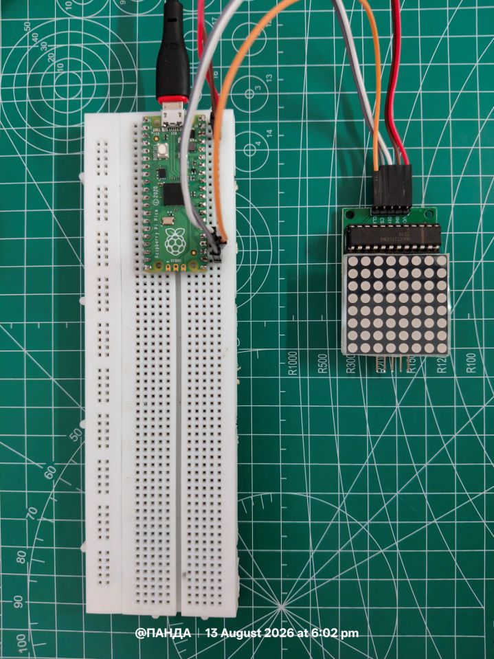
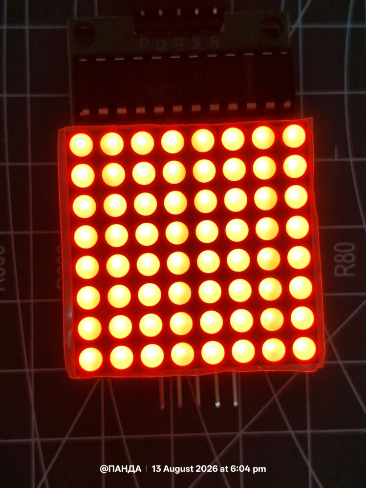
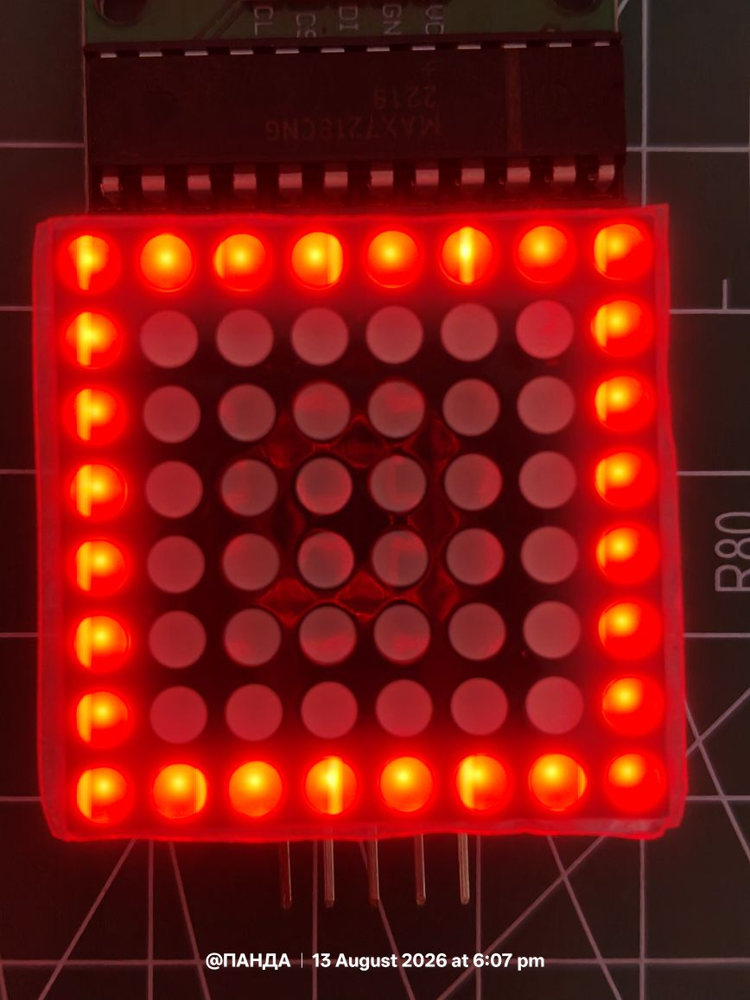
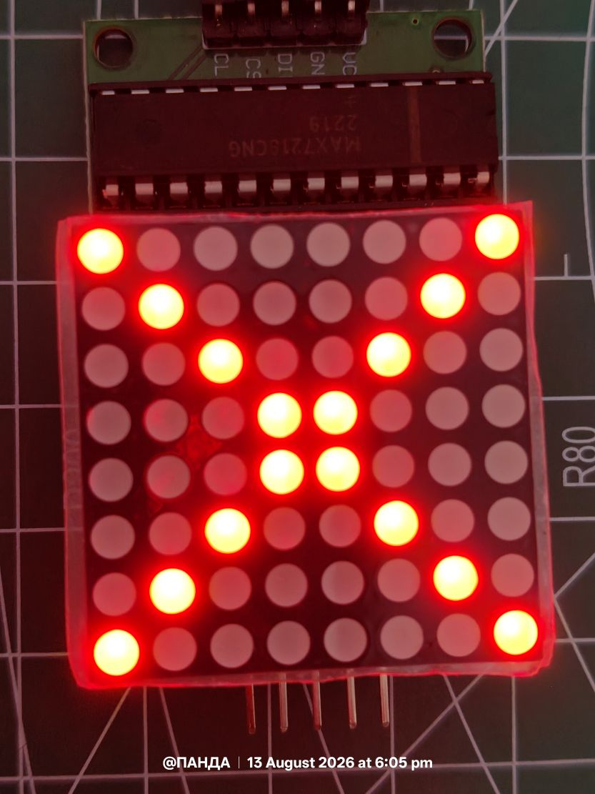
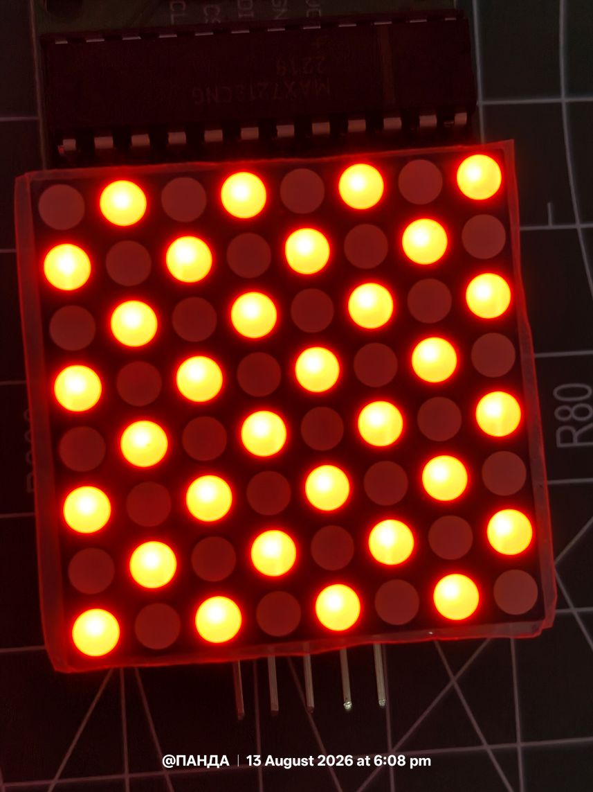

# 12 — 8x8 Matrix LED

A MicroPython project using a **Raspberry Pi Pico** and a **MAX7219/MAX7218-based 8x8 LED matrix** over hardware SPI.

The project progresses from basic hardware testing to static bitmap patterns, animation effects, and scrolling text.



---

## Hardware

| Component         | Details                    |
| ----------------- | -------------------------- |
| Raspberry Pi Pico | RP2040 running MicroPython |
| 8x8 LED Matrix    | MAX7219/MAX7218 driver     |
| Breadboard        | Prototyping                |
| Jumper wires      | Connections                |
| USB cable         | Power and programming      |

---

## Wiring

| MAX7219 | Pico Pin   | GPIO | Function    |
| ------- | ---------- | ---- | ----------- |
| VCC     | 3V3 / VSYS | —    | Power       |
| GND     | GND        | —    | Ground      |
| CLK     | Pin 18     | GP18 | SPI Clock   |
| DIN     | Pin 19     | GP19 | SPI MOSI    |
| CS      | Pin 17     | GP17 | Chip Select |

### SPI Configuration

```python
from machine import Pin, SPI

spi = SPI(
    0,
    baudrate=1_000_000,
    polarity=0,
    phase=0,
    sck=Pin(18),
    mosi=Pin(19)
)

cs = Pin(17, Pin.OUT)
```

The MAX7219 is write-only, so **MISO is not required**.

Each SPI transaction sends two bytes:

```text
[register, data]
```

The transfer is framed by pulling CS LOW and then HIGH.

```python
def write_reg(reg, data):
    cs.value(0)
    spi.write(bytes([reg, data]))
    cs.value(1)
```

---

## MAX7219 Register Configuration

The display is configured using the following registers:

| Register     | Address |         Value | Purpose          |
| ------------ | ------: | ------------: | ---------------- |
| Shutdown     |  `0x0C` |        `0x01` | Normal operation |
| Decode Mode  |  `0x09` |        `0x00` | Raw bitmap mode  |
| Scan Limit   |  `0x0B` |        `0x07` | All 8 rows       |
| Intensity    |  `0x0A` |   `0x00–0x0F` | Brightness       |
| Display Test |  `0x0F` | `0x00 / 0x01` | Test mode        |

Rows are controlled through registers `0x01` to `0x08`.

Each row is represented by one 8-bit value:

```python
for row in range(8):
    write_reg(row + 1, pattern[row])
```

---

## Project Files

| File                | Purpose                                           |
| ------------------- | ------------------------------------------------- |
| `01_Test.py`        | Hardware test using the MAX7219 display-test mode |
| `02_Box.py`         | Static hollow square                              |
| `02_X.py`           | Static X pattern                                  |
| `02_Checkboard.py`  | Static checkerboard pattern                       |
| `03_Mix_Pattern.py` | Animated bitmap patterns and effects              |
| `04_Text.py`        | Bitmap font and scrolling text                    |

Each script is self-contained and can be copied to the Pico as `main.py`.

---

# 01 — Test

The first program verifies the hardware using the MAX7219's built-in display-test mode.

```python
write_reg(0x0C, 0x01)   # Normal operation
write_reg(0x09, 0x00)   # No decode
write_reg(0x0B, 0x07)   # Scan all 8 rows
write_reg(0x0A, 0x0F)   # Maximum brightness
write_reg(0x0F, 0x01)   # Display test ON
```

Expected result:

```text
########
########
########
########
########
########
########
########
```

This confirms that the Pico, SPI communication, MAX7219 and LED matrix are working correctly.

---

# 02 — Basic Patterns

The basic pattern programs introduce bitmap representation.

Each row of the matrix is represented by one byte.

### Box

```python
pattern = [
    0b11111111,
    0b10000001,
    0b10000001,
    0b10000001,
    0b10000001,
    0b10000001,
    0b10000001,
    0b11111111
]
```

### X

```python
pattern = [
    0b10000001,
    0b01000010,
    0b00100100,
    0b00011000,
    0b00011000,
    0b00100100,
    0b01000010,
    0b10000001
]
```

### Checkerboard

```python
pattern = [
    0b10101010,
    0b01010101,
    0b10101010,
    0b01010101,
    0b10101010,
    0b01010101,
    0b10101010,
    0b01010101
]
```

These patterns demonstrate how **binary values can directly represent LED pixels**.

---

# 03 — Mixed Pattern Animation

`03_Mix_Pattern.py` builds on the static bitmap system and introduces reusable animation functions.

### Bitmap Patterns

* `HEART`
* `SMILEY`
* `ARROW_UP`
* `X_MARK`
* `CHECKERBOARD`
* `ALL_OFF`
* `ALL_ON`

### Animation Effects

* **Diagonal wipe** — reveals a pattern diagonally.
* **Spiral fill** — lights LEDs along an inward spiral.
* **Pulse** — repeatedly turns a pattern ON and OFF.

Example:

```python
while True:
    diagonal_wipe_in(SMILEY)
    pulse(HEART, cycles=3, delay=0.35)
    spiral_fill(delay=0.04)
    show(X_MARK)
    show(CHECKERBOARD)
```

The animation functions work with arbitrary 8-row bitmap patterns, making them reusable for future graphics.

---

# 04 — Scrolling Text

`04_Text.py` adds a small bitmap font and scrolling text renderer.

The font contains:

* `A–Z`
* `0–9`
* `.`
* `!`
* `?`
* `-`
* `:`
* Space

Example:

```python
while True:
    scroll_text("JAI ", delay=0.05)
    scroll_text("JAGANNATH", delay=0.04)
```

### Font Representation

Characters are represented using small bitmap grids:

```python
FONT = {
    'A': [
        '.#.',
        '#.#',
        '###',
        '#.#',
        '#.#'
    ],
}
```

### Rendering Pipeline

```text
FONT
  ↓
glyph_to_columns()
  ↓
text_to_column_stream()
  ↓
columns_to_rows()
  ↓
show()
  ↓
8x8 Matrix
```

The font and scrolling logic are independent from the SPI driver, so new characters can be added without changing the display code.

---

# Running the Project

### 1. Install MicroPython

Flash MicroPython onto the Raspberry Pi Pico.

### 2. Connect the Matrix

Follow the wiring table above.

### 3. Run a Program

Open any `.py` file in Thonny and run it on the Pico.

For automatic execution on boot, save the desired program as:

```text
main.py
```

### 4. Power the Pico

Connect the Pico through USB.

---

# Learning Progression

```text
01_Test
   ↓
02_Box / X / Checkerboard
   ↓
03_Mix_Pattern
   ↓
04_Text
   ↓
Animations
   ↓
Joystick Control
   ↓
Games
```

### Concepts Covered

* MicroPython
* SPI communication
* MAX7219 register control
* Binary representation
* Bit manipulation
* Bitmap graphics
* Animation
* Character rendering
* Scrolling text
* Embedded display control

# Output


<table>
  <tr>
    <td align="center">
      
      <br><b>Display Test</b>
    </td>
    <td align="center">
      
      <br><b>Box Pattern</b>
    </td>
    <td align="center">
      
      <br><b>X Pattern</b>
    </td>
    <td align="center">
      
      <br><b>Checkerboard Pattern</b>
    </td>
  </tr>
</table>

# Future Improvements

* Joystick-controlled pixel
* Moving objects
* Snake
* Pong
* More bitmap characters
* More animation effects
* Multiple cascaded MAX7219 modules
* Reusable MAX7219 driver
* C implementation using the Pico SDK

---

# Status

| Feature          | Status     |
| ---------------- | ---------- |
| Hardware Test    | ✅ Complete |
| Basic Patterns   | ✅ Complete |
| Animation        | ✅ Complete |
| Scrolling Text   | ✅ Complete |
| Joystick Control | 🔜         |
| Games            | 🔜         |
