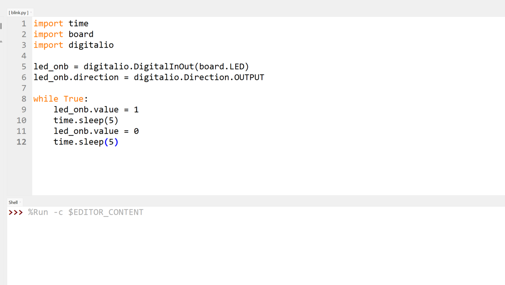
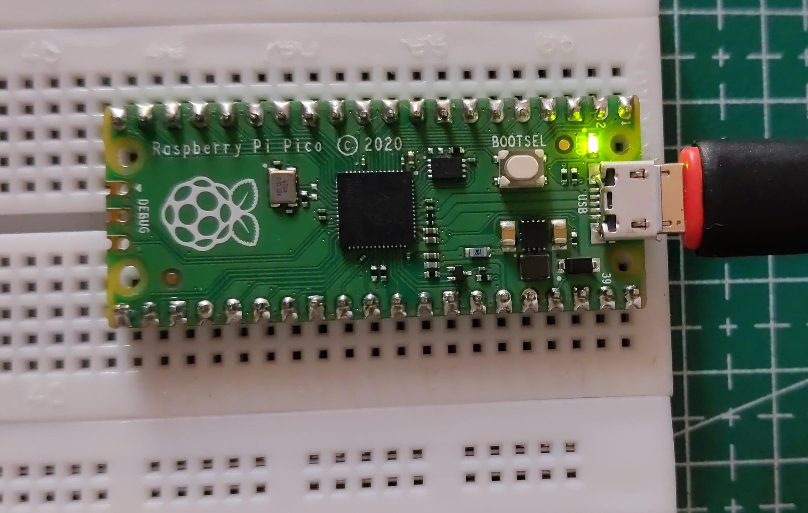

# Raspberry Pi Pico Onboard LED Blink (CircuitPython)

A beginner-friendly CircuitPython project that demonstrates how to blink the onboard LED of the Raspberry Pi Pico.

---

## 📖 Overview

This project demonstrates how to control the onboard LED of the **Raspberry Pi Pico** using **CircuitPython**. The onboard LED is turned ON and OFF every **100 milliseconds** using the `digitalio` module.

Blinking an LED is traditionally the first program written for a new microcontroller and is widely considered the embedded systems equivalent of **"Hello, World!"**. It introduces the fundamental concepts of GPIO control, digital outputs, and timing delays.

---

## 🛠 Requirements

- Raspberry Pi Pico (RP2040)
- CircuitPython firmware installed
- USB Type-A to Micro-USB data cable
- Thonny IDE, Mu Editor, or any text editor

---

## 💻 Source Code

```python
import time
import board
import digitalio

led_onb = digitalio.DigitalInOut(board.LED)
led_onb.direction = digitalio.Direction.OUTPUT

while True:
    led_onb.value = True
    time.sleep(0.1)

    led_onb.value = False
    time.sleep(0.1)
```

---

## ▶️ How to Run

1. Install **CircuitPython** on your Raspberry Pi Pico.
2. Connect the Pico to your computer using a USB cable.
3. Open the **CIRCUITPY** drive.
4. Open the `code.py` file (or create it if it doesn't already exist).
5. Copy and paste the program above into `code.py`.
6. Save the file.

The Pico will automatically reload the program, and the onboard LED will begin blinking continuously.



---

## 📚 Concepts Covered

- CircuitPython Basics
- GPIO Output
- `digitalio` Module
- `board.LED`
- Infinite Loops
- Timing with `time.sleep()`

---

## 🔍 Code Explanation

### Importing Modules

```python
import time
import board
import digitalio
```

- `time` provides delay functions such as `sleep()`.
- `board` provides pin definitions for the Raspberry Pi Pico.
- `digitalio` allows digital input and output operations.

---

### Creating the LED Object

```python
led_onb = digitalio.DigitalInOut(board.LED)
```

This creates a digital I/O object associated with the Pico's onboard LED.

Using `board.LED` instead of a GPIO number makes the program portable across many CircuitPython-supported development boards.

---

### Configuring the Pin

```python
led_onb.direction = digitalio.Direction.OUTPUT
```

The onboard LED pin is configured as an output so it can drive the LED.

---

### Turning the LED On

```python
led_onb.value = True
```

Setting the output value to `True` turns the LED ON.

---

### Delay

```python
time.sleep(0.1)
```

Pauses program execution for **0.1 seconds (100 milliseconds)**.

---

### Turning the LED Off

```python
led_onb.value = False
```

Setting the output value to `False` turns the LED OFF.

---

### Infinite Loop

```python
while True:
```

The `while True` loop continuously repeats the blinking sequence until power is removed or a different program is loaded onto the Pico.

---

## 🎯 Expected Output


After saving the program:

- The onboard LED turns ON for **100 ms**
- The onboard LED turns OFF for **100 ms**
- The process repeats indefinitely

This confirms that CircuitPython has been installed correctly and that the GPIO subsystem is functioning as expected.

---

## 📜 License

This project is intended for educational purposes and is part of the Raspberry Pi Pico learning repository.

---

Made with ❤️ using **CircuitPython** on the **Raspberry Pi Pico**.
