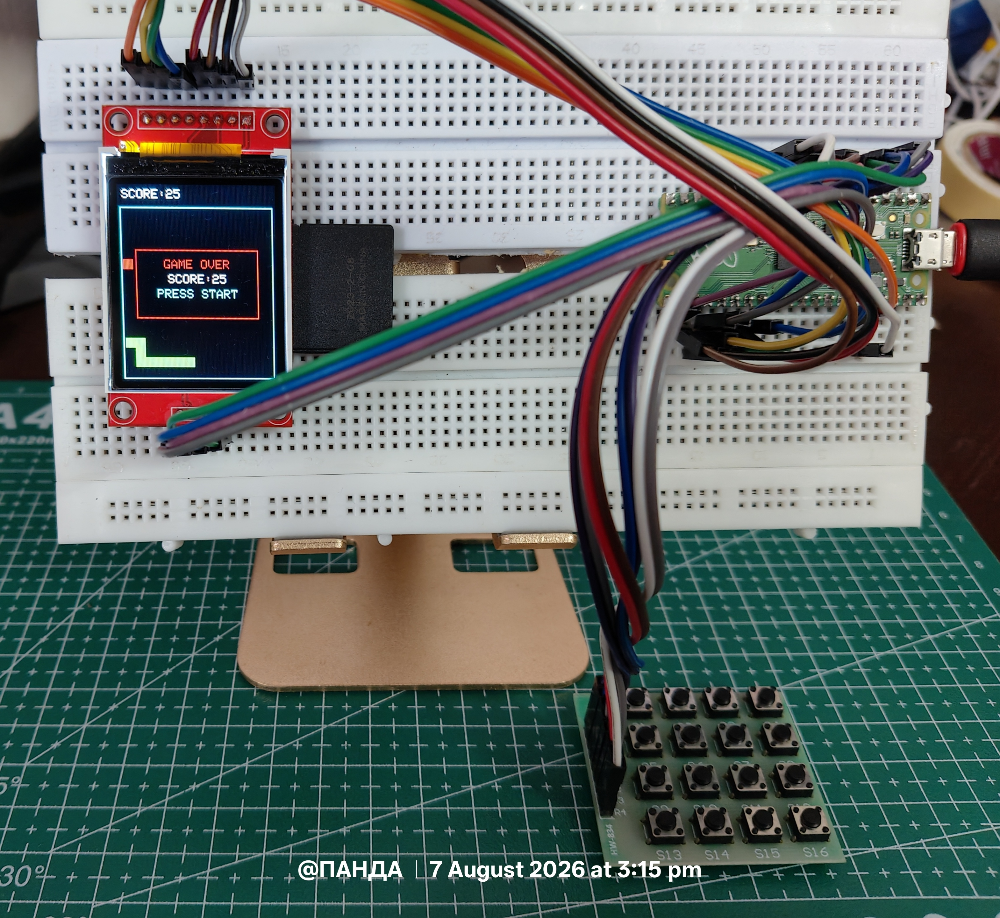
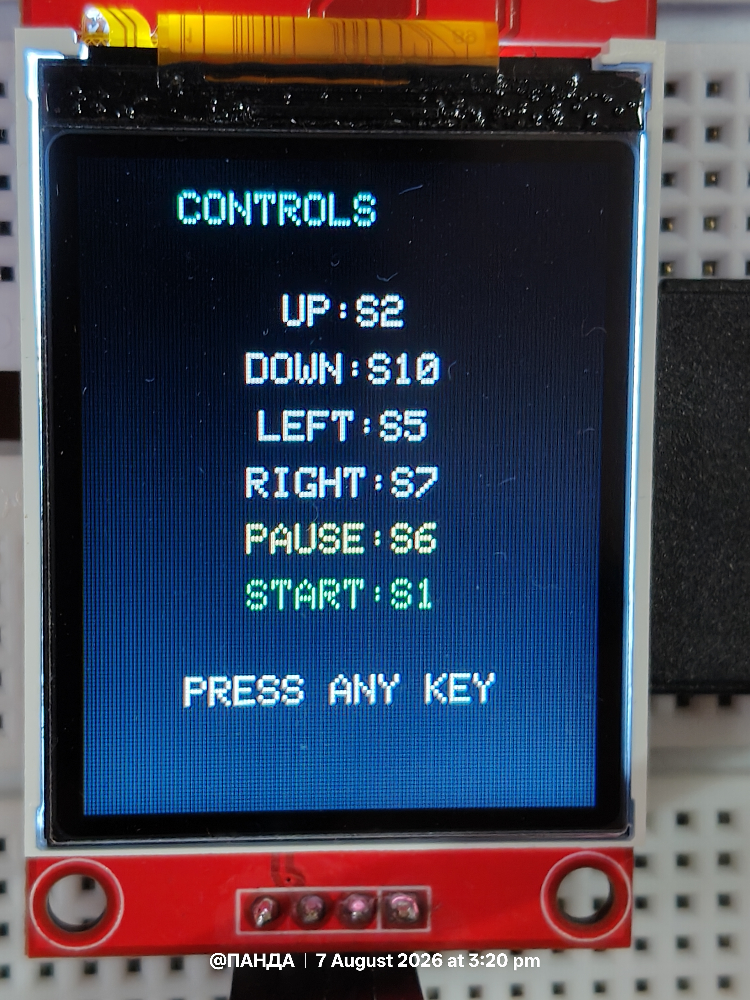
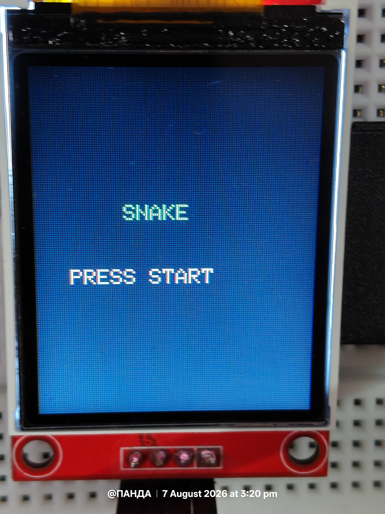
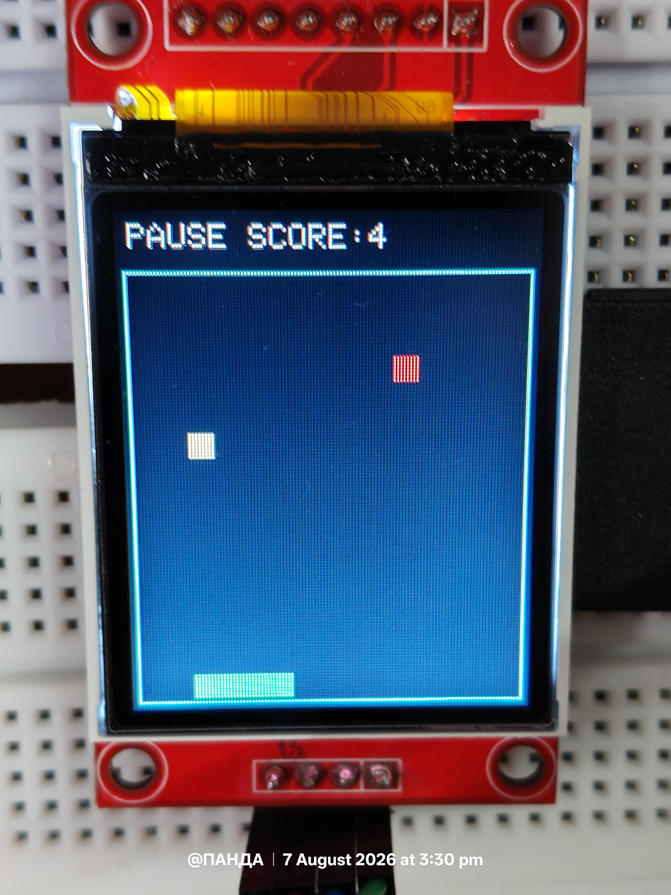
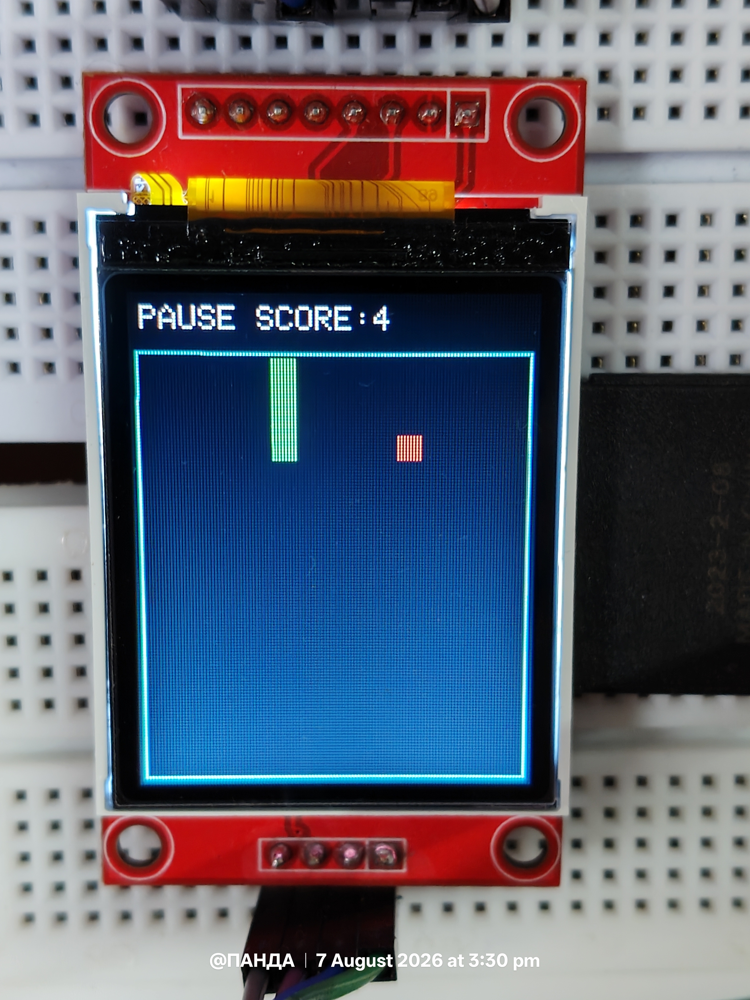
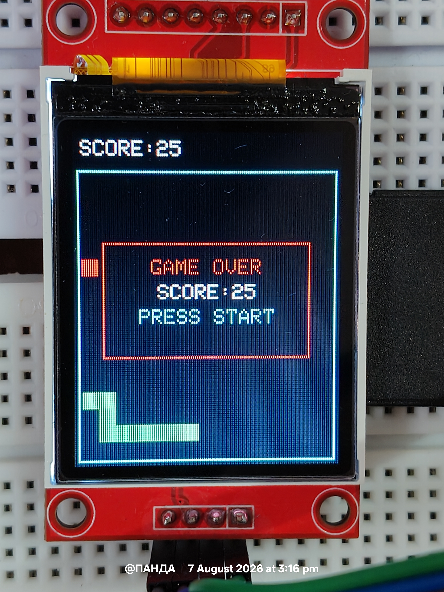

# Snake Game — Code Walkthrough

This document explains how `snake.py` works, function by function, including
the new **master treat** and **gradual growth** features.

**Target hardware:** Raspberry Pi Pico + ST7735 TFT display + 4×4 matrix keypad,
running MicroPython.

---

## Project Preview 

### Hardware Setup 

 

--- 


### Display Controls 


---


### Start Screen  


--- 


### Master Treat The special bonus treat appears periodically and awards additional points. 
 


--- 


### Pause Screen Pause the game at any time without losing progress. 
 


--- ### Game Over Game over screen displaying the final score and allowing the player to restart. 


 

---


## 1. High-Level Architecture

The game is a classic **grid-based Snake**, structured as:

1. **Setup** — import drivers, define constants, initialize hardware.
2. **State** — a handful of global variables track the snake, food, score, etc.
3. **Helper functions** — drawing, input scanning, spawning food/treats.
4. **Game logic** — `step_game()` moves the snake by exactly one cell per call.
5. **Screens** — title screen and game-over screen (blocking, wait for a keypress).
6. **Main loop** — a non-blocking loop that separates *input polling* (fast,
   every 5ms) from *game movement* (slow, every `TICK_MS`).

The key design idea: **input is read far more often than the snake moves.**
This keeps the controls feeling responsive even though the snake itself only
advances one cell every 180ms.

---

## 2. Imports & Hardware Setup

```python
from time import ticks_ms, ticks_diff, sleep_ms
from st7735_dev import ST7735, WIDTH, HEIGHT
from colors import *
from keypad import Keypad
```

- `ticks_ms()` / `ticks_diff()` — MicroPython's wraparound-safe millisecond
  clock, used for both the game tick and the master treat timer.
- `ST7735`, `WIDTH`, `HEIGHT` — your display driver and its resolution.
- `colors` — RGB565 color constants (`RED`, `GREEN`, `BLACK`, etc.).
- `Keypad` — wraps the 4×4 matrix wiring (`kp.rows`, `kp.cols`, `kp.keys`).

```python
try:
    import urandom as _rnd
except ImportError:
    import random as _rnd
```
Uses MicroPython's `urandom` if available, falling back to CPython's `random`
for testing off-device. `_rnd.getrandbits(16)` is used later for randomness.

```python
display = ST7735()
kp = Keypad()
```
Instantiates the two hardware objects used everywhere else in the file.

---

## 3. Key Mapping

```python
KEY_UP, KEY_DOWN, KEY_LEFT, KEY_RIGHT, KEY_PAUSE, KEY_START
DIR_KEYS = { KEY_UP: (0,-1), KEY_DOWN: (0,1), KEY_LEFT: (-1,0), KEY_RIGHT: (1,0) }
```
Each key name (e.g. `'S2'`) maps to a `(dx, dy)` grid delta. `DIR_KEYS` is a
lookup table so the main loop can turn "which key was pressed" directly into
"which direction to move," without a chain of `if/elif`.

---

## 4. Grid & Timing Configuration

| Constant | Meaning |
|---|---|
| `CELL = 8` | Pixel size of one grid square (snake segments are `8×8`). |
| `SCORE_H = 16` | Height reserved at the top of the screen for the score bar. |
| `GRID_COLS = 15`, `GRID_ROWS = 17` | Playfield size in cells (120×136 px). |
| `FIELD_X`, `FIELD_Y` | Pixel offset of the playfield's top-left corner (leaves room for a border and the score bar). |
| `TICK_MS = 180` | How often the snake advances one cell. Lower = faster snake. |

`cell_to_px()` later converts `(col, row)` grid coordinates into actual pixel
coordinates using `FIELD_X`/`FIELD_Y`/`CELL`.

---

## 5. Scoring / Growth Configuration (new)

```python
NORMAL_FOOD_SCORE = 1
MASTER_TREAT_SCORE = 5

GROWTH_PER_NORMAL = 0.34
GROWTH_PER_MASTER = 0.6

MASTER_TREAT_EVERY_N_FOOD = 4
MASTER_TREAT_DURATION_MS = 6000
```

- **Scoring**: normal food is worth 1 point, the master treat is worth 5.
- **Growth credit**: rather than growing a full segment every time the snake
  eats, each catch adds a *fraction* of a segment to an accumulator
  (`growth_credit`). Only once that accumulator reaches `1.0` does the snake
  actually get longer. `GROWTH_PER_NORMAL = 0.34` means it takes roughly
  3 normal foods to grow one segment; the master treat contributes more
  (`0.6`) since it's the rarer, bigger prize.
- **Master treat cadence**: a master treat is offered after every 4th normal
  food eaten (`MASTER_TREAT_EVERY_N_FOOD`), *if* one isn't already on the
  board. Once it appears, it only lasts `MASTER_TREAT_DURATION_MS` (6
  seconds) before vanishing on its own.

```python
try:
    MASTER_TREAT_COLOR = YELLOW
except NameError:
    try:
        MASTER_TREAT_COLOR = MAGENTA
    except NameError:
        MASTER_TREAT_COLOR = WHITE
```
Defensive color selection: if your `colors.py` doesn't define `YELLOW`, it
falls back to `MAGENTA`, then `WHITE`, so the game never crashes just because
a color constant is missing.

---

## 6. Input Handling Functions

### `scan_key()`
```python
def scan_key():
    detected = None
    for c in range(4):
        kp.cols[c].value(1)
        for r in range(4):
            if kp.rows[r].value():
                detected = kp.keys[r][c]
        kp.cols[c].value(0)
    return detected
```
A **non-blocking, single-pass** scan of the 4×4 matrix:
- For each column, drive it high (`value(1)`).
- Check every row — if a row reads high, that row/column intersection is the
  pressed key, looked up via `kp.keys[r][c]`.
- Drive the column back low before moving to the next column (so only one
  column is "hot" at a time — this is how matrix keypads avoid ghosting).
- Returns `None` immediately if nothing is pressed, or the last key found if
  multiple are (in practice, one key at a time).

This function is called every ~5ms in the main loop, so movement input feels
instant even though the snake itself only moves every 180ms.

### `wait_for_key(target=None)`
```python
def wait_for_key(target=None):
    while scan_key() is not None:
        sleep_ms(10)
    while True:
        k = scan_key()
        if k is not None and (target is None or k == target):
            return k
        sleep_ms(10)
```
A **blocking** helper used only on the title screen and game-over screen:
1. First waits for any currently-held key to be released (so a leftover
   press from the previous screen doesn't instantly trigger the next one).
2. Then polls every 10ms until a fresh key is pressed — either any key
   (`target=None`) or a specific one (e.g. `KEY_START`).

---

## 7. Drawing Helpers

### `cell_to_px(col, row)`
Converts grid coordinates to pixel coordinates: `FIELD_X + col*CELL`,
`FIELD_Y + row*CELL`. Every other drawing function builds on this.

### `draw_cell(col, row, color)`
Fills one `8×8` grid cell with a solid color — this is the fundamental
drawing primitive. It's used to draw snake segments, food, the master treat,
and to erase cells (by drawing them `BLACK`).

### `draw_border()`
Draws a cyan rectangle outline around the entire playfield, 2px outside the
grid boundary on each side.

### `draw_score()`
```python
def draw_score():
    display.fill_rectangle(0, 0, WIDTH, SCORE_H, BLACK)
    label = "PAUSE " if paused else ""
    display.draw_text_fast(4, 4, label + "SCORE:" + str(score), WHITE, BLACK)
```
Clears the score bar area and redraws it. Prepends `"PAUSE "` to the label
when the game is paused, so pausing is visible without a separate overlay.
Called any time the score changes or the pause state toggles.

### `show_message_box(lines, border_color=RED)`
Draws a centered pop-up box (used for the game-over screen). `lines` is a
list of `(text, color)` tuples, one per line — each line is horizontally
centered by estimating text width as `len(text) * 6` pixels.

---

## 8. Global Game State

```python
snake = []                  # list of (col, row) tuples, snake[0] is the head
direction = (1, 0)          # current movement vector
pending_direction = (1, 0)  # most recent direction requested by the player
food = (0, 0)                # normal food position
score = 0
paused = False
game_over = False

master_treat = None         # (col, row) or None when not on screen
master_treat_spawn = 0      # ticks_ms() timestamp of when it appeared
foods_eaten = 0              # count of normal food eaten so far

growth_credit = 0.0          # accumulator for gradual growth
```

Why both `direction` and `pending_direction`? Because keypresses arrive
between game ticks. `pending_direction` records the *intent* the instant a
key is pressed; `direction` (the value actually used to move the snake) is
only updated once per tick inside `step_game()`, and only if the requested
turn isn't a 180° reversal into itself.

---

## 9. Spawning Food & the Master Treat

### `spawn_food()`
```python
def spawn_food():
    global food
    while True:
        c = rand_cell_index(GRID_COLS)
        r = rand_cell_index(GRID_ROWS)
        if (c, r) not in snake:
            food = (c, r)
            draw_cell(c, r, RED)
            return
```
Keeps picking random cells until it finds one not occupied by the snake,
then stores it in `food` and draws it red. `rand_cell_index(n)` is just
`_rnd.getrandbits(16) % n` — a cheap way to get a random index in `[0, n)`.

### `spawn_master_treat()` *(new)*
```python
def spawn_master_treat():
    global master_treat, master_treat_spawn
    for _ in range(20):
        c = rand_cell_index(GRID_COLS)
        r = rand_cell_index(GRID_ROWS)
        if (c, r) not in snake and (c, r) != food:
            master_treat = (c, r)
            master_treat_spawn = ticks_ms()
            draw_cell(c, r, MASTER_TREAT_COLOR)
            return
    master_treat = None
```
Same idea as `spawn_food()`, but:
- It avoids both the snake **and** the current food cell.
- It only tries **20 times** rather than looping forever — if the board is
  nearly full of snake, it just gives up silently for this call (a later
  call, triggered by the next food eaten, will try again). This avoids a
  potential infinite loop on a near-full board.
- It timestamps the spawn (`master_treat_spawn = ticks_ms()`) so the main
  loop can later tell how long it's been on screen.

### `clear_master_treat()` *(new)*
```python
def clear_master_treat():
    global master_treat
    if master_treat is not None:
        draw_cell(master_treat[0], master_treat[1], BLACK)
        master_treat = None
```
Erases the treat from the screen (paints its cell black) and resets the
state variable to `None`. Called both when the snake eats it and when it
times out.

---

## 10. `reset_game()`

```python
def reset_game():
    global snake, direction, pending_direction
    global score, paused, game_over
    global master_treat, foods_eaten, growth_credit

    score = 0
    paused = False
    game_over = False
    master_treat = None
    foods_eaten = 0
    growth_credit = 0.0

    mid_c = GRID_COLS // 2
    mid_r = GRID_ROWS // 2
    snake = [(mid_c, mid_r), (mid_c - 1, mid_r), (mid_c - 2, mid_r)]
    direction = (1, 0)
    pending_direction = (1, 0)

    display.fill_screen(BLACK)
    draw_border()
    for seg in snake:
        draw_cell(seg[0], seg[1], GREEN)

    spawn_food()
    draw_score()
```
Called once at the start of the game, and again every time the snake dies
(to start a fresh round without restarting the whole program):
1. Resets every piece of state — including the **new** master-treat and
   growth-credit state, so leftover treats/credit from a previous life don't
   carry over.
2. Places the snake as a 3-segment horizontal line in the middle of the
   grid, moving right.
3. Clears the screen, redraws the border, redraws the snake.
4. Spawns the first food and redraws the score bar.

---

## 11. `step_game()` — The Core Logic (updated)

This function runs **once per tick** (every `TICK_MS`) and advances the
snake by exactly one cell. Here's the full sequence:

```python
def step_game():
    global snake, direction, pending_direction, score, game_over
    global master_treat, foods_eaten, growth_credit
```

**Step 1 — Apply the turn.**
```python
    if pending_direction != (-direction[0], -direction[1]):
        direction = pending_direction
```
Only accept the player's requested direction if it isn't the exact opposite
of the current direction — this is the classic "can't reverse into your own
neck" rule. If the player *did* try to reverse, `direction` just stays as it
was, and the snake keeps going the way it was already going.

**Step 2 — Compute the new head position.**
```python
    head_c, head_r = snake[0]
    new_head = (head_c + direction[0], head_r + direction[1])
```

**Step 3 — Check wall collision.**
```python
    if not (0 <= new_head[0] < GRID_COLS and 0 <= new_head[1] < GRID_ROWS):
        game_over = True
        return
```
If the new head would land outside the grid, the game ends immediately —
nothing else in this function runs.

**Step 4 — Check self collision.**
```python
    if new_head in snake and new_head != snake[-1]:
        game_over = True
        return
```
If the new head would land on any existing snake segment, that's a
collision — **except** the current tail cell, because the tail is about to
vacate that cell this same tick (unless the snake is growing, but food never
spawns on the tail so this edge case doesn't come up for food/treats).

**Step 5 — Check what's being eaten.**
```python
    ate_food = (new_head == food)
    ate_master = (master_treat is not None and new_head == master_treat)
```
Two independent checks: did the new head land on the normal food, or on the
master treat (if one is currently on screen)?

**Step 6 — Move the snake.**
```python
    snake.insert(0, new_head)
    draw_cell(new_head[0], new_head[1], GREEN)
```
The new head is always added to the front of the list and drawn green.
Whether the *tail* is removed (i.e., whether the snake actually got longer)
is decided later, based on growth credit.

**Step 7 — Handle eating normal food.**
```python
    if ate_food:
        score += NORMAL_FOOD_SCORE
        foods_eaten += 1
        growth_credit += GROWTH_PER_NORMAL
        draw_score()
        spawn_food()

        if master_treat is None and foods_eaten % MASTER_TREAT_EVERY_N_FOOD == 0:
            spawn_master_treat()
```
- Adds 1 point, increments the eaten-food counter, and adds a fraction of
  growth credit.
- Redraws the score bar and spawns a fresh food.
- Every 4th food eaten (and only if no treat is currently active), spawns a
  master treat.

**Step 8 — Handle eating the master treat.**
```python
    elif ate_master:
        score += MASTER_TREAT_SCORE
        growth_credit += GROWTH_PER_MASTER
        draw_score()
        clear_master_treat()
```
Adds 5 points, a bigger chunk of growth credit, and removes the treat from
the board. This is an `elif` — a single move can't land on both food and the
treat at once since they're never spawned on the same cell.

**Step 9 — Apply gradual growth.**
```python
    if growth_credit >= 1:
        growth_credit -= 1
    else:
        tail = snake.pop()
        draw_cell(tail[0], tail[1], BLACK)
```
This runs on **every** tick, whether or not something was eaten this tick:
- If enough credit has built up (≥ 1.0), the snake keeps its tail this move
  (i.e., it's now one cell longer) and 1.0 is subtracted from the credit.
- Otherwise, the tail is popped off the list and erased from the screen, as
  in ordinary movement.

This is what makes growth feel gradual: eating one food only adds `0.34` to
the credit, which isn't enough to trigger growth by itself. It typically
takes about 3 normal foods (or roughly 2 master treats) before enough credit
accumulates to actually add a segment — and when it does, the extra segment
can show up on a tick *after* the eating happened, not necessarily the exact
same tick.

---

## 12. Screens
### `def show_controls_screen():`
Shows the game controls onto the screen before starting of the game 

### `title_screen()`
Clears the screen, prints "SNAKE" and "PRESS START," then blocks on
`wait_for_key(KEY_START)` until the player presses start.

### `game_over_screen()`
Uses `show_message_box()` to show "GAME OVER," the final score, and "PRESS
START," then blocks until the player presses start again.

---

## 13. `main()` — The Game Loop

```python
def main():
    global pending_direction, paused

    title_screen()
    reset_game()

    last_tick = ticks_ms()
    prev_key = None

    while True:
        key = scan_key()

        if key is not None and key != prev_key:
            if key in DIR_KEYS:
                pending_direction = DIR_KEYS[key]
            elif key == KEY_PAUSE and not game_over:
                paused = not paused
                draw_score()

        prev_key = key

        if (not paused and not game_over and master_treat is not None
                and ticks_diff(ticks_ms(), master_treat_spawn) >= MASTER_TREAT_DURATION_MS):
            clear_master_treat()

        if not paused and not game_over:
            if ticks_diff(ticks_ms(), last_tick) >= TICK_MS:
                last_tick = ticks_ms()
                step_game()

                if game_over:
                    game_over_screen()
                    reset_game()
                    last_tick = ticks_ms()
                    prev_key = None

        sleep_ms(5)
```

Walking through each part:

1. **Title screen, then reset.** Runs once before the loop starts.

2. **`key = scan_key()`** — polled every iteration (every ~5ms, since the
   loop sleeps 5ms at the bottom).

3. **Edge-triggered input.**
   ```python
   if key is not None and key != prev_key:
   ```
   This only reacts the *moment* a key transitions from "not pressed" (or a
   different key) to newly pressed — not on every single scan while it's
   held down. That's why holding a direction key doesn't spam
   `pending_direction` updates every 5ms; it's set once per press.
   - A direction key updates `pending_direction` (consumed later by
     `step_game()`).
   - The pause key toggles `paused` and immediately redraws the score bar
     (so the "PAUSE" label appears/disappears instantly, not on the next
     tick).

4. **`prev_key = key`** — remembers this scan's key so the next iteration
   can detect the *next* transition.

5. **Master treat timeout check** *(new)* — runs every loop iteration
   (every ~5ms), independent of the game tick:
   ```python
   if (not paused and not game_over and master_treat is not None
           and ticks_diff(ticks_ms(), master_treat_spawn) >= MASTER_TREAT_DURATION_MS):
       clear_master_treat()
   ```
   Because this check happens on the fast input-polling cycle rather than
   the slow game tick, the treat disappears close to exactly 6 seconds after
   it spawned, regardless of `TICK_MS`. It's skipped while paused, so
   pausing effectively pauses the treat's countdown too.

6. **Game tick.**
   ```python
   if not paused and not game_over:
       if ticks_diff(ticks_ms(), last_tick) >= TICK_MS:
           last_tick = ticks_ms()
           step_game()
           ...
   ```
   Only advances the snake once at least `TICK_MS` (180ms) has passed since
   the last move — this is what actually controls snake speed, completely
   decoupled from how often the loop itself runs.

7. **Game-over handling.** If `step_game()` set `game_over = True`, the loop
   shows the game-over screen (which blocks until "start" is pressed), then
   calls `reset_game()` and resets the tick/key trackers so the new round
   starts clean.

8. **`sleep_ms(5)`** — a short yield at the bottom of every iteration, so
   the loop polls input roughly 200 times per second without pegging the
   CPU at 100%.

---

## 14. Why Input Polling Is Separate From the Game Tick

This is the most important architectural idea in the file: **the loop never
blocks waiting for the next move.** Instead:

- Every ~5ms: check the keypad, update `pending_direction` if needed, check
  the master treat timer.
- Only every ~180ms: actually move the snake one cell.

If input were only checked once per game tick, a quick key press between
ticks could be missed, and turning would feel laggy. By decoupling the two,
a player can press "turn" the instant they want to, and it will reliably be
picked up on the very next tick.

---

## 15. Feature Summary Table

| Feature | Where it lives | How it works |
|---|---|---|
| Snake movement | `step_game()` | Insert new head, conditionally pop tail |
| Wall/self collision | `step_game()` | Bounds check + membership check on `snake` |
| Normal food | `spawn_food()`, `step_game()` | Random free cell, +1 point, +0.34 growth credit |
| Master treat | `spawn_master_treat()`, `clear_master_treat()`, `step_game()`, `main()` | Random free cell every 4th food, +5 points, +0.6 growth credit, times out after 6s |
| Gradual growth | `growth_credit`, end of `step_game()` | Fractional credit per catch; tail only kept once credit ≥ 1 |
| Pause | `main()`, `draw_score()` | Toggled on keypress, skips tick advancement and treat timer while active |
| Score display | `draw_score()` | Redrawn on score change and pause toggle |
