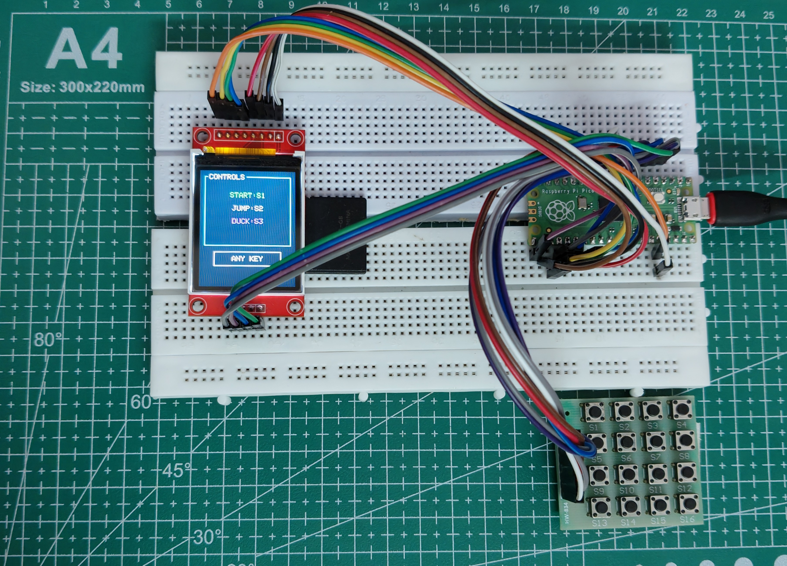
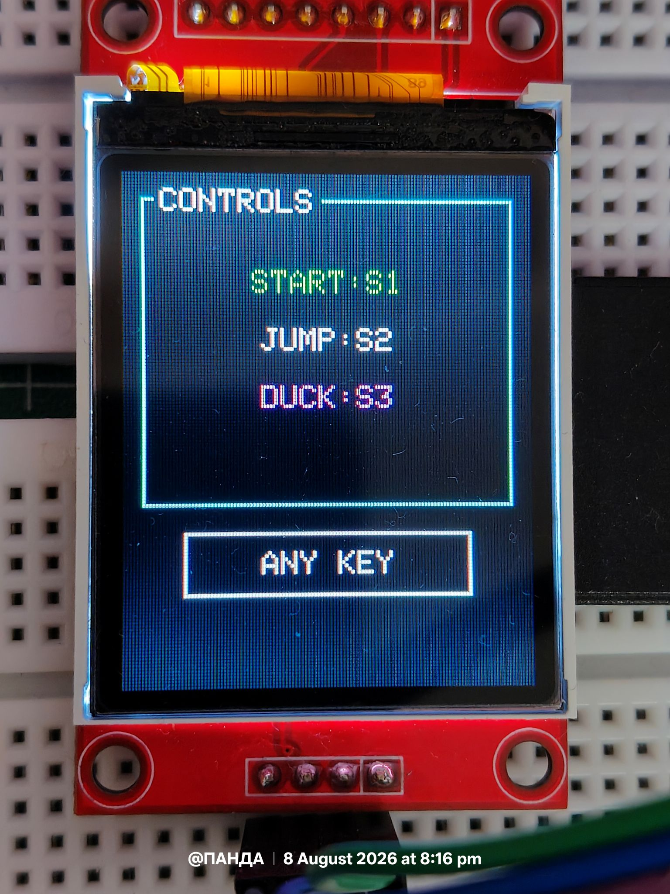
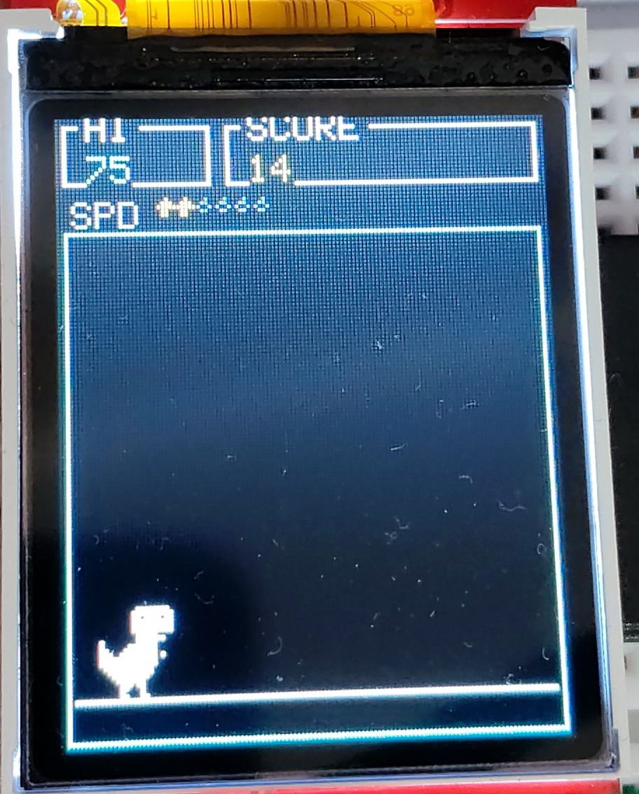
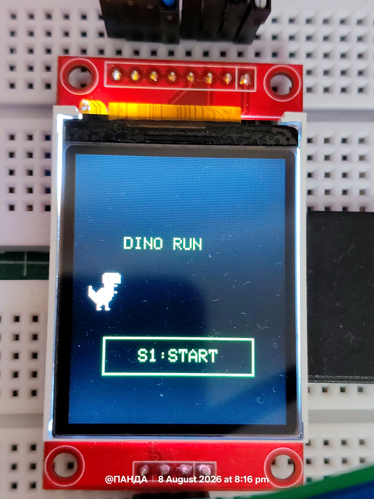
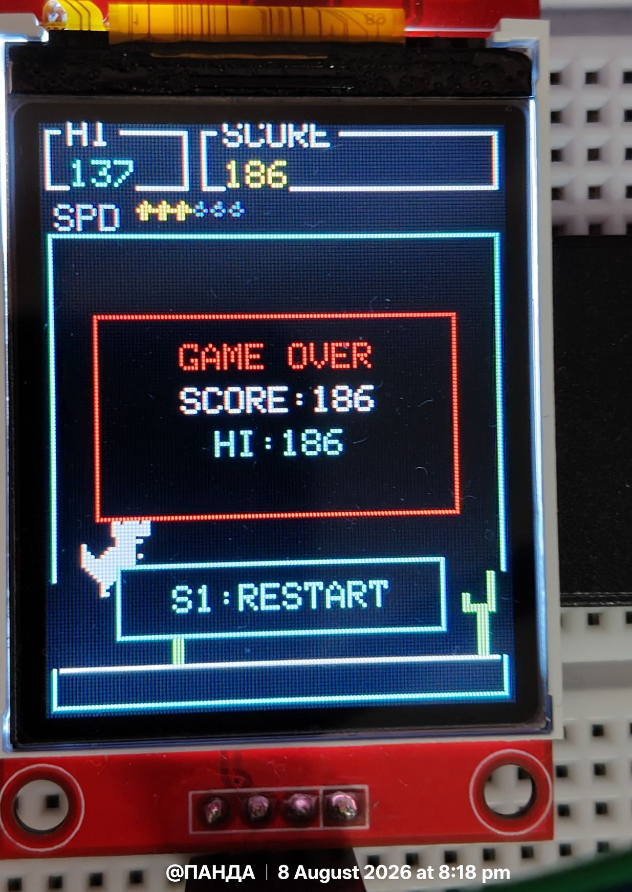

# 🦖 Dino Run — Raspberry Pi Pico

A Chrome-Dino-style endless runner implemented for the **Raspberry Pi Pico (RP2040)** using an **ST7735 TFT display** and a **4×4 matrix keypad**.

The project is written in **MicroPython** and is designed around a lightweight, non-blocking game loop suitable for a resource-constrained microcontroller.

---

## 📌 Overview

**Dino Run** is an endless-runner game inspired by the classic Chrome Dino game.

The player controls a dinosaur that must survive an increasingly fast stream of obstacles. The game supports:

* Jumping over cacti
* Ducking beneath flying obstacles
* Automatic scrolling
* Increasing game speed
* Score tracking
* High-score tracking
* Game-over and restart functionality
* Hardware keypad input
* Optimized sprite rendering

The game runs entirely on the Pico and communicates directly with the ST7735 TFT over SPI.

The implementation was designed around the same driver architecture used by the project's other games (`snake.py`), making it easy to integrate into the existing Pico game framework.

---

## 🎮 Hardware

### Required Hardware

| Component                  | Purpose                           |
| --------------------------- | --------------------------------- |
| Raspberry Pi Pico / RP2040  | Game controller                   |
| ST7735 TFT LCD              | Game display                      |
| 4×4 Matrix Keypad           | Player controls                   |
| USB connection              | Power and MicroPython programming |

### Display

The game uses the project's existing `ST7735` driver:

```text
st7735_dev.py
```

The display resolution is:

```text
128 × 160 pixels
```

The game divides the display into two primary areas:

```text
┌──────────────────────────────┐
│ HI        SCORE              │
│ SPD  ◆ ◆ ◆                  │
├──────────────────────────────┤
│                              │
│        GAME AREA             │
│                              │
│   🦖             🌵          │
│______________________________│
└──────────────────────────────┘
```

The upper section contains the score and speed information, while the lower section is the bordered play area.

>Note : This code uses the drivers from previous project :01_Dino_Run_Micropython. 

### Circuit Setup



The Pico, ST7735 TFT, and 4×4 matrix keypad wired together as described above.

---

# ⌨️ Controls

The game uses three keys from the 4×4 keypad.

```text
S1 → START / RESTART
S2 → JUMP
S3 → DUCK
```

The full 4×4 layout, as read from `keypad.py`'s `self.keys[row][col]` table, is:

```text
        col0   col1   col2   col3
row0:   S13    S14    S15    S16
row1:   S9     S10    S11    S12
row2:   S5     S6     S7     S8
row3:   S1     S2     S3     S4
```

Only the bottom-left three keys (`S1`, `S2`, `S3`) are used by the game logic. If your physical silkscreen doesn't match this table, the three `KEY_START` / `KEY_JUMP` / `KEY_DUCK` constants at the top of `Dino.py` can be edited without touching the rest of the game.

### S1 — Start / Restart

Starts the game from the title screen.

After a collision, pressing **S1** starts a new run.

### S2 — Jump

Performs a fixed-height jump.

The jump is **edge-triggered**, meaning the game reacts only when S2 is newly pressed rather than repeatedly triggering jumps while the key remains held. This is implemented by comparing the current scanned key against the previous tick's key (`key != prev_key`).

### S3 — Duck

S3 is **level-triggered**.

Holding the key keeps the dinosaur crouched while on the ground.

During an airborne jump, pressing S3 causes the dinosaur to **fast-fall** toward the ground by snapping its vertical velocity to `FAST_FALL_VELOCITY`.



---

## ⚠️ A Note on Button Debounce

`scan_key()` reads the physical keypad's electrical state directly, once per loop iteration, with no software debouncing logic in front of it. This means **contact bounce** is a realistic possibility with this circuit.

**What debounce actually is:** a mechanical switch (including the switches inside a matrix keypad) doesn't transition cleanly from "open" to "closed" the instant it's pressed. The metal contacts physically bounce against each other for a very short window — typically somewhere in the range of a few hundred microseconds to a few milliseconds — before settling into a stable connection. Read fast enough and often enough, a microcontroller can see that bounce as several rapid presses and releases instead of one clean press.

**Why it matters here specifically:**

* `KEY_JUMP` is edge-triggered (`key != prev_key`). If S2's contacts bounce across two consecutive scans, the game could register a second jump edge immediately after the first, even though the player only pressed the key once.
* `KEY_DUCK` is level-triggered, so bounce is less likely to cause a visible problem there — a few bounced reads still just mean "duck is/was held."
* The main loop scans the keypad roughly every 5 ms (`sleep_ms(5)`) but only advances the game every `TICK_MS` (30 ms). This spacing happens to give mechanical contacts a little time to settle between reads, which reduces how often bounce is visible in practice, but it does not eliminate it — it's a side effect of the timing, not an intentional debounce mechanism.

**If bounce becomes noticeable** (e.g. occasional "double jumps" from a single press), a small software debounce can be added without changing the rest of the game — for example, ignoring a new key transition for a few milliseconds after the previous one, or requiring a key to read consistently across two or three consecutive scans before it's accepted as a genuine press/release. Hardware options (a small RC filter, or a keypad/switch with built-in debounce) are also possible if a software fix isn't desired.

---

# 🗂️ Project Architecture

The game is intentionally separated from the underlying hardware drivers.

```text
Dino Run
│
├── Dino.py
└───assets
        00_Circuit_Setup.jpg
        01_Controls.jpg
        02_Home_Screen.jpg
        03_Running.jpg
        04_Game_Over.jpg
```

### `Dino.py`

Contains the complete game implementation:

* Game state
* Physics
* Collision detection
* Obstacle generation
* Sprite rendering
* Score handling
* Game screens
* Input processing
* Main game loop

### `st7735_dev.py`

Provides the TFT display interface. The game imports `ST7735`, `WIDTH`, and `HEIGHT` from it, and uses fast display operations such as:

```text
set_window()
write_buffer()
fill_rectangle()
draw_rectangle()
draw_text_fast()
```

This allows the game to minimize unnecessary SPI transfers.

### `colors.py`

Contains RGB565 color constants used throughout the interface, imported with `from colors import *`.

Examples include:

```text
BLACK
WHITE
GREEN
CYAN
MAGENTA
YELLOW
ORANGE
GRAY
DARKGRAY
RED
```

### `keypad.py`

Provides the 4×4 matrix keypad configuration, including:

* Row pins (`kp.rows`)
* Column pins (`kp.cols`)
* Key mapping (`kp.keys[row][col]`)

The game accesses `kp.rows` and `kp.cols` directly inside its own `scan_key()` function rather than calling a blocking helper on the `Keypad` object.

### `widgets_dev.py`

Provides reusable UI components such as:

```text
draw_panel()
draw_button()
draw_meter()
```

These are used for the controls screen, title screen, game-over screen, score panels, and speed meter.

---

# ⚙️ Game Loop Architecture

One of the most important design decisions in Dino Run is separating **input scanning** from the **game tick**.

The keypad is scanned continuously, once per loop iteration:

```text
Keypad Scan
     │
     ▼
  Input State
     │
     ├───────────────┐
     │               │
     ▼               ▼
Jump Edge        Duck Level
Detection        Detection
     │               │
     └───────┬───────┘
             ▼
        Game Tick
             │
             ▼
       Physics Update
             │
             ▼
      Obstacle Update
             │
             ▼
        Collision
             │
             ▼
         Rendering
```

The game uses:

```python
TICK_MS = 30
```

The main loop continuously scans the keypad every ~5 ms (`sleep_ms(5)`), but the game state (`step_game()`) only advances once the elapsed time since the last tick, measured with `ticks_diff(ticks_ms(), last_tick)`, reaches `TICK_MS`.

This prevents blocking keypad operations from freezing the game, and decouples "how often we check for input" from "how often the world moves."

---

# 🎯 Non-Blocking Keypad Input

A conventional blocking keypad function such as:

```python
kp.get_key()
```

would stop execution while waiting for a key.

That is undesirable for an endless runner because:

* Obstacles would stop moving
* Physics would stop updating
* The display would become unresponsive
* Timing would become inconsistent

Instead, Dino Run implements its own scanner:

```python
def scan_key():
    detected = None
    for c in range(4):
        kp.cols[c].value(1)
        for r in range(4):
            if kp.rows[r].value():
                detected = kp.keys[r][c]
        kp.cols[c].value(0)
    return detected
```

The scanner drives each column pin high one at a time, reads all four row pins, and immediately returns. If no key is pressed:

```python
None
```

is returned. This allows the game to repeatedly poll the keypad without ever blocking the runner.

A second helper, `wait_for_key(target=None)`, is used only on the non-gameplay screens (controls, title, game-over). It first waits for any already-held key to release, then blocks until a fresh key press (optionally matching a specific `target` key) is detected — acceptable here because these screens are not actively simulating a running game.

---

# 🦖 Player Physics

The dinosaur uses a simple integer-based physics model suitable for the RP2040.

The primary parameters are:

```python
GRAVITY = 1
JUMP_VELOCITY = -11
FAST_FALL_VELOCITY = 10
```

Each game tick, while airborne:

```text
velocity += gravity
dino_y += velocity
```

When the dinosaur's computed `dino_y` reaches or passes the ground level (`GROUND_Y - DINO_H`), it is clamped back down and:

```text
dino_y = GROUND_Y - DINO_H
velocity = 0
on_ground = True
```

The dinosaur therefore follows a simple ballistic jump:

```text
             🦖
          ↗      ↘
       ↗            ↘
    ↗                  ↘
────────────────────────────
           GROUND
```

The physics intentionally use integer arithmetic, avoiding floating-point calculations inside the main game loop — important for a MicroPython interpreter running on a microcontroller with no hardware FPU acceleration comparable to a desktop CPU.

> **Author's note:** the current jump/gravity/fast-fall values (`GRAVITY = 1`, `JUMP_VELOCITY = -11`, `FAST_FALL_VELOCITY = 10`) don't feel especially smooth or "comfortable" to play as-is — the jump arc can feel abrupt and the fast-fall a bit sudden. This wasn't heavily tuned. All three values live as plain constants at the top of `Dino.py` specifically so they're easy to adjust; if the jump feels too floaty, too sharp, too short, or too long, changing `GRAVITY` and `JUMP_VELOCITY` (and `FAST_FALL_VELOCITY` for the duck-fall) is the place to start. See **🛠️ Troubleshooting** below for specific tuning suggestions.

---

# 🏃 Dino States

The game maintains several important player-state variables (all module-level globals mutated via `global` inside functions):

```python
dino_y
velocity
on_ground
ducking
```

These determine the dinosaur's current hitbox and sprite, computed by `dino_rect()` and `dino_buffer()`.

### Standing

The normal dinosaur sprite/hitbox is:

```text
20 × 22 pixels     (DINO_W × DINO_H)
```

### Ducking

The ducking state only applies while `on_ground` is `True`. It reduces the effective player height to:

```text
20 × 10 pixels     (DINO_W × DINO_DUCK_H)
```

No separate duck bitmap was supplied for the sprite art, so the game reuses the bottom `DINO_DUCK_H` rows of the same standing dino bitmap (the legs/tail region) via `build_sprite_buffer(..., row_start=DINO_H - DINO_DUCK_H, row_count=DINO_DUCK_H)`, producing a cropped-but-consistent crouch pose instead of falling back to a plain rectangle.

Mid-air, `ducking` is always forced back to `False` — the hitbox stays standing-sized while jumping, and a held duck key instead triggers the fast-fall behavior described above.

---

# 🌵 Obstacles

Dino Run currently supports two obstacle types, both defined as packed 1-bpp bitmaps (cactus) or solid-color rectangles (pterodactyl).

## Cactus

The cactus is a ground obstacle, rendered from `CACTUS_BITMAP`:

```text
       ██
       ██
    ███████
       ██
       ██
       ██
       ██
```

Its dimensions are:

```python
CACTUS_W = 11
CACTUS_H = 23
```

The cactus uses a packed 1-bit bitmap (MSB-first, each row padded to a whole number of bytes) and is converted into an RGB565 rendering buffer (`CACTUS_BUF`) once at import time.

---

# 🦅 Flying Obstacle

The game also generates a flying obstacle representing a pterodactyl. Unlike the cactus, it currently has no bitmap and is drawn as a solid filled rectangle in `PTERO_COLOR` (magenta).

Its configured dimensions are:

```python
PTERO_W = 14
PTERO_H = 8
```

Its vertical position is fixed at "head height" of a *standing* dino:

```python
PTERO_Y = GROUND_Y - DINO_H
```

— well above a ducking dino's much shorter hitbox, which is precisely what makes ducking (rather than jumping) the reliable response to it:

```text
CACTUS
   ↓
JUMP

PTERODACTYL
   ↓
DUCK
```

The pterodactyl spawn probability is controlled by:

```python
PTERO_CHANCE = 35
```

meaning a newly spawned obstacle has a configured 35% chance of being a pterodactyl, decided by `rand_percent() < PTERO_CHANCE`.

---

# 🎲 Procedural Obstacle Generation

Obstacles are generated dynamically rather than being stored as a predefined level.

The distance between obstacles is randomized between:

```python
SPAWN_MIN_GAP_PX = 55
SPAWN_MAX_GAP_PX = 130
```

Each tick, `spawn_gap_remaining` is decremented by the current `scroll_speed`; once it reaches zero or below, `spawn_obstacle()` is called and a new random gap is chosen via `rand_range(SPAWN_MIN_GAP_PX, SPAWN_MAX_GAP_PX)`.

Random values come from `urandom.getrandbits(16)` on-device (falling back to Python's standard `random` module if `urandom` is unavailable, e.g. when testing off-device), so the game produces a different obstacle sequence on different runs.

---

# 💥 Collision Detection

Collision detection uses axis-aligned bounding boxes (AABB).

The collision function checks whether two rectangular hitboxes overlap:

```python
def rects_overlap(ax, ay, aw, ah, bx, by, bw, bh):
    return ax < bx + bw and ax + aw > bx and ay < by + bh and ay + ah > by
```

Conceptually:

```text
Player
┌────────┐
│  🦖    │
└────────┘
     │
     │ collision
     ▼
   ┌─────┐
   │ 🌵  │
   └─────┘
```

Every tick, the current dino rectangle (from `dino_rect()`, which already accounts for ducking) is checked against every active obstacle rectangle. A collision immediately sets:

```python
game_over = True
```

which halts scoring and triggers the game-over screen on the next iteration of the main loop.

---

# 🖼️ Sprite Rendering

The game does not repeatedly decode the original bitmap data during gameplay.

Instead, sprite buffers are generated once during initialization, via `build_sprite_buffer()`.

The supplied sprites are stored as **packed 1-bit-per-pixel bitmaps**, MSB-first, with each row padded to a whole number of bytes. For example:

```text
1 → foreground color
0 → background color
```

`build_sprite_buffer()` walks every bit of the source bitmap and writes the corresponding RGB565 color bytes (foreground or background) into a flat `bytearray`. These are converted into RGB565 buffers before the game starts:

```python
DINO_STAND_BUF
DINO_DUCK_BUF
CACTUS_BUF
```

This eliminates bitmap decoding from the main game tick — at runtime the game only ever blits pre-built byte buffers.

---

# ⚡ Background Rendering Optimization

A particularly important optimization is the use of **background rendering**.

Instead of storing transparency information and performing a separate erase operation for every sprite pixel, each sprite buffer is built with the play area's background color already baked into every transparent (`0`) pixel:

```text
Sprite pixel (1)      → sprite color
Transparent pixel (0) → BG_COLOR
```

Therefore, a single:

```text
set_window()
+
write_buffer()
```

operation both **draws the sprite** and **erases whatever was behind it**, in one bulk SPI burst — no separate erase pass is needed for the sprite's own footprint.

This is especially useful on the ST7735 because the display communicates over SPI and transfer operations are relatively expensive; this mirrors the same trick the driver's `draw_text_fast()` uses for glyphs, applied here to game sprites.

---

# ✂️ Sprite Clipping

Obstacles can partially exist outside the display — they spawn just past the right edge and later scroll off the left edge.

```text
                  ┌──────────── DISPLAY ────────────┐
                  │                                  │
                  │                         ████     │
                  │                         ████     │
                  └──────────────────────────────────┘
                                             ↑
                                      partially visible
```

Because the driver's `set_window()` operation does not automatically clip coordinates the way `fill_rectangle()` does, the game implements its own clipping inside `blit()`:

```python
def blit(x, y, w, h, buf):
    ...
```

The function:

1. Calculates the visible region by clamping `x0, y0, x1, y1` against the screen bounds
2. Determines the source sprite offset (`src_x0`, `src_y0`) that corresponds to the clipped edges
3. Crops the RGB565 buffer row-by-row into a smaller `cropped` buffer when only partially visible
4. Sends only the visible portion to the display via `set_window()` + `write_buffer()`

If the sprite is fully off-screen, `blit()` returns immediately without touching the display. If it is fully on-screen, the precomputed buffer is sent as-is with no cropping overhead. This prevents off-screen coordinates from being written into the TFT's memory.

---

# 🧹 Rendering Strategy

Each game tick (`step_game()`) follows a predictable rendering sequence:

```text
1. Erase previous dinosaur footprint
2. Process jump input (edge-triggered)
3. Process duck input (level-triggered) / fast-fall
4. Update vertical physics
5. Draw dinosaur at its new position
6. Erase each obstacle's previous footprint
7. Move each obstacle left by scroll_speed
8. Draw each obstacle at its new position
9. Check collisions against the dino
10. Drop obstacles that scrolled off-screen
11. Spawn a new obstacle if the spawn gap has elapsed
12. Redraw the ground line
13. Update the score text
14. Update the speed meter widget if the speed just changed
```

This approach avoids clearing the entire display every frame — the game never calls a full-screen `fill_screen()` mid-run. Only regions affected by movement are erased and redrawn, which matters a great deal for a small SPI-connected TFT where every transfer has real, measurable latency.



---

# 📈 Difficulty Scaling

The game gradually increases its scrolling speed.

Initial speed:

```python
SCROLL_SPEED_START = 2
```

Maximum speed:

```python
SCROLL_SPEED_MAX = 6
```

The speed increases every:

```python
SPEED_UP_EVERY_SCORE = 150
```

score points, checked with `score % SPEED_UP_EVERY_SCORE == 0`.

Therefore:

```text
Score       Speed
──────────────────
0–149         2
150–299       3
300–449       4
450–599       5
600+          6
```

The speed meter widget (`draw_speed_meter()`, backed by `widgets_dev.draw_meter()`) is updated only when the speed actually changes, rather than being unnecessarily redrawn every game tick.

---

# 🏆 Score System

The score represents how long the player survives.

Every successful (non-collision) game tick increments:

```python
score += 1
```

The current score is displayed in the top `SCORE` panel via `display.draw_text_fast()`.

The highest score achieved during the current Pico boot session is stored in:

```python
high_score
```

When the player gets a new record, checked in `step_game()` right after a collision:

```python
if score > high_score:
    high_score = score
```

The high score is therefore preserved across in-session game restarts (calls to `reset_game()`), but is **not** persisted to flash, so it resets back to `0` after a hard Pico reboot.

---

# 🖥️ User Interface

Dino Run contains three primary interface screens, each built from `widgets_dev.py` components.

## 1. Controls Screen — `show_controls_screen()`

Displayed once, when the program first starts.

It shows:

```text
CONTROLS

START:S1
JUMP:S2
DUCK:S3

        ANY KEY
```

This prevents the player from having to remember the keypad mapping before playing. It blocks on `wait_for_key()` with no specific target, so any key advances past it.

---

## 2. Title Screen — `title_screen()`

The title screen displays:

```text
DINO RUN

       🦖

   ┌──────────┐
   │ S1:START │
   └──────────┘
```

The game waits specifically for `KEY_START` (`S1`) before starting, via `wait_for_key(KEY_START)`.



---

## 3. Game Over Screen — `game_over_screen()`

After a collision, `show_message_box()` renders a centered box:

```text
┌──────────────────┐
│    GAME OVER     │
│                  │
│    SCORE:XXX     │
│    HI:XXX        │
└──────────────────┘

    S1:RESTART
```

Pressing S1 calls `reset_game()`, which resets the game state and begins another run without leaving `main()`.



---

# 🔄 Game State Reset

The game is designed so that it does **not** require a Pico reboot after a game over.

The function:

```python
def reset_game():
    ...
```

resets:

```text
dino position (dino_y)
velocity
on_ground state
ducking state
obstacles list
spawn_gap_remaining
scroll_speed
score
game_over flag
```

It then rebuilds the display from scratch — `fill_screen(BLACK)`, `draw_play_border()`, `draw_ground()`, draws the standing dino, and redraws the score panels and speed meter — so every restart begins from a visually clean, consistent state.

This makes repeated gameplay possible without restarting MicroPython or losing the current session's `high_score`.

---

# 🧠 Memory and Performance Considerations

The implementation is designed with the limitations of a microcontroller in mind.

### Avoids unnecessary full-screen redraws

The game does not call `display.fill_screen(...)` every frame — only once per `reset_game()`. During gameplay, only moving objects and dynamic UI elements are updated.

### Precomputes sprite buffers

Bitmap decoding (`build_sprite_buffer()`) occurs once at import time rather than during every game tick.

### Uses RGB565

The display's native 16-bit pixel format is used directly, avoiding any intermediate color-space conversion at draw time.

### Uses integer physics

No floating-point physics calculations are required — `dino_y`, `velocity`, `GRAVITY`, etc. are all plain integers.

### Uses fixed game timing

The runner advances according to a fixed interval:

```python
TICK_MS = 30
```

measured with `ticks_ms()` / `ticks_diff()`, rather than depending directly on however fast the interpreter happens to execute the main Python loop.

### Non-blocking gameplay input

The custom `scan_key()` scanner does not stall the game engine; only the non-gameplay screens use the blocking `wait_for_key()` helper.

These design choices collectively make the game suitable for running directly on the RP2040 with MicroPython.

---

# 🚀 Installation

## 1. Flash MicroPython

Install a recent MicroPython firmware onto the Raspberry Pi Pico.

Verify that the board boots successfully and that the MicroPython REPL is accessible.

---

## 2. Copy the Drivers

Place the required driver files on the Pico:

```text
st7735_dev.py
colors.py
keypad.py
widgets_dev.py
```

---

## 3. Copy the Game

Copy:

```text
Dino.py
```

to the Pico filesystem.

---

## 4. Verify Imports

The game expects:

```python
from st7735_dev import ST7735, WIDTH, HEIGHT
from colors import *
from keypad import Keypad
from widgets_dev import draw_panel, draw_button, draw_meter
```

Therefore, these modules must be available in the same filesystem location or import path.

---

## 5. Run

Execute:

```python
Dino.py
```

The startup sequence is:

```text
Power On
   │
   ▼
Controls Screen
   │
   ▼
Wait for Key
   │
   ▼
Title Screen
   │
   ▼
Wait for S1
   │
   ▼
Game
   │
   ├── Collision ──► Game Over
   │                     │
   │                     ▼
   │                  S1 Restart
   │                     │
   └─────────────────────┘
```

This complete startup and restart flow is implemented in `main()`.

---

# 🔧 Configuration

The game is intentionally configurable through constants near the top of the source file.

## Controls

```python
KEY_START = 'S1'
KEY_JUMP  = 'S2'
KEY_DUCK  = 'S3'
```

If the physical keypad wiring uses a different mapping, these values can be changed without modifying the rest of the game.

---

## Game Speed

```python
TICK_MS = 30
```

Lower values make the game update more frequently (faster).

Higher values slow the game down.

---

## Jump

```python
GRAVITY = 1
JUMP_VELOCITY = -11
FAST_FALL_VELOCITY = 10
```

These values control the jump height, duration, and fast-fall behavior.

---

## Obstacle Speed

```python
SCROLL_SPEED_START = 2
SCROLL_SPEED_MAX = 6
SPEED_UP_EVERY_SCORE = 150
```

---

## Obstacle Spacing

```python
SPAWN_MIN_GAP_PX = 55
SPAWN_MAX_GAP_PX = 130
```

---

## Pterodactyl Probability

```python
PTERO_CHANCE = 35
```

---

# 🛠️ Troubleshooting

### Display does not initialize

Verify:

* ST7735 wiring
* SPI configuration
* `st7735_dev.py`
* Display driver initialization

---

### Keypad does not respond

Verify the row/column wiring used by:

```text
keypad.py
```

If the physical key labels differ from the configured mapping, modify:

```python
KEY_START
KEY_JUMP
KEY_DUCK
```

The source specifically exposes these constants so the game logic does not need to be modified.

---

### Game feels too fast

Increase:

```python
TICK_MS
```

or reduce:

```python
SCROLL_SPEED_START
```

---

### Jump is too high / low

Adjust:

```python
JUMP_VELOCITY
```

and, if necessary:

```python
GRAVITY
```

---

### Ducking feels too fast

Adjust:

```python
FAST_FALL_VELOCITY
```

---

# 📁 Project Structure

The repository currently contains just the game script and its screenshot assets:

```text
D:.
│   Dino.py
│
└───assets
        00_Circuit_Setup.jpg
        01_Controls.jpg
        02_Home_Screen.jpg
        03_Running.jpg
        04_Game_Over.jpg
```

This is captured directly from a PowerShell `tree /f` listing:

```powershell
Windows PowerShell
Copyright (C) Microsoft Corporation. All rights reserved.
PS D:\Games\02_Dino_Run_MicroPython> tree /f
Folder PATH listing for volume New Volume
Volume serial number is 000000CC 6846:8396
D:.
│   Dino.py
│
└───assets
        00_Circuit_Setup.jpg
        01_Controls.jpg
        02_Home_Screen.jpg
        03_Running.jpg
        04_Game_Over.jpg
PS D:\Games\02_Dino_Run_MicroPython>
```

`Dino.py` currently imports its hardware drivers (`st7735_dev.py`, `colors.py`, `keypad.py`, `widgets_dev.py`) from elsewhere in the wider Pico project — they are **not yet part of this repository**. For a self-contained, easy-to-clone project, consider growing the structure into something like this:

```text
02_Dino_Run_MicroPython/
│
├── Dino.py                     # main game script (entry point)
├── README.md
│
├── drivers/                    # shared hardware abstraction layer
│   ├── st7735_dev.py           # ST7735 TFT display driver
│   ├── colors.py                # RGB565 color constants
│   ├── keypad.py                 # 4x4 matrix keypad wiring + scanning
│   └── widgets_dev.py           # draw_panel / draw_button / draw_meter
│
└── assets/                     # README screenshots (not deployed to the Pico)
    ├── 00_Circuit_Setup.jpg
    ├── 01_Controls.jpg
    ├── 02_Home_Screen.jpg
    ├── 03_Running.jpg
    └── 04_Game_Over.jpg
```

Notes on this improvised layout:

* **`drivers/` is separated from the game script** so the same hardware abstraction layer can be reused by other games in the parent project (e.g. `snake.py`), matching the "Project Architecture" section above.
* **`assets/` stays purely documentation-facing** — screenshots referenced by this README, not files copied onto the Pico's filesystem.
* When deploying to the physical board, only `Dino.py` and the contents of `drivers/` need to be copied over (see **🚀 Installation** above); `README.md` and `assets/` are for the repository only.
* If this game is eventually split out of the larger Pico project, `drivers/` could instead become a git submodule or a small installable package, so driver fixes benefit every game that depends on it instead of being duplicated per game folder.

---

# 🧩 Design Philosophy

Dino Run is intentionally more than a simple demonstration of graphics on a TFT.

The implementation explores several embedded-systems concepts:

* Hardware input scanning
* Non-blocking input handling
* Fixed-rate game loops
* Real-time state updates
* Integer physics
* Collision detection
* Procedural generation
* SPI display optimization
* RGB565 graphics
* Bitmap rendering
* Buffer precomputation
* Memory-conscious rendering
* Modular driver architecture

The result is a small but complete embedded game engine running on an RP2040.

---

# 📊 Technical Summary

| Feature       | Implementation                     |
| ------------- | ----------------------------------- |
| MCU           | Raspberry Pi Pico / RP2040          |
| Language      | MicroPython                         |
| Display       | ST7735 TFT                          |
| Resolution    | 128 × 160                           |
| Input         | 4×4 Matrix Keypad                   |
| Game Type     | Endless Runner                      |
| Physics       | Integer-based                       |
| Rendering     | RGB565                              |
| Sprite Format | Packed 1-bit bitmap                 |
| Game Tick     | 30 ms                               |
| Initial Speed | 2 px/tick                           |
| Maximum Speed | 6 px/tick                           |
| Player Jump   | Fixed-height                        |
| Ducking       | Ground crouch + airborne fast-fall  |
| Obstacles     | Cactus (bitmap) + Pterodactyl (rect) |
| Collision     | AABB                                |
| Score         | Distance/survival based             |
| High Score    | Persistent during current boot      |
| Restart       | Without Pico reboot                 |
| Input Model   | Non-blocking polling                |

---

# 🔮 Possible Future Improvements

The current implementation provides a solid base for further development.

Potential upgrades include:

* Animated running frames
* Dedicated duck sprite (instead of the cropped standing sprite)
* Animated / bitmap pterodactyl sprite (instead of a solid rectangle)
* Multiple cactus variants
* Multiple obstacle combinations
* Difficulty curves based on distance
* Persistent high score using flash
* Sound effects through a buzzer
* Start countdown
* Pause functionality
* More advanced collision hitboxes
* Parallax background
* Clouds and environmental elements
* Day/night cycles
* Power-ups
* Multiple game modes
* Sound and music system
* Hardware-independent game engine

The current architecture makes these additions possible without fundamentally changing the keypad or display drivers.

---

# 📜 License

This project is part of the Raspberry Pi Pico embedded-systems project and may be distributed according to the license specified by the parent repository.

If this game is distributed independently, add the repository's chosen license file here.

---

# 🙏 Acknowledgements

Inspired by the classic **Chrome Dino** endless runner.

Developed as an embedded graphics and game-development project using:

* Raspberry Pi Pico / RP2040
* MicroPython
* ST7735 TFT
* 4×4 Matrix Keypad

---

## 🦖 Final Notes

Dino Run demonstrates how a relatively complete real-time game can be implemented on a small microcontroller without relying on a conventional game engine.

The project combines hardware abstraction, input handling, physics, procedural obstacle generation, collision detection and optimized SPI rendering into a single embedded application.

The most important optimization is the separation between **fast input polling** and the **fixed-rate game tick**, combined with precomputed RGB565 sprite buffers and partial-screen rendering. This allows the RP2040 to spend its limited processing and SPI bandwidth on actual gameplay rather than unnecessary display operations.

**Built on the Pico. Played on the TFT. 🦖**

---

# ✍️ Author's Note

This project was built by **Rajsekhar Panda**, who is not a professional game developer, but an intermediate-level programmer learning both software and hardware side by side through projects like this one.

Dino Run started as a way to get more comfortable with real-time systems, SPI displays, and physical input handling on a microcontroller — not as a polished commercial game. Because of that, some parts of the implementation (the jump/gravity feel mentioned above, the lack of software debounce, the rectangle-based pterodactyl instead of a real sprite) are honest reflections of where the project currently stands rather than deliberate final design choices. They're documented in this README so anyone building on this project — including a future version of the author — knows exactly what's been tuned carefully and what's still a first pass. And for real testers I've intentionally left the flying dinosaur as just a colored block , I could have easily added it in the first place but this repository is learning oriented so 👉👈.. i want you to learn that add that and improve your version of the code , don't come to me to add that, do it yourself ! And moreover I am also working on the button issue and have found a solution assuming it will work for future projects. 

Feedback, issues, and pull requests that improve the physics feel, add debounce handling, or extend the sprite work are welcome.  
