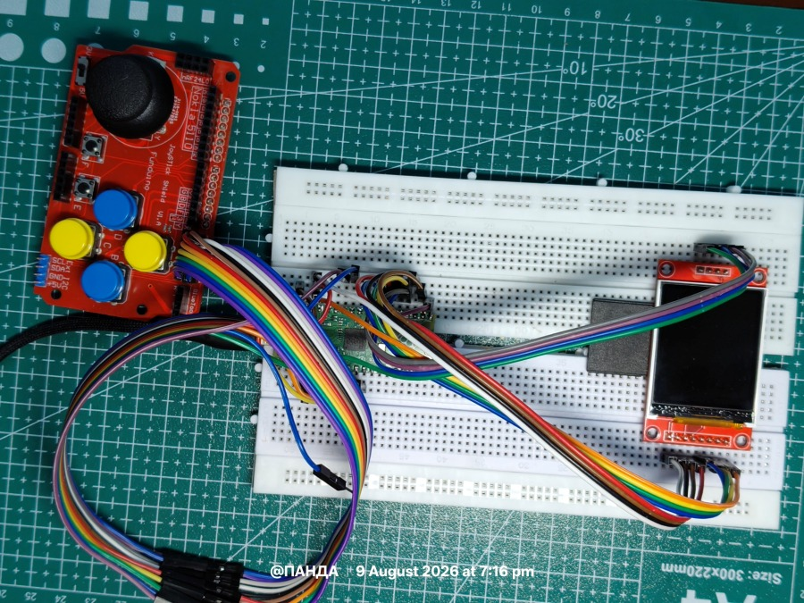
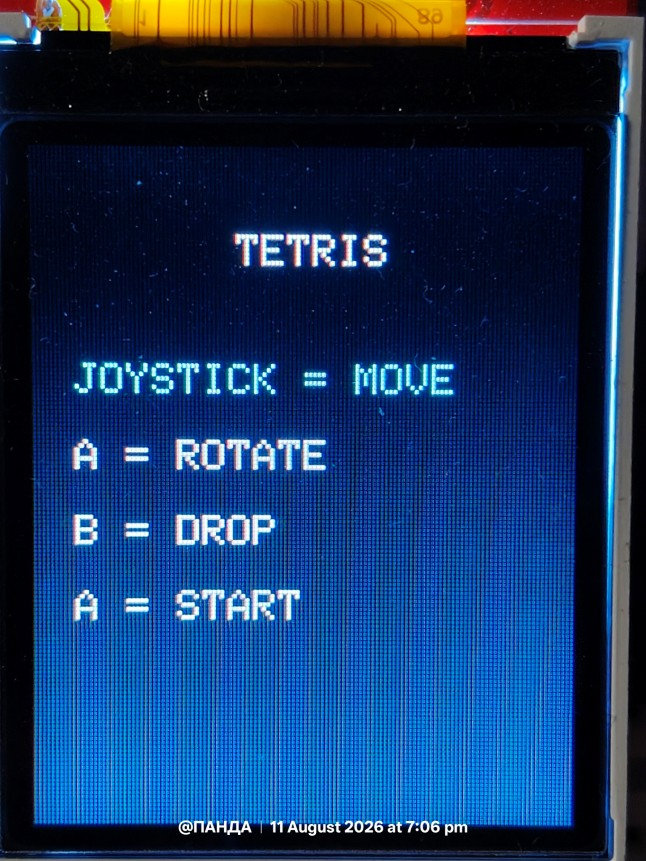
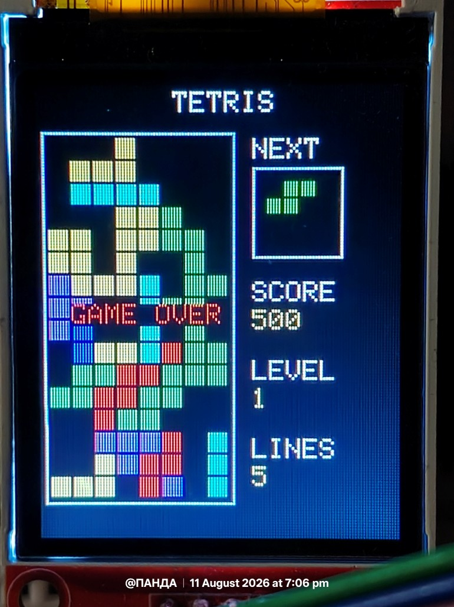

# Raspberry Pi Pico Tetris (Micro Python) — Code Documentation

## Abstract

This document provides a detailed technical walkthrough of `main.py` made in micro python, a Tetris implementation for the Raspberry Pi Pico driving an ST7735 TFT display, an analog joystick, and three push buttons. It covers the hardware interface, data structures, rendering strategy, game logic, and the input-handling model, including the edge-detection fixes applied to the button inputs and the throttled joystick movement.

---

## 1. Hardware Configuration

### 1.1 Display

The display is an ST7735 TFT driven over SPI0.

| Parameter | Value |
|---|---|
| SPI ID | 0 |
| Baudrate | 20 MHz |
| SCK | GP18 |
| MOSI | GP19 |
| CS | GP17 |
| DC | GP21 |
| RST | GP20 |

The `ST7735` driver class (imported from `st7735_dev`) exposes `fill_screen`, `fill_rectangle`, and `draw_text_fast`, which are the only three primitives this program uses to render anything.

### 1.2 Joystick

Two ADC channels read the joystick's analog axes:

| Axis | Pin | ADC Channel |
|---|---|---|
| X | GP26 | ADC0 |
| Y | GP27 | ADC1 |

### 1.3 Buttons

| Button | Pin | Function | Pull |
|---|---|---|---|
| `btn_rotate` (A) | GP3 | Rotate piece | Pull-down |
| `btn_drop` (B) | GP4 | Hard drop | Pull-down |
| `btn_pause` (K) | GP2 | Pause / resume | Pull-down |

All three are configured `Pin.IN` with `Pin.PULL_DOWN`, meaning they read `0` when unpressed and `1` when pressed (active-high, assuming the switch pulls to 3V3).


### Circuit Setup



---

## 2. Screen Layout Constants

The board and side panel positions are all derived from a handful of constants rather than hardcoded per-widget:

| Constant | Value | Meaning |
|---|---|---|
| `COLS` | 8 | Board width in cells |
| `ROWS` | 16 | Board height in cells |
| `CELL` | 8 | Pixel size of one cell |
| `BOARD_X`, `BOARD_Y` | 4, 18 | Top-left pixel of the play field |
| `BOARD_W`, `BOARD_H` | `COLS*CELL`, `ROWS*CELL` | Play field size in pixels (64×128) |
| `SIDE_X` | 76 | X-origin for the score/level/lines sidebar |
| `NEXT_BOX_X/Y/W/H` | 76, 28, 32, 32 | "Next piece" preview box |

Everything downstream (cell drawing, panel borders, text placement) references these constants, so resizing the board only requires changing this block.

---

## 3. Game Speed Constants

| Constant | Value | Meaning |
|---|---|---|
| `GRAVITY` | 600 ms | Base time between automatic downward steps at level 1 |
| `SOFT_DROP` | 80 ms | Downward step interval when the joystick is pushed down |
| `MOVE_REPEAT` | 150 ms | Minimum time between horizontal joystick moves while held |

`GRAVITY` is reduced by 40 ms per level (floored at 120 ms) in the main loop — see §8.4.

---

## 4. Piece Definitions

### 4.1 `SHAPES`

A dictionary mapping each of the seven standard tetromino letters (`I O T S Z J L`) to a list of rotation states. Each rotation state is a list of four `(x, y)` offsets relative to the piece's local origin, e.g.:

```python
"T": [
    [(1,0),(0,1),(1,1),(2,1)],   # rotation 0
    [(1,0),(1,1),(2,1),(1,2)],   # rotation 1
    [(0,1),(1,1),(2,1),(1,2)],   # rotation 2
    [(1,0),(0,1),(1,1),(1,2)]    # rotation 3
]
```

`O` has only one rotation state (a square looks the same rotated), all others have two or four.

### 4.2 `COLORS`

Maps each piece letter to a color constant imported from `colors.py` (standard Tetris guideline coloring: I=cyan, O=yellow, T=purple, S=green, Z=red, J=blue, L=orange).

### 4.3 `PIECE_TYPES`

A flat list of the seven letters, used by `random.choice()` to pick pieces.

---

## 5. Global Game State

```python
board = [[None for x in range(COLS)] for y in range(ROWS)]
piece_type = None
piece_rotation = 0
piece_x = 2
piece_y = 0
next_piece = None
score = 0
level = 1
lines = 0
paused = False
game_over = False
```

`board` is a 2D list (`ROWS` × `COLS`). Each cell is either `None` (empty) or a color constant (occupied, colored by whichever piece locked there). This same structure is reused both for collision checks and for rendering — a cell's color *is* its occupancy state.

---

## 6. Core Functions

### 6.1 `joystick(adc)`

Reads a raw 16-bit ADC value (`0`–`65535`), recenters it around the midpoint (`32768`), and scales it to roughly `-100`…`+100`:

```python
value = adc.read_u16()
value = (value - 32768) * 100 // 32768
return -value
```

The sign is inverted at the end to correct for the joystick's physical wiring orientation (this matches the axis-inversion fix from earlier work on the joystick/ST7735 interface project).

### 6.2 `get_shape()`

Returns `SHAPES[piece_type][piece_rotation]` — a convenience accessor used everywhere the current piece's cell offsets are needed.

### 6.3 `random_piece()`

Thin wrapper around `random.choice(PIECE_TYPES)`.

### 6.4 `collision(x, y, rotation)`

Given a hypothetical position and rotation, checks whether that placement is legal:

1. For each of the piece's four cells, compute absolute board coordinates.
2. Reject if the column is outside `0..COLS-1` (side walls).
3. Reject if the row is `>= ROWS` (floor).
4. Reject if the row is `>= 0` and `board[row][col]` is already occupied.

Row `< 0` (above the visible board, during spawn) is allowed through, since a piece partially above the board isn't colliding with anything yet.

This function is the single source of truth for legality — `move()`, `rotate()`, and `spawn_piece()` all call it rather than duplicating boundary logic.

### 6.5 `draw_cell(col, row, color)`

Draws one board cell as a filled rectangle at `(BOARD_X + col*CELL, BOARD_Y + row*CELL)`, sized `CELL-1` so a 1px gap is left between cells (grid effect). Rows above the board (`row < 0`) are silently skipped.

### 6.6 `draw_piece()` / `erase_piece()`

- `draw_piece()` draws all four cells of the current piece in its color.
- `erase_piece()` redraws those same four cells, but using whatever the board says should be there (either the locked color, or `BLACK` if empty).

This pair is the basis of the **dirty-rectangle** rendering approach: instead of repainting the whole board every frame, moving a piece is "erase old position → move → draw new position", touching only 4–8 cells per step rather than all 128.

### 6.7 `draw_board()`

Iterates every cell in `board` and draws it (occupied color or black). This is a full-board repaint — deliberately more expensive than `draw_piece()`/`erase_piece()`, so it's only called when the board's static contents actually changed (after a line clear, or on unpause — see §9.3) rather than every frame.

### 6.8 `draw_next()`

Clears the interior of the "next piece" preview box, then draws the next piece's rotation-0 shape scaled down (6px cells instead of 8px) inside it.

### 6.9 `draw_ui()`

The **full** screen repaint: clears the entire screen, draws the title, board border panel, "NEXT" label and box, and the SCORE/LEVEL/LINES labels and values, then calls `draw_board()`. This is expensive and is only called:

- Once at game start (`main()`).
- After a line clear (`clear_lines()`), since score/level/lines text needs updating anyway.

It is **not** called on every pause/unpause cycle (see §9.3) — that was identified as an inefficient use of the dirty-rectangle strategy and fixed.

---

## 7. Piece Lifecycle Functions

### 7.1 `spawn_piece()`

Promotes `next_piece` to `piece_type` (or picks a random one on the very first call), generates a fresh `next_piece`, and resets rotation/position to the spawn point `(x=2, y=0)`.

If the spawn position immediately collides, `game_over` is set `True` and a "GAME OVER" message is drawn — this is the standard Tetris top-out condition.

Otherwise it draws the new piece and updates the next-piece preview.

### 7.2 `move(dx, dy)`

Computes a candidate position, checks `collision()`, and if legal: erases the piece at its old position, updates `piece_x`/`piece_y`, and redraws at the new position. Returns `True`/`False` so callers (like the gravity step) can detect a blocked downward move.

### 7.3 `rotate()`

Tries the next rotation state (`(piece_rotation + 1) % len(SHAPES[piece_type])`) at the current position. If that collides, it attempts a one-cell **wall kick** to the left before giving up. This is a simplified version of the standard SRS wall-kick system — it only tries one offset rather than the full kick table, which is adequate for an 8-wide board.

### 7.4 `lock_piece()`

Writes the current piece's four cells permanently into `board`, then calls `clear_lines()` followed by `spawn_piece()` to bring in the next piece.

### 7.5 `hard_drop()`

Repeatedly calls `move(0, 1)` until it returns `False` (piece has landed), then calls `lock_piece()`.

---

## 8. Line Clearing

`clear_lines()`:

1. Builds `new_board` by keeping only rows that are **not** fully occupied (`all(cell is not None for cell in row)` identifies a full row).
2. Counts how many rows were dropped (`cleared`).
3. If nothing cleared, returns early — no redraw needed.
4. Prepends empty rows to `new_board` until it's back to `ROWS` rows, so cleared rows visually "fall" the stack down by re-inserting blank rows at the top.
5. Updates `score` (`cleared * 100 * level` — clearing multiple lines scores more than clearing them one at a time), `lines`, and recomputes `level = 1 + lines // 10` (level increases every 10 lines).
6. **Reassigns `board = new_board`.** This was a real bug in an earlier version of this file: the function computed the cleared board but never wrote it back to the global `board`, so lines visually appeared to clear on the redraw but the underlying occupancy grid never changed — subsequent collision checks still saw the "cleared" cells as full. The missing `global board` declaration and the `board = new_board` assignment fix this.
7. Calls `draw_board()` then `draw_ui()` to reflect both the new board state and the updated score/level/lines text.

---

## 9. Input Handling Model

This is the part of the code that changed most across iterations, so it's worth explaining the reasoning explicitly.

### 9.1 Two categories of input

The game has two fundamentally different kinds of input, and they're handled differently on purpose:

| Input | Nature | Handling |
|---|---|---|
| Joystick (left/right) | Continuous / analog, held-down implies "keep moving" | Time-throttled, fires repeatedly while held |
| Joystick (down) | Continuous, held implies "fall faster" | Just changes `gravity_time`, no discrete trigger needed |
| Rotate button | Discrete, one press = one action | Edge-triggered, fires once per press |
| Drop button | Discrete, one press = one action | Edge-triggered, fires once per press |
| Pause button | Discrete toggle | Edge-triggered, fires once per press |

### 9.2 Edge detection (`old_x and not old_x` pattern)

For the three buttons, each loop iteration compares the current reading against the previous iteration's reading:

```python
rotate_button = btn_rotate.value()
if rotate_button and not old_rotate:
    rotate()
old_rotate = rotate_button
```

The action only fires on the specific tick where the button transitions from *not pressed* to *pressed* — i.e. the rising edge. Without this, since the main loop runs roughly every 30 ms, a single physical button press (which typically lasts well over 100 ms) would trigger the action many times in a row. This was exactly the earlier bug: pause would toggle on/off repeatedly within one press, rotate would spin through several rotation states before the finger lifted, and hard-drop would drop, lock, spawn, and instantly drop the *next* piece too.

Note: this is edge-detection, not electrical debounce. True debounce filters out rapid electrical bounce noise from a mechanical switch (usually via a hardware RC filter or a longer software delay after the transition). What this code does is simpler — it just ensures one logical action per physical press — which is sufficient here since there's no evidence of switch-bounce artifacts, only the "fires every loop tick while held" problem.

### 9.3 Joystick horizontal throttling

Left/right movement is intentionally **not** edge-triggered, because holding the joystick to one side should keep moving the piece (like a DAS/auto-repeat system in standard Tetris), not just move it once. Instead it's throttled by elapsed time:

```python
if abs(x) > 40:
    if time.ticks_diff(now, last_move_x) >= MOVE_REPEAT:
        move(1 if x > 0 else -1, 0)
        last_move_x = now
else:
    last_move_x = now - MOVE_REPEAT
```

- `40` is the deadzone threshold (below this, the joystick is treated as centered/idle).
- The first push moves immediately (the `else` branch resets `last_move_x` far enough in the past that the very next threshold-crossing tick passes the `ticks_diff` check).
- While held past the threshold, it repeats every `MOVE_REPEAT` (150 ms) rather than every 30 ms loop tick — this was the fix for "joystick too fast," where every single loop iteration was previously counted as a move.

### 9.4 Efficient pause/resume redraw

On pausing, only a "PAUSED" text string is drawn over the existing screen — no clearing, no rebuild.

On resuming, the fix uses:

```python
draw_board()
draw_piece()
```

instead of the earlier `draw_ui()` + `draw_piece()`. `draw_ui()` blanks the entire screen and redraws the title, both panel borders, the next-piece box, and all three sidebar labels — none of which changed while paused. `draw_board()` alone repaints just the 128 board cells (still not a true minimal dirty-rectangle redraw, since the "PAUSED" text isn't the *only* thing that needs clearing, but it's a large reduction from a full-screen wipe) and is consistent with the erase/redraw philosophy used everywhere else in the piece-movement code.

---

## 10. Main Loop (`main()`)

Structure per iteration, in order:

1. **Pause button check** (edge-triggered). If paused and `game_over` was already `True`, pressing pause restarts the game by recursively calling `main()`. Otherwise it toggles `paused`.
2. **Early exit if paused or over**: `time.sleep_ms(50); continue` — skips all game logic, just idles and re-polls.
3. **Horizontal joystick** (throttled, §9.3).
4. **Rotate button** (edge-triggered).
5. **Hard drop button** (edge-triggered); also resets `last_gravity` so gravity doesn't immediately fire again right after a hard drop.
6. **Vertical joystick** — sets `gravity_time` to `SOFT_DROP` if pushed down past the threshold, otherwise computes level-scaled gravity: `max(120, GRAVITY - (level-1)*40)`.
7. **Gravity step** — if enough time (`gravity_time`) has elapsed since the last automatic drop, attempt `move(0, 1)`; if that fails (piece has landed), call `lock_piece()`.
8. `time.sleep_ms(30)` — a fixed ~30 ms loop delay, which sets the effective input-polling rate for everything above.

### 10.1 Restart flow

Pressing pause while `game_over` is `True` calls `main()` again (a fresh game) and `return`s out of the current (now-orphaned) invocation. This is a recursive restart rather than a loop-based reset — functionally fine for this program's depth, though on very constrained MicroPython stacks repeated restarts across a long play session could theoretically accumulate stack frames, since each `main()` call never actually returns from the *previous* invocation's perspective until the whole program is powered off. In practice this generally is not an issue for a session of this length.

---

## 11. Program Entry

```python
main()
```

At import time, `main()` is called once at module scope, which runs `start_screen()` (waits for the rotate button to be pressed, no debounce needed here since it's a one-shot wait) and then falls into the main loop described above.

---

## 12. Summary of Fixes Applied During Development

| Bug | Cause | Fix |
|---|---|---|
| Joystick moved too fast after debounce removal | No throttle on continuous joystick polling | Added `MOVE_REPEAT` time-based throttle |
| Lines never actually cleared | `clear_lines()` computed `new_board` but never reassigned it to the global `board` | Added `global board` and `board = new_board` |
| Pause toggled rapidly / rotate spun through states / hard drop repeated instantly | Buttons fired on every ~30 ms loop tick while held, not once per press | Reintroduced edge-detection (`button and not old_button`) for pause, rotate, and drop |
| Inefficient redraw on unpause | `draw_ui()` did a full screen wipe and rebuild of static UI elements that never changed | Replaced with `draw_board()` + `draw_piece()` |


## 13 Output 

<table>
  <tr>
    <td align="center">
      
      <br>Home Screen
    </td>
    <td align="center">
      
      <br>High Score & Game Over 
    </td>
  </tr>
</table>

## Author’s Viewpoint

This MicroPython Tetris project was developed as a practical way to explore embedded programming beyond simple sensor and display experiments. The goal was not only to recreate a familiar game, but also to understand how a microcontroller handles real-time input, graphics, memory, timing, and game logic within limited hardware resources.

Developing Tetris on the Raspberry Pi Pico provided valuable hands-on experience with MicroPython and the ST7735 TFT display. Implementing falling blocks, collision detection, rotation, line clearing, scoring, and button-based controls required careful consideration of both software logic and hardware limitations.

From the author’s perspective, the project demonstrates that even a small microcontroller can support an interactive graphical application when the software is designed efficiently. It also serves as a bridge between basic embedded programming experiments and more complex projects involving real-time systems, user interfaces, and hardware–software integration.

Ultimately, this project was built not merely to play Tetris, but to learn how an embedded system can be pushed from controlling individual components to running a complete, interactive application. 
