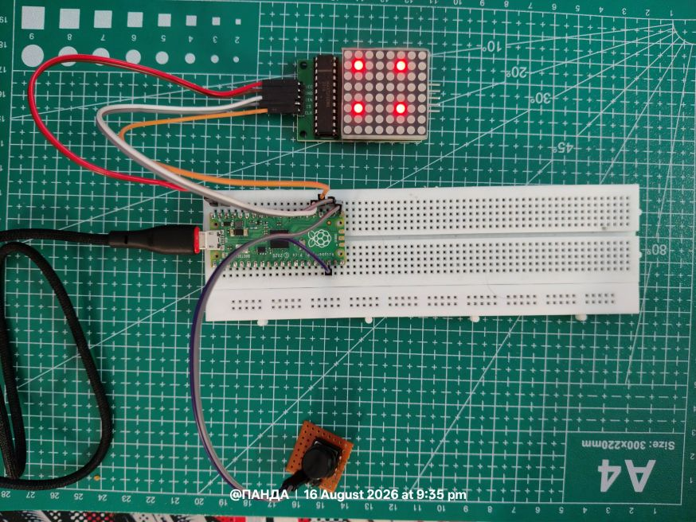
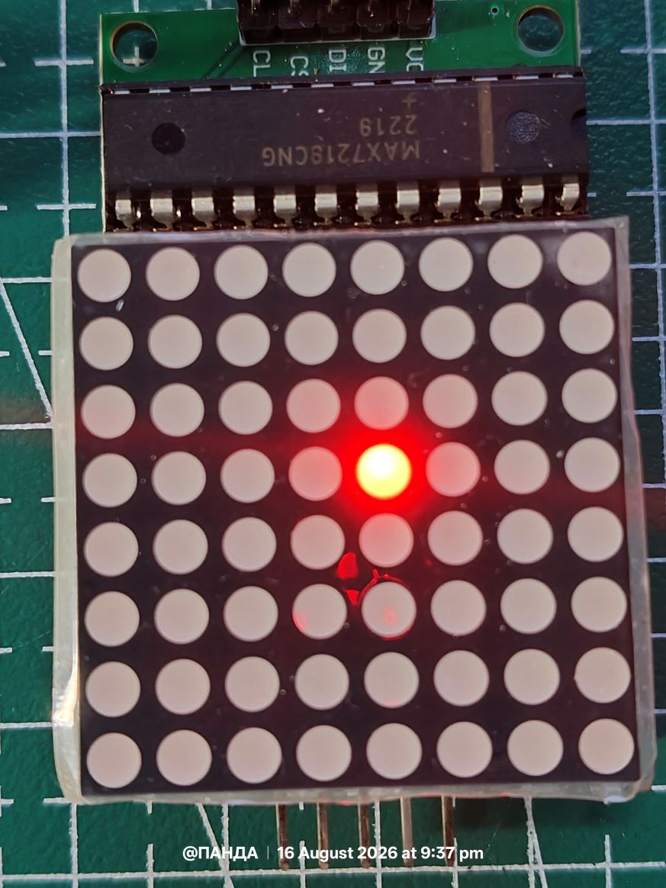
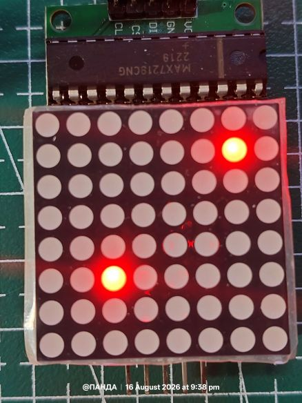
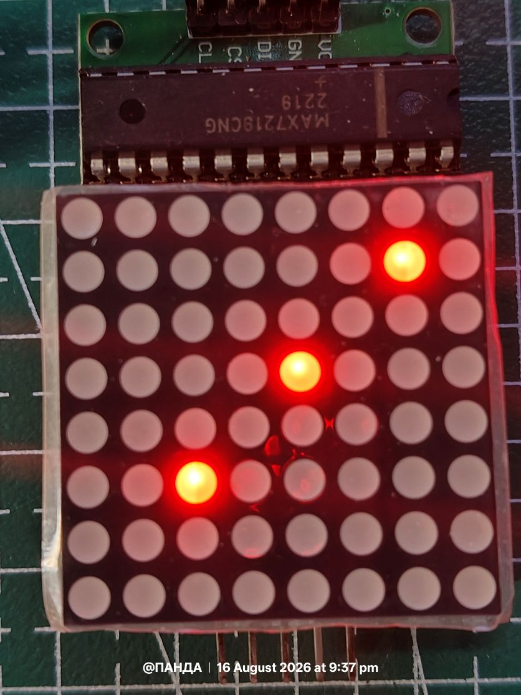
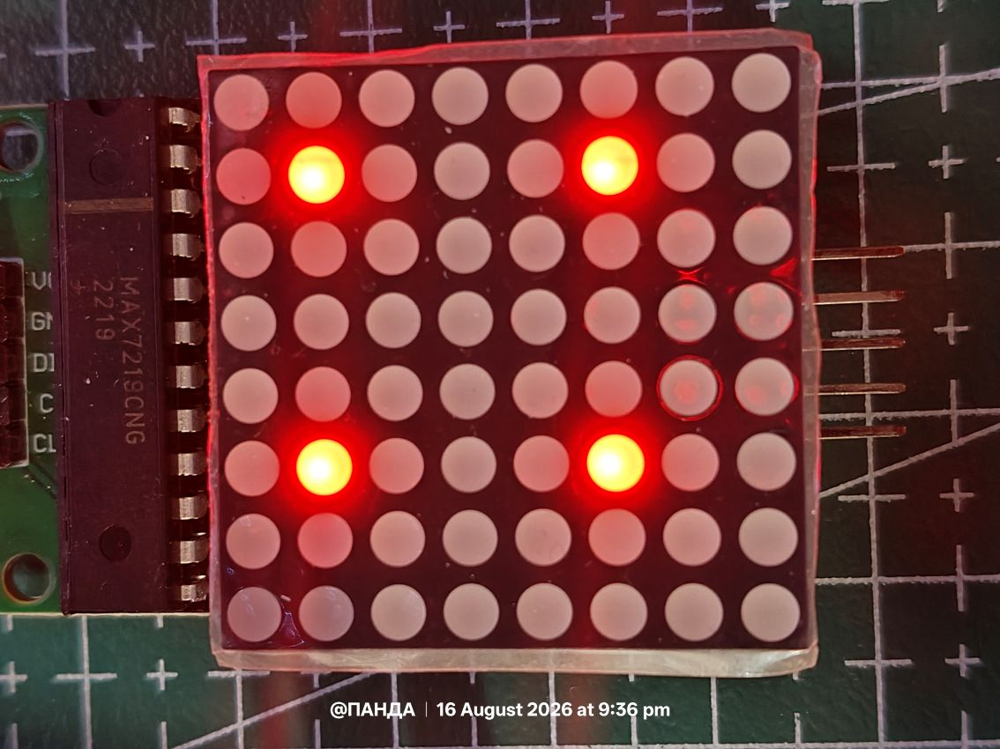
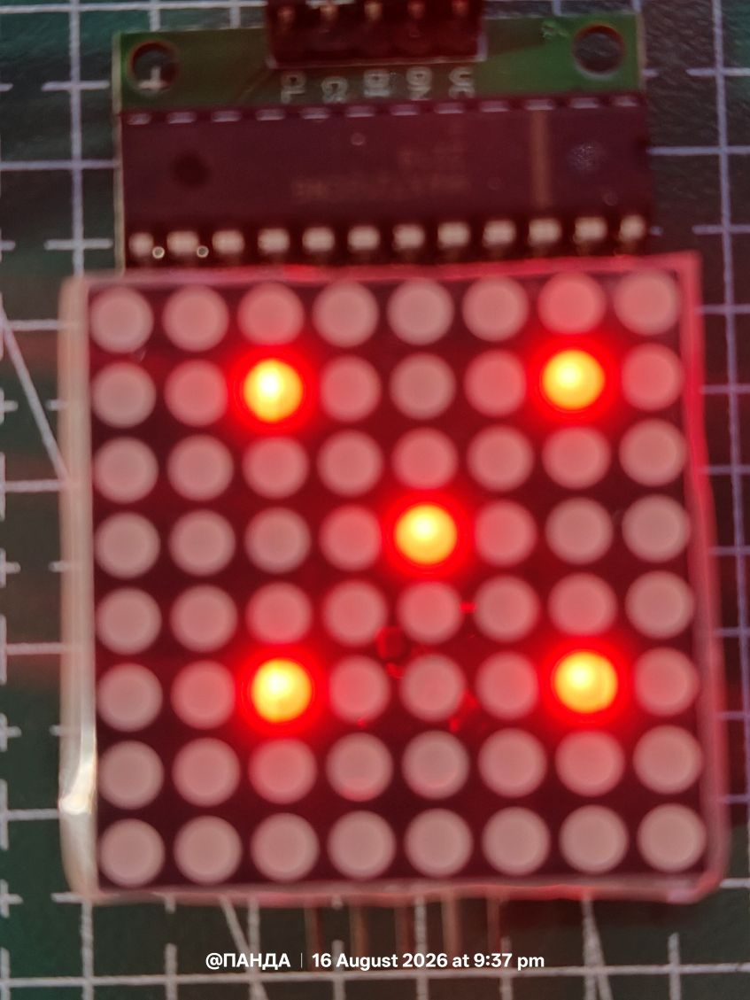
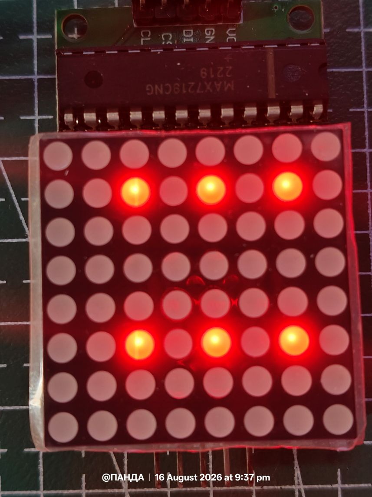

# Button-Triggered Dice Roller

Simulates rolling a six-sided die on an 8x8 LED matrix. Press a button,
watch the die "tumble" through random faces for a moment, then land on a
result - pip pattern shown on the matrix, number printed to the console.

## Hardware

| Component | Pico pin | Notes |
|----------------|----------|-------------------------------------------|
| MAX7219 VCC | 3V3 | Power |
| MAX7219 GND | GND | Ground |
| MAX7219 DIN | GPIO19 | SPI MOSI |
| MAX7219 CS | GPIO17 | Chip select |
| MAX7219 CLK | GPIO18 | SPI clock |
| Button, leg 1 | GPIO16 | Configured with internal pull-up |
| Button, leg 2 | GND | No external resistor needed |

Idle state: GPIO16 reads **HIGH** (pulled up internally). Pressed: the
button shorts the pin to GND, so it reads **LOW**. All the button logic
in the script assumes this active-low behavior.


## Circuit 



---


# Output

### Dice Faces

<table>
 <tr>
 <td align="center"><br>1</td>
 <td align="center"><br>2</td>
 <td align="center"><br>3</td>
 </tr>
 <tr>
 <td align="center"><br>4</td>
 <td align="center"><br>5</td>
 <td align="center"><br>6</td>
 </tr>
</table>


## Setup sequence

Same five MAX7219 register writes used across the whole project:

```python
write_reg(0x0C, 0x01) # shutdown -> normal operation
write_reg(0x09, 0x00) # decode mode -> raw bitmap, no BCD decode
write_reg(0x0B, 0x07) # scan limit -> drive all 8 rows
write_reg(0x0A, 0x08) # intensity -> medium brightness
write_reg(0x0F, 0x00) # display test -> off
```


##


## Dice face bitmaps

Each face is an 8-byte list - one byte per row, bit 7 = leftmost column.
Pips sit on a 3x3 grid at rows/columns **1, 3, 5**, which keeps them
roughly centered with a margin on all sides:

```
col: 0 1 2 3 4 5 6 7
row1: . TL . . . TR . .
row3: . ML . C . MR . .
row5: . BL . . . BR . .
```

| Face | Pips lit | Byte pattern (row1, row3, row5) |
|------|----------------------------|-----------------------------------|
| 1 | Center | `0x00, 0x10, 0x00` |
| 2 | TL, BR | `0x40, 0x00, 0x04` |
| 3 | TL, Center, BR | `0x40, 0x10, 0x04` |
| 4 | TL, TR, BL, BR | `0x44, 0x00, 0x44` |
| 5 | TL, TR, Center, BL, BR | `0x44, 0x10, 0x44` |
| 6 | TL, TR, ML, MR, BL, BR | `0x44, 0x44, 0x44` |

Rows 0, 2, 4, 6, 7 are always `0x00` - they only exist as spacing.

## The debounce core: `_wait_for_stable()`

This is the part worth understanding closely, since it's what fixed the
earlier misfiring (a single button press producing many rolls).

```python
def _wait_for_stable(target_value, stable_ms=50, poll_ms=5):
 while True:
 if button.value() == target_value:
 t0 = ticks_ms()
 stable = True
 while ticks_diff(ticks_ms(), t0) < stable_ms:
 if button.value() != target_value:
 stable = False
 break
 sleep(poll_ms / 1000)
 if stable:
 return
 sleep(poll_ms / 1000)
```

Step by step:

1. Poll the pin every `poll_ms` (5ms) until it first reaches
 `target_value` (0 for "pressed", 1 for "released").
2. Once it does, start a `stable_ms` (50ms) window and keep re-checking
 the pin every 5ms **inside that window**.
3. If the pin changes away from `target_value` at any point during the
 window - a bounce, a loose contact, electrical noise - `stable` is
 set to `False`, the inner loop breaks, and the whole thing starts
 over from step 1.
4. Only if the pin holds steady for the *entire* 50ms does the function
 return.

This is stronger than a "sleep 30ms then check once" debounce: that
approach only samples the pin at a single instant after the delay, so a
bounce that happens to land outside that one sample slips through
undetected. Requiring continuous stability across the whole window
closes that gap.

`wait_for_press()` and `wait_for_release()` are thin wrappers calling
this with `target_value=0` and `target_value=1` respectively.

## Main flow

```python
show(ALL_OFF)

while True:
 if wait_for_press():
 roll_animation(duration_ms=600, step_ms=60)
 result = random.randint(1, 6)
 show(FACES[result])
 print("Rolled:", result)
 wait_for_release()
```

1. Matrix starts blank.
2. Block until a confirmed, stable button press is detected.
3. Run `roll_animation()` - every `step_ms` (60ms) for `duration_ms`
 (600ms total, so ~10 flashes), show a random face to simulate
 tumbling.
4. Pick the real result with `random.randint(1, 6)` and display it.
5. Print the result over serial.
6. Block until the button is confirmed released before allowing another
 roll - this is what stops one long press from triggering repeated
 rolls.

## Tuning

- **Roll speed / suspense** - `roll_animation(duration_ms=600, step_ms=60)`. Lower `step_ms` = faster flicker; higher `duration_ms` = longer wait before the result.
- **Debounce strictness** - `stable_ms=50` in `_wait_for_stable()`. Raise it if you're still seeing misfires (e.g. `70`-`100`); lower it (e.g. `30`) for a snappier feel once you're confident the wiring is solid.
- **Brightness** - register `0x0A`, currently `0x08`. Range is `0x00` (dim) to `0x0F` (max).

## Possible extensions

- **Two-dice mode** - roll twice, split the 8 columns into two 4-wide
 halves, show one die per half.
- **Roll history** - append each `result` to a list and print running
 totals or stats over serial.
- **Weighted / loaded die** - swap `random.randint(1, 6)` for
 `random.choices([1,2,3,4,5,6], weights=[...])` if MicroPython's
 `random` module on your build supports it, otherwise implement a
 simple weighted pick manually.
