# Introduction

The **Raspberry Pi Pico** is a low-cost microcontroller development board introduced by the Raspberry Pi Foundation in **January 2021**. It is built around the **RP2040** microcontroller, the first microcontroller chip designed in-house by Raspberry Pi. The Pico was created to provide an affordable yet powerful platform for learning embedded systems, electronics, and hardware programming.

Unlike a single-board computer such as the Raspberry Pi 4, the Raspberry Pi Pico is a **microcontroller board**. It does not run a full operating system like Linux. Instead, it executes a single program stored in its onboard flash memory, making it ideal for real-time applications, robotics, automation, sensor interfacing, and Internet of Things (IoT) projects.

This repository focuses on the **original Raspberry Pi Pico (2021)**, which features the **RP2040** microcontroller and **does not include built-in Wi-Fi or Bluetooth connectivity**. All networking capabilities, if required, must be added using external modules.

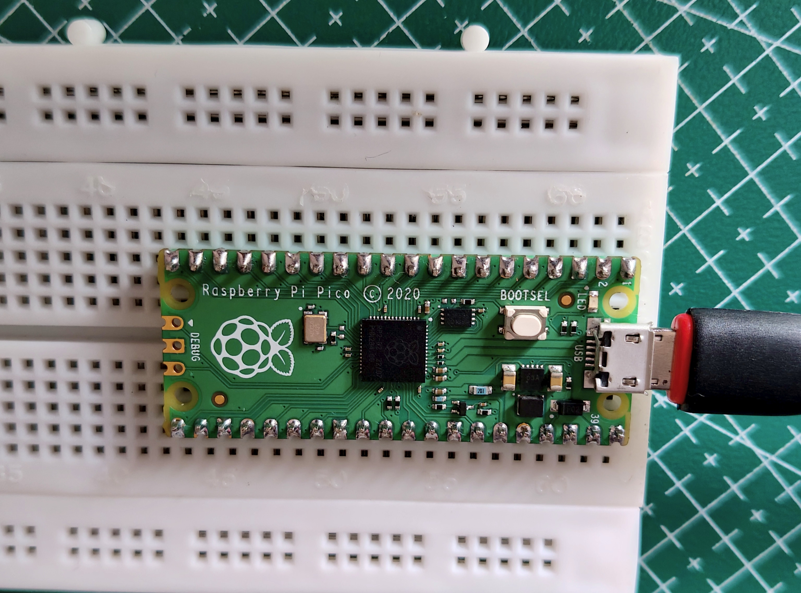

---

## Key Features

- Dual-core ARM Cortex-M0+ processor running at up to **133 MHz**
- **264 KB** of on-chip SRAM
- **2 MB** of onboard QSPI flash memory
- **26** multifunction GPIO pins
- Support for **I²C, SPI, UART, PWM, ADC, and PIO (Programmable I/O)**
- USB 1.1 device and host support
- Low-power operation suitable for battery-powered applications
- Programmable using **CircuitPython, MicroPython, C/C++, Arduino**, and other supported SDKs

---

## Repository Goal

The objective of this repository is to document the process of learning embedded systems using the Raspberry Pi Pico through a series of practical experiments and projects. Each project is organized with source code, circuit diagrams, explanations, and demonstrations to provide a structured learning path from basic GPIO control to advanced peripheral interfacing.

---

# Getting Started

Before programming the Raspberry Pi Pico, you need to flash a compatible firmware onto the board. The Pico supports multiple programming environments, with **MicroPython** and **CircuitPython** being the most popular choices.

---

# Installing MicroPython

MicroPython is a lightweight implementation of Python designed specifically for microcontrollers. It is officially supported by the Raspberry Pi Foundation and is an excellent choice for embedded systems development.

## Requirements

- Raspberry Pi Pico
- USB Type-A to Micro-USB cable (Data Cable)
- A computer running Windows, Linux, or macOS
- Latest MicroPython UF2 firmware

## Step 1: Download the Firmware

Download the latest MicroPython UF2 firmware from the official website.

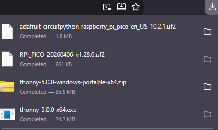

https://micropython.org/download/rp2-pico/

---

## Step 2: Enter BOOTSEL Mode

1. Press and hold the **BOOTSEL** button.
2. While holding the button, connect the Pico to your computer using a USB cable.
3. Release the button once the board is detected.

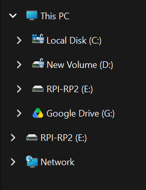

The Pico will appear as a USB mass storage device named **RPI-RP2**.

---

## Step 3: Flash the Firmware

1. Copy the downloaded `.uf2` firmware file onto the **RPI-RP2** drive.

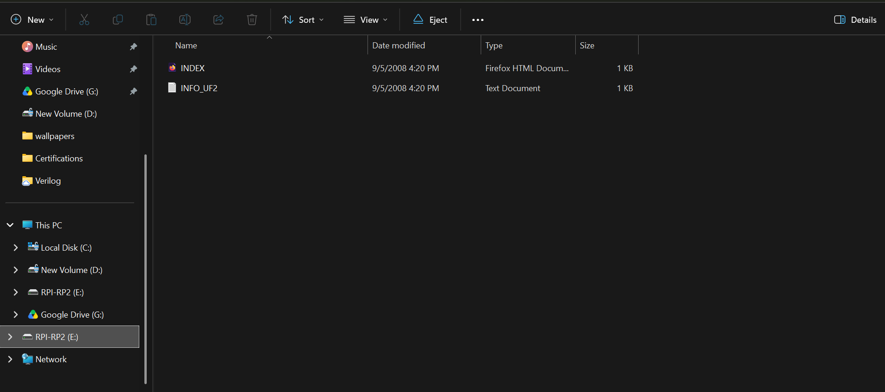

2. Wait a few seconds for the file transfer to complete.

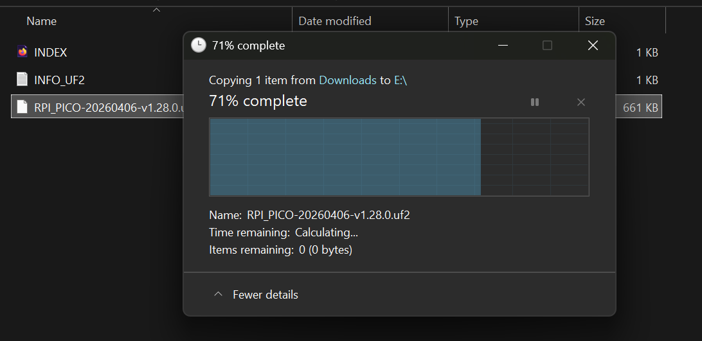

The board will automatically reboot and the **RPI-RP2** drive will disappear.

MicroPython is now installed.

---

## Step 4: Verify the Installation

Open **Thonny IDE**.

Navigate to

```
Run → Select Interpreter
```

Choose

```
MicroPython (Raspberry Pi Pico)
```

Click **OK**.

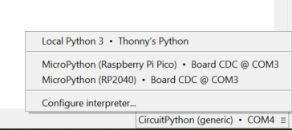

Open the Shell.

If everything is installed correctly, you'll see something similar to

```python
MicroPython v1.xx.x on 202x-xx-xx
Type "help()" for more information.
>>>
```

Congratulations! Your Raspberry Pi Pico is now ready to run MicroPython programs.

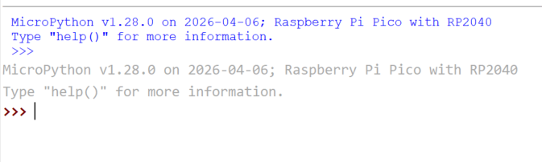

---

# Installing CircuitPython

CircuitPython is a beginner-friendly fork of MicroPython developed by Adafruit. It allows you to edit files directly on the Pico without uploading firmware every time you make changes.

## Requirements

- Raspberry Pi Pico
- USB Type-A to Micro-USB cable
- A computer running Windows, Linux, or macOS
- Latest CircuitPython UF2 firmware

## Step 1: Download the Firmware

Download the latest CircuitPython firmware.


https://circuitpython.org/board/raspberry_pi_pico/

---

## Step 2: Enter BOOTSEL Mode

1. Disconnect the Pico.
2. Hold the **BOOTSEL** button.
3. Connect the Pico to your computer.
4. Release the button.

The board will appear as **RPI-RP2**.

---

## Step 3: Flash the Firmware

Copy the downloaded CircuitPython `.uf2` file to the **RPI-RP2** drive.

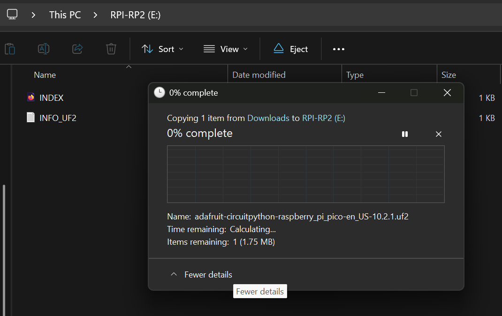

The board will reboot automatically.

---

## Step 4: Verify the Installation

After rebooting, a new USB drive named

```
CIRCUITPY
```

will appear.

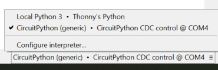

This confirms that CircuitPython has been installed successfully.

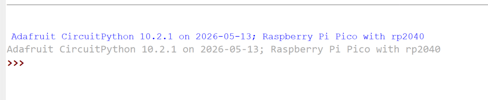

Inside the drive you'll find files similar to

```
boot_out.txt
code.py
lib/
```

The `code.py` file runs automatically whenever the Pico powers on.

---

## Using Thonny with CircuitPython

Open **Thonny IDE**.

Navigate to

```
Run → Select Interpreter
```

Select

```
CircuitPython (Generic)
```

or the appropriate CircuitPython interpreter available in your version of Thonny.

Open the Shell.

You should see

```python
Adafruit CircuitPython x.x.x on 202x-xx-xx
>>>
```

Your Raspberry Pi Pico is now ready for CircuitPython development.

---

# How to View Files Inside the Raspberry Pi Pico

## Using Thonny (Recommended)

1. Connect the Raspberry Pi Pico to your computer.
2. Open **Thonny IDE**.
3. Navigate to

```
View → Files
```

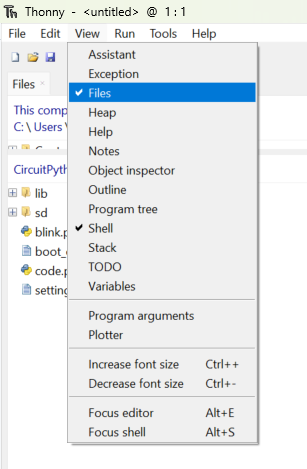

4. Select **MicroPython Device** or **CircuitPython Device**.

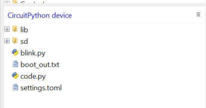

5. You'll see all files stored on the Pico, including

- `boot.py`
- `main.py`
- `code.py` (CircuitPython)
- Other Python files

6. To delete a file, right-click it and select **Delete**.

---

Happy Hacking! 🚀
