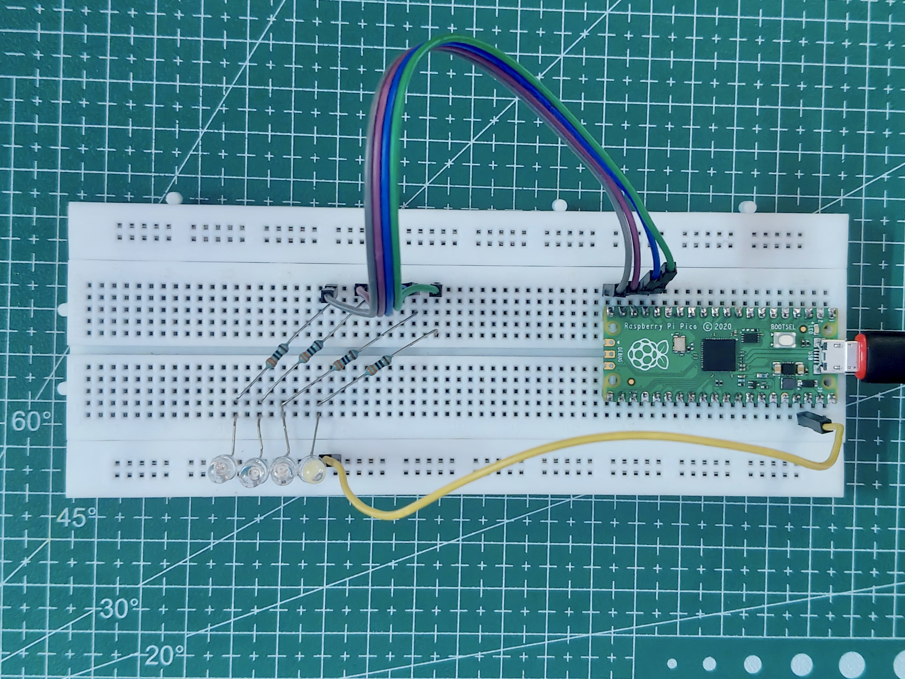
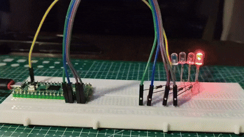
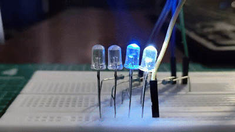
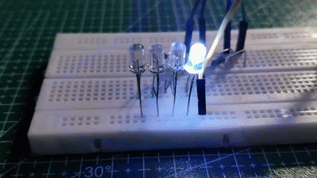
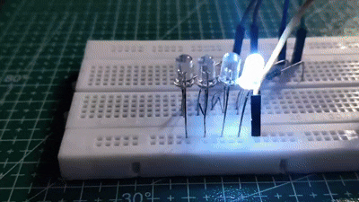
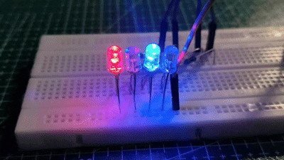

# Multiple LED Control using Raspberry Pi Pico (MicroPython)

## Overview

This project demonstrates how to control multiple external LEDs using the Raspberry Pi Pico programmed with **MicroPython**. Four LEDs are connected to individual GPIO pins, and different lighting patterns are implemented to introduce fundamental embedded programming concepts such as GPIO output, loops, lists, indexing, and timing.

---

## Objectives

- Learn how to interface multiple LEDs with the Raspberry Pi Pico.
- Understand digital GPIO output in MicroPython.
- Create different LED patterns using loops and timing.
- Practice writing clean and reusable embedded code.

---

## Components Required

| Component | Quantity |
|----------|---------:|
| Raspberry Pi Pico | 1 |
| LEDs (Any Color) | 4 |
| 330 Ω Resistors | 4 |
| Breadboard | 1 |
| Jumper Wires | As Required |
| USB Cable | 1 |

---

## GPIO Connections

| GPIO Pin | LED |
|:--------:|:---:|
| GP12 | LED 1 |
| GP13 | LED 2 |
| GP14 | LED 3 |
| GP15 | LED 4 |

Each LED is connected through its own **330 Ω current-limiting resistor**, while all cathodes are connected to a common **GND rail (Common Cathode Configuration).**

---

# Connections



> **Note:** Please verify the Raspberry Pi Pico physical pinout before making any connections. The official pinout diagram is available on the Raspberry Pi website.

---

# Pattern 1 - Running LED

## Description

One LED lights up at a time from **LED 1 → LED 2 → LED 3 → LED 4**, creating a simple running light effect.

### Sequence

```text
① → ② → ③ → ④
```

### Concepts Covered

- GPIO Output
- Lists
- For Loops
- Sequential GPIO Control

### Demonstration

**With Circuit Setup**



**Output**



---

# Pattern 2 - Ping Pong

## Description

The LEDs move from left to right and then reverse direction, creating a bouncing (Ping Pong) animation.

### Sequence

```text
① → ② → ③ → ④
 ↓
① ← ② ← ③ ← ④
```

### Concepts Covered

- Forward Iteration
- Reverse Iteration
- Indexing

### Demonstration



---

# Pattern 3 - Fill and Empty

## Description

The LEDs gradually turn ON one by one until all LEDs are illuminated. They then turn OFF one by one in reverse order.

### Sequence

```text
①

① ②

① ② ③

① ② ③ ④

↓

① ② ③

↓

① ②

↓

①
```

### Concepts Covered

- Progressive GPIO Control
- Reverse Traversal
- Animation Logic

### Demonstration



---

# Pattern 4 - Alternate Pair

## Description

Two alternate LEDs blink together while the other two remain OFF. The pattern then switches, creating an alternating lighting effect.

### Sequence

```text
State 1

① ③

↓

State 2

② ④

↓

Repeat
```

### Concepts Covered

- Multiple GPIO Output
- Simultaneous Pin Control
- Timing Control
- Pattern Generation

### Demonstration



---

# Expected Output

- Four LEDs connected to the Raspberry Pi Pico display different lighting patterns.
- Each pattern demonstrates a different programming technique using MicroPython.

---

# Applications

- Learning GPIO Programming
- Embedded Systems Fundamentals
- LED Pattern Generation
- Robotics Indicators
- Educational Demonstrations

---

# What You'll Learn

- Configuring GPIO pins in MicroPython
- Controlling multiple outputs simultaneously
- Using loops efficiently
- Organizing code for scalability
- Creating basic LED animations

---

# Future Improvements

- PWM Brightness Control
- Push Button Pattern Selection
- RGB LED Control
- Binary Counter
- Traffic Light Simulation
- Random LED Animations
- Knight Rider (Larson Scanner)
- Morse Code Transmitter

---

# License

This project is licensed under the **MIT License**.
