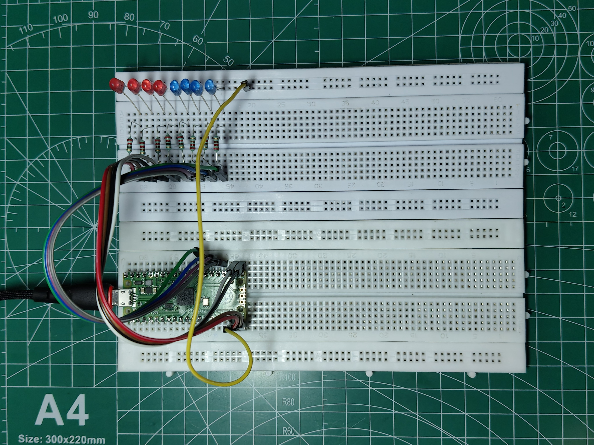
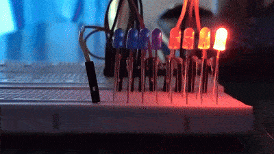
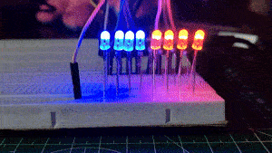
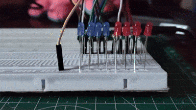
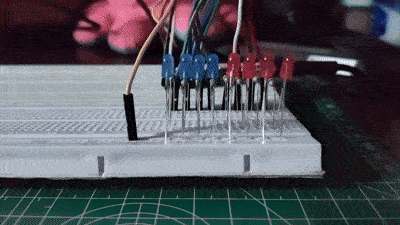
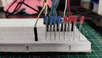
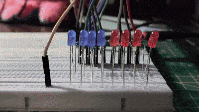

# 8-Bit LED Manipulation using Raspberry Pi Pico

An educational Raspberry Pi Pico project demonstrating **8-bit binary operations** using eight LEDs. This project visualizes binary numbers and fundamental bitwise operations commonly used in **Digital Electronics**, **Microprocessors**, and **Embedded Systems**.

---

## Demo

### Circuit Setup

<p align="center">
 
</p>

---

## Hardware Used

- Raspberry Pi Pico
- Breadboard
- 8 × LEDs
 - 4 × Blue LEDs (MSB Nibble)
 - 4 × Red LEDs (LSB Nibble)
- 8 × 220 Ω Resistors
- Jumper Wires
- USB Cable

---

## GPIO Mapping

| Bit | GPIO | LED |
|:---:|:----:|:---:|
| D7 (MSB) | GP21 | 🔵 |
| D6 | GP20 | 🔵 |
| D5 | GP19 | 🔵 |
| D4 | GP18 | 🔵 |
| D3 | GP17 | 🔴 |
| D2 | GP16 | 🔴 |
| D1 | GP15 | 🔴 |
| D0 (LSB) | GP14 | 🔴 |

---

## Project Structure

```
03_8Bit_LED_Manipulation
│
├── Assets
│ ├── and.gif
│ ├── circuit.jpg
│ ├── counter.gif
│ ├── or.gif
│ ├── shifter.gif
│ ├── test.gif
│ └── xor.gif
│
├── 01_LED_Test.py
├── 02_Binary_Counter.py
├── 03_Shifters.py
├── 04_Bitwise_AND.py
├── 05_Bitwise_OR.py
├── 06_Bitwise_XOR.py
│
└── README.md
```

---

# Experiment 1 - LED Test

Sequentially tests every LED connected to the Raspberry Pi Pico to verify correct wiring and GPIO mapping.

## Demo

<p align="center">
 
</p>

---

# Experiment 2 - Binary Counter

Displays decimal numbers from **0 to 255** in binary using the eight LEDs.

## Demo

<p align="center">
 
</p>

### Sample Serial Output

```text
Decimal: 0 Binary: 00000000
Decimal: 1 Binary: 00000001
Decimal: 2 Binary: 00000010
...
Decimal: 254 Binary: 11111110
Decimal: 255 Binary: 11111111
```

---

# Experiment 3 - Bit Shifters

Demonstrates **Left Shift (<<)** and **Right Shift (>>)** operations.

## Demo

<p align="center">
 
</p>

### Sample Serial Output

```text
LEFT SHIFT (<<)

00000001
00000010
00000100
00001000
00010000
00100000
01000000
10000000

RIGHT SHIFT (>>)

10000000
01000000
00100000
00010000
00001000
00000100
00000010
00000001
```

---

# Experiment 4 - Bitwise AND

Performs the Bitwise **AND (&)** operation on predefined 8-bit values and displays the result on the LEDs.

## Demo

<p align="center">
 
</p>

### Sample Serial Output

```text
--------------------------------
 BITWISE AND (&)
--------------------------------
A : 11001100
B : 10101010
----------------
Result : 10001000

--------------------------------
 BITWISE AND (&)
--------------------------------
A : 11110000
B : 00001111
----------------
Result : 00000000

--------------------------------
 BITWISE AND (&)
--------------------------------
A : 11111111
B : 01010101
----------------
Result : 01010101

--------------------------------
 BITWISE AND (&)
--------------------------------
A : 00111100
B : 11110000
----------------
Result : 00110000

--------------------------------
 BITWISE AND (&)
--------------------------------
A : 10011001
B : 01100110
----------------
Result : 00000000
```

---

# Experiment 5 - Bitwise OR

Performs the Bitwise **OR (|)** operation on predefined 8-bit values.

## Demo

<p align="center">
 
</p>

### Sample Serial Output

```text
--------------------------------
 BITWISE OR (|)
--------------------------------
A : 11001100
B : 10101010
----------------
Result : 11101110

--------------------------------
 BITWISE OR (|)
--------------------------------
A : 11110000
B : 00001111
----------------
Result : 11111111

--------------------------------
 BITWISE OR (|)
--------------------------------
A : 11111111
B : 01010101
----------------
Result : 11111111

--------------------------------
 BITWISE OR (|)
--------------------------------
A : 00111100
B : 11110000
----------------
Result : 11111100

--------------------------------
 BITWISE OR (|)
--------------------------------
A : 10011001
B : 01100110
----------------
Result : 11111111
```

---

# Experiment 6 - Bitwise XOR

Demonstrates the Bitwise **Exclusive OR (^)** operation.

## Demo

<p align="center">
 
</p>

### Sample Serial Output

```text
--------------------------------
 BITWISE XOR (^)
--------------------------------
A : 11001100
B : 10101010
----------------
Result : 01100110

--------------------------------
 BITWISE XOR (^)
--------------------------------
A : 11110000
B : 00001111
----------------
Result : 11111111

--------------------------------
 BITWISE XOR (^)
--------------------------------
A : 11111111
B : 01010101
----------------
Result : 10101010

--------------------------------
 BITWISE XOR (^)
--------------------------------
A : 00111100
B : 11110000
----------------
Result : 11001100
```

---

# Learning Outcomes

After completing this project, you will understand:

- Binary Number Representation
- 8-bit Data Representation
- GPIO Programming using MicroPython
- Binary Counting
- Left and Right Bit Shifting
- Bitwise AND
- Bitwise OR
- Bitwise XOR
- LED-based Binary Visualization
- Basic Embedded Systems Programming

---

## Future Improvements

- Bitwise NOT Operation
- Binary Addition
- Binary Subtraction
- Overflow Demonstration
- Hexadecimal Display
- 16×2 LCD Integration
- Interactive 8-bit Binary Calculator
- ALU Simulation
