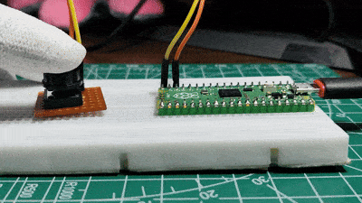
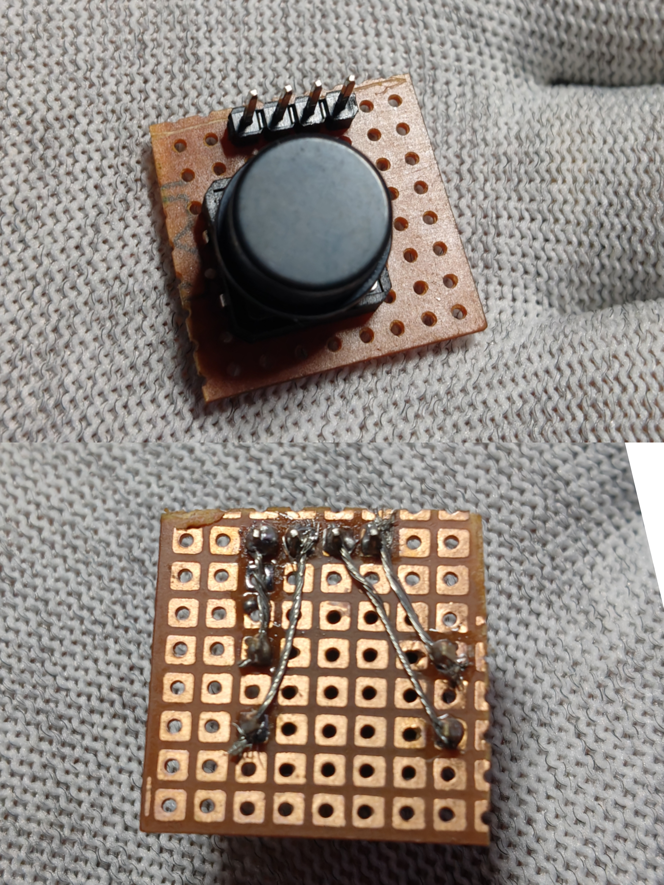
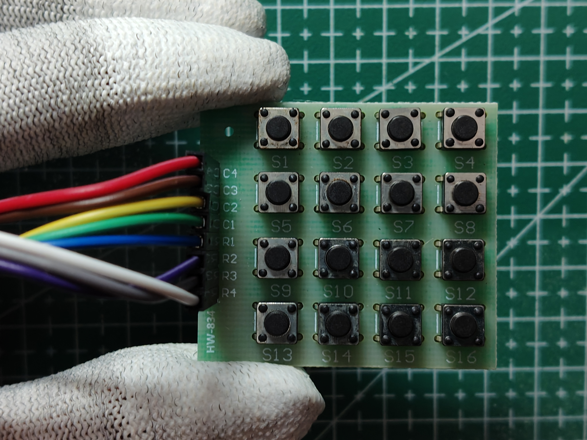
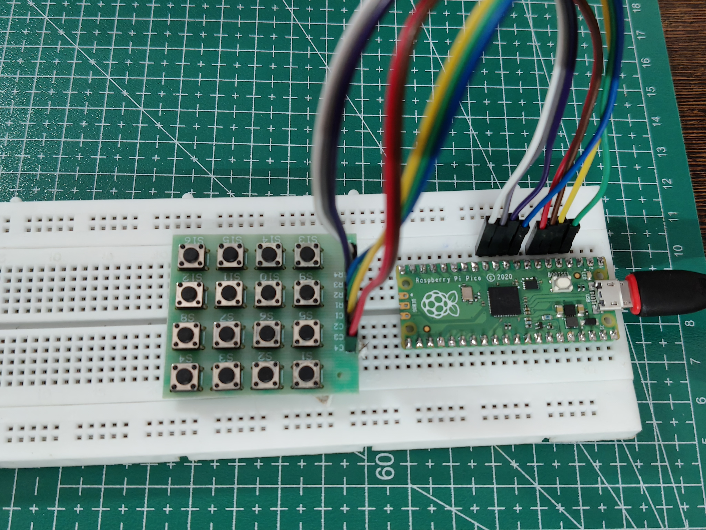
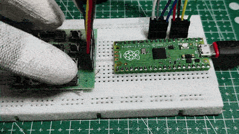

# Raspberry Pi Pico Button & Switches

Learn how to interface digital input devices with the Raspberry Pi Pico using MicroPython.

This chapter introduces the fundamentals of digital inputs by working with a single push button and a 4×4 matrix keypad. These components form the basis for many embedded systems such as calculators, password locks, menu-driven interfaces, gaming controllers, vending machines, and industrial control panels.

---

## Components Required

- Raspberry Pi Pico
- Breadboard
- Push Button
- 4×4 Matrix Keypad
- Jumper Wires
- USB Cable

---

# Push Button

A push button is one of the simplest digital input devices used in embedded systems. It has only two states:

- **Pressed**
- **Released**

The Raspberry Pi Pico reads these states as digital logic levels (HIGH or LOW), allowing software to react whenever the button is pressed.

---

## GPIO Connection

| Push Button | Raspberry Pi Pico |
|-------------|-------------------|
| One Terminal | GP15 |
| Other Terminal | GND |

The internal pull-up resistor is enabled in software, eliminating the need for an external resistor.

---

## Experiment 1 - Button Controlled Onboard LED

In this experiment, the onboard LED directly follows the button state.

- Press Button → LED ON
- Release Button → LED OFF

### Demonstration




---

## DIY Button Module

Many large tactile switches have soft or wide leads that do not fit securely into a breadboard. A simple workaround is to solder the switch onto a small piece of perfboard and add a 4-pin header.

This creates a reusable button module that plugs directly into a breadboard while providing much better mechanical stability.



---

# 4×4 Matrix Keypad

A 4×4 matrix keypad combines sixteen push buttons while requiring only eight GPIO pins.

Instead of dedicating one GPIO pin to every button, the keys are arranged in rows and columns. The Raspberry Pi Pico continuously scans the keypad by driving one column at a time and reading the row inputs to determine which key is pressed.

This scanning technique is widely used in calculators, PIN pads, ATMs, electronic locks, and embedded user interfaces.

---

## GPIO Connections

| Keypad Pin | Pico GPIO |
|------------|-----------|
| C1 | GP2 |
| C2 | GP3 |
| C3 | GP4 |
| C4 | GP5 |
| R1 | GP6 |
| R2 | GP7 |
| R3 | GP8 |
| R4 | GP9 |

---

## Key Layout

```
┌───┬───┬───┬───┐
│ 1 │ 2 │ 3 │ A │
├───┼───┼───┼───┤
│ 4 │ 5 │ 6 │ B │
├───┼───┼───┼───┤
│ 7 │ 8 │ 9 │ C │
├───┼───┼───┼───┤
│ * │ 0 │ # │ D │
└───┴───┴───┴───┘
```

---

## Experiment 1 - Reading Key Presses

The Pico scans the keypad continuously and prints the detected key to the serial terminal.

Example output:

```
Key Pressed: 1
Key Pressed: 5
Key Pressed: 9
Key Pressed: A
Key Pressed: #
```


### Hardware





---

## Experiment 2 - Number Controlled LED Blink

In this experiment, numeric keys control the Raspberry Pi Pico onboard LED.

| Key Pressed | LED Action |
|-------------|------------|
| 1 | Blink once |
| 2 | Blink twice |
| 3 | Blink three times |
| ... | ... |
| 9 | Blink nine times |

Special keys (`A`, `B`, `C`, `D`, `*`, `#`) are ignored.

### Demonstration




This demonstrates how keypad input can be converted into program logic rather than simply displaying characters.

---

# Concepts Covered

By completing these experiments, you will understand:

- Digital Inputs
- GPIO Configuration
- Internal Pull-Up Resistors
- Push Button Interfacing
- Matrix Keypad Scanning
- Row-Column Detection
- Polling
- Conditional Statements
- Nested Loops
- Debouncing
- Digital Output Control

---

# Applications

The techniques learned in this chapter are commonly used in:

- Password Locks
- Calculators
- Electronic Safes
- Security Systems
- Menu Navigation
- Industrial Control Panels
- Human Machine Interfaces (HMI)
- Robotics Controllers
- Vending Machines
- Embedded Gaming Devices

---

# Repository Structure

```
04_Button_Switches/
│
├── Assets/
│ ├── button.jpg
│ ├── button.gif
│ ├── button_module.jpg
│ ├── keypad.jpg
│ ├── keypad.gif
│ └── keypad_setup.jpg
│
├── Button/
│ └── Button_Read.py
│
├── Keypad/
│ ├── Keypad_Read.py
│ └── Keypad_LED_Blink.py
│
└── README.md
```

---

## What's Next?

The concepts introduced here will be used extensively in future projects, including:

- LCD Menu Systems
- Calculator
- Password Protected Door Lock
- Electronic Voting Machine
- Snake Game
- Joystick Interface
- OLED User Interface
- Robotics Controller
