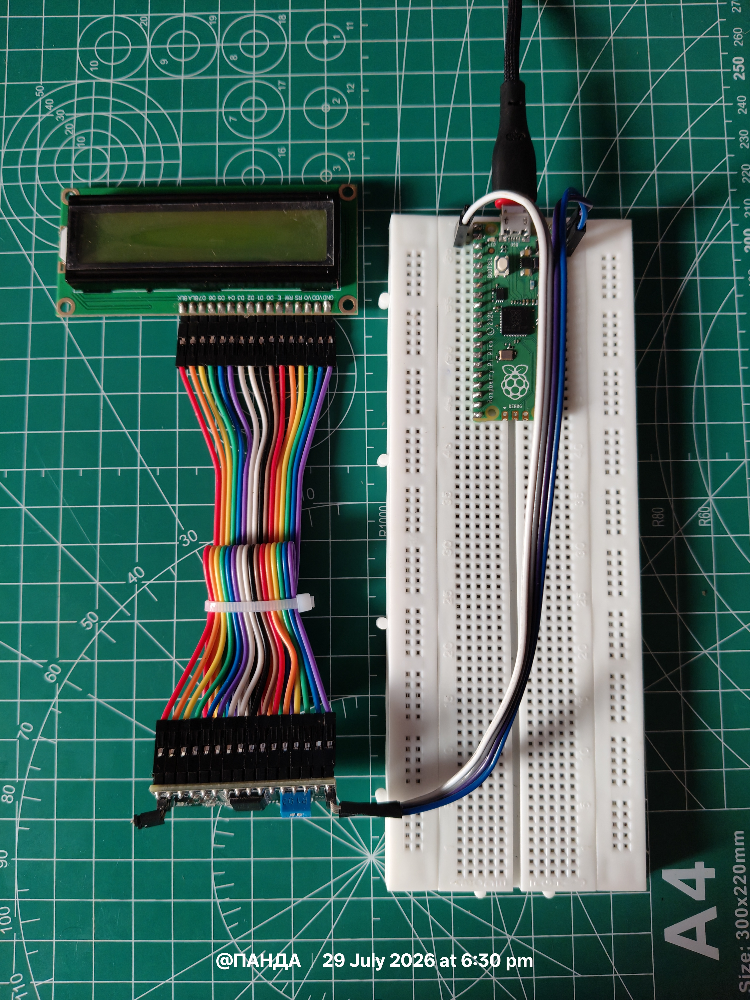
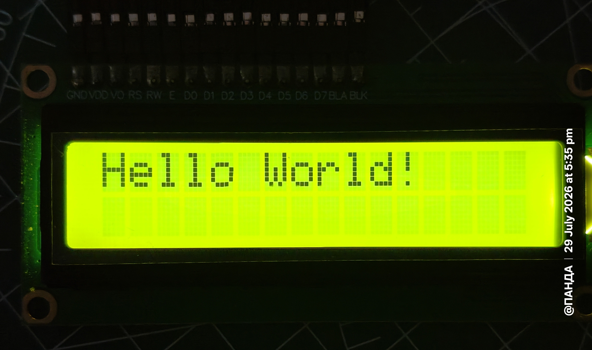
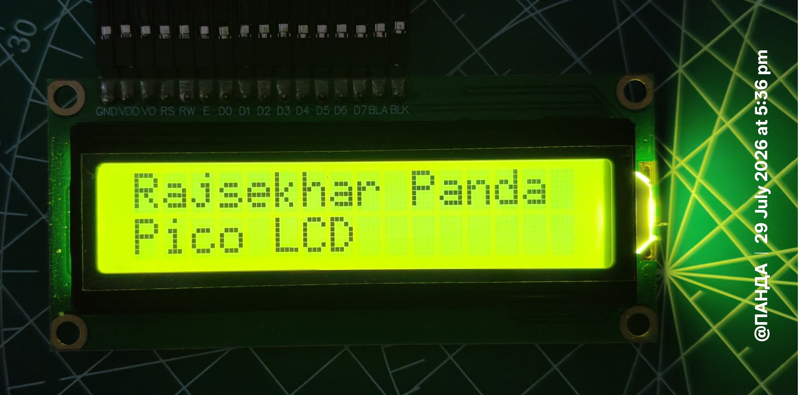
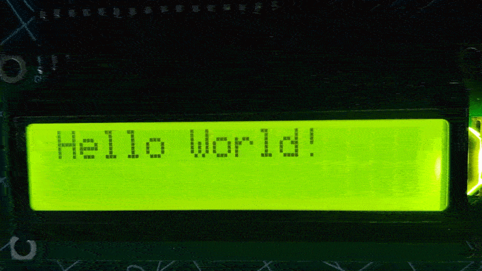
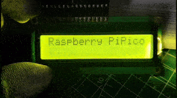
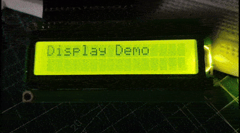
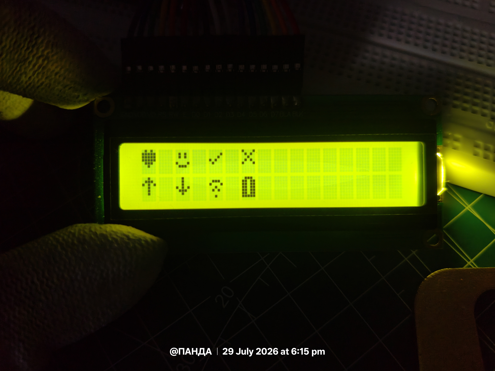
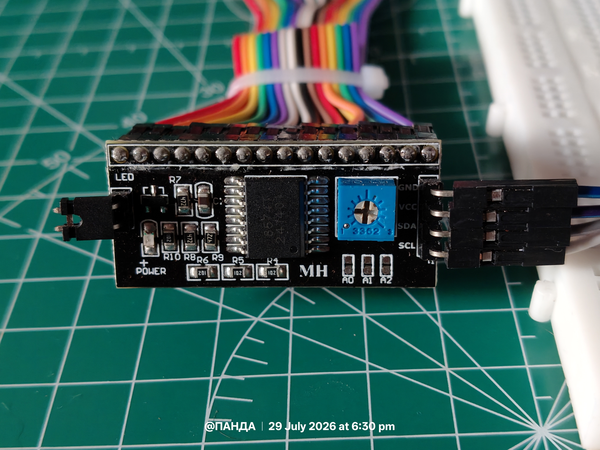

# 05 — 16×2 I2C LCD Interface with Raspberry Pi Pico

**Author:** Rajsekhar Panda
**Series:** Raspberry Pi Pico Embedded Systems Learning Series

---

## Overview

This experiment covers interfacing a **16×2 character LCD display** with the **Raspberry Pi Pico** over the **I2C** communication protocol, using a PCF8574-based I2C backpack module rather than driving the LCD's native 8/4-bit parallel interface directly.

The project is built as a **layered driver architecture**, separating three concerns:

| Layer | Responsibility |
|---|---|
| Low-level I2C communication | Talking to the PCF8574 backpack over the I2C bus |
| LCD command handling | Translating HD44780 command/data semantics into I2C writes |
| User application code | Calling a simple, display-agnostic API |

A custom **LCD API layer** sits on top of the I2C driver to abstract away HD44780 command bytes and bit-banged enable pulses, so application code only ever calls simple, readable functions (`clear()`, `move_to()`, `putstr()`, etc.). This makes the driver portable to future projects with minimal changes.

---

## Objectives

- Understand I2C communication between microcontrollers and peripherals.
- Interface an HD44780-compatible LCD using a PCF8574 I2C backpack.
- Develop a modular LCD driver architecture (interface layer + hardware layer).
- Learn LCD command/control sequences at the register level.
- Implement cursor movement, clearing, scrolling, and custom characters.
- Build reusable embedded software components for future projects.

---

## Hardware Used

| Component | Quantity |
|---|---|
| Raspberry Pi Pico | 1 |
| 16×2 Character LCD Display (HD44780-compatible) | 1 |
| I2C LCD Adapter Module (PCF8574 backpack) | 1 |
| Jumper Wires | As required |
| Breadboard | 1 |

---

## Wiring / Connections

The I2C backpack reduces the LCD's parallel interface down to four wires: two for power, two for the I2C bus.

| I2C Backpack Pin | Raspberry Pi Pico Pin | Notes |
|---|---|---|
| VCC | VBUS (pin 40) or 3V3(OUT) (pin 36) | Most backpacks are 5V-tolerant on VCC; confirm your module's rated voltage before wiring |
| GND | GND (any GND pin, e.g. pin 38) | Common ground with the Pico |
| SDA | GPIO 0 (or any GPIO assigned to `i2c0`/`i2c1`) | Serial data line |
| SCL | GPIO 1 (or any GPIO assigned to `i2c0`/`i2c1`) | Serial clock line |

> **Note:** Most PCF8574 LCD backpacks include their own onboard pull-up resistors on SDA/SCL, so external pull-ups are usually not required. If you experience unreliable communication, verify the module has pull-ups populated, or add external 4.7 kΩ resistors to 3.3V/5V as appropriate.

The default I2C address for most PCF8574-based backpacks is `0x27` or `0x3F`, depending on the vendor and the address-select jumpers on the board. Experiment 01 (I2C Scan) is used to confirm the actual address on your specific module rather than assuming it.

---

## Software

- **MicroPython** (running on the Raspberry Pi Pico)
- **Thonny IDE** for development and deployment
- **Custom LCD driver** (`lcd_api.py` + `i2c_lcd.py`)

---

## Circuit Connections 




## Project Structure

```
05_16X2_I2C_LCD/
│
├── assets/                      # Reference images/photos for each experiment
│
├── lcd/
│   ├── lcd_api.py                # Hardware-independent LCD API layer
│   └── i2c_lcd.py                # I2C-specific driver implementation
│
├── 01_I2C_Scan
├── 02_hello
├── 03_cursor_positioning
├── 04_clear_home
├── 05_scroll
├── 06_display_demo
├── 07_custom_characters
├── Read_i2c.md                   # I^2C Manual 
└── README.md
```

---

## LCD Driver Architecture

The LCD software is organized into two layers, so that the communication method (I2C here) can be swapped out later — e.g., for a parallel HD44780 driver — without changing any application code.

### 1. LCD API Layer

**File:** `lcd/lcd_api.py`

This layer contains high-level LCD functions that are independent of the underlying communication interface. It hides HD44780 command bytes and cursor/timing details behind simple calls:

```python
lcd.clear()
lcd.home()
lcd.move_to(x, y)
lcd.putstr("Hello")
```

### 2. I2C LCD Driver Layer

**File:** `lcd/i2c_lcd.py`

Responsible for:

- I2C bus communication with the PCF8574 backpack
- Sending LCD command bytes and data bytes
- Writing data
- Generating the enable (`E`) pulses the HD44780 requires to latch each nibble
- Backlight control (via the backpack's spare I/O bit)
- LCD initialization sequence (4-bit mode setup)

### Communication Flow

```
User Program
     |
     v
LCD API            (lcd_api.py)
     |
     v
I2C LCD Driver      (i2c_lcd.py)
     |
     v
I2C Bus
     |
     v
LCD Hardware (via PCF8574 backpack)
```

---

## Experiments

### Experiment 01 — I2C Device Scanner

**Folder:** `01_I2C_Scan`

**Objective:** Detect connected I2C devices and identify the LCD backpack's bus address.

**Concepts learned:**
- I2C addressing
- Device detection via bus scanning
- General I2C bus communication

**Expected output:**

Terminal displays the detected device address:

```
I2C devices found:
['0x27']
```

---

### Experiment 02 — Hello World Display

**Folder:** `02_hello`

**Objective:** Display basic text on the LCD.

**Implementation:**

```python
lcd.putstr("Hello World")
```

**Expected output:** LCD displays:

```
Hello World
```



---

### Experiment 03 — Cursor Positioning

**Folder:** `03_cursor_positioning`

**Objective:** Control the LCD cursor position.

**Function used:** `lcd.move_to(column, row)`

```python
lcd.move_to(5, 0)
lcd.putstr("Your String")
```

**Expected output:** Text appears at the selected position on the display.



---

### Experiment 04 — Clear and Home Commands

**Folder:** `04_clear_home`

**Objective:** Understand LCD reset and cursor-return operations.

**Functions implemented:**
- `lcd.clear()`
- `lcd.home()`

**Concepts learned:**
- Clearing display memory (DDRAM)
- Returning the cursor to its initial position without clearing content



---

### Experiment 05 — Scrolling Text

**Folder:** `05_scroll`

**Objective:** Create moving text animation on the LCD.

**Concepts:**
- Cursor/display shifting
- Delay-based timing control
- Dynamic display updates




---

### Experiment 06 — LCD Display Demo

**Folder:** `06_display_demo`

**Objective:** Demonstrate multiple LCD features together in a single combined program.

**Implemented:**
- Multiple lines of text
- Text positioning
- Display updates
- Basic formatting




---

### Experiment 07 — Custom Characters

**Folder:** `07_custom_characters`

**Objective:** Create custom LCD symbols using CGRAM (Character Generator RAM).

**Examples:**
- Icons
- Special symbols
- Custom bitmap patterns

**Concepts:**
- LCD CGRAM addressing
- Bitmap-based character definition (5×8 pixel grids)



---

## Learning Outcomes

After completing this experiment set:

- ✔ Understood I2C communication principles and addressing
- ✔ Learned the HD44780 LCD initialization sequence
- ✔ Created reusable MicroPython drivers
- ✔ Implemented clean hardware-abstraction layers
- ✔ Controlled LCD cursor movement and display functions
- ✔ Created custom LCD characters via CGRAM
- ✔ Practiced organizing embedded firmware into modular components

---

## Future Improvements

Possible extensions to this project:

- LCD-based calculator using a matrix keypad
- Sensor data display system (e.g., temperature/humidity readout)
- Menu-driven user interface with button navigation
- Real-time clock (RTC) display
- Graphical UI experiments (where hardware supports it)

---

### Note 

If your 16x2 display isn't readily available with the i2c configuration then you can use an adapter to convert it to i2c similar to 
the following reference image :


Try to get the adapter with female connectors as it easily snaps on to the display and saves wire usage. 


*Part of the Raspberry Pi Pico Embedded Systems Learning Series.*
