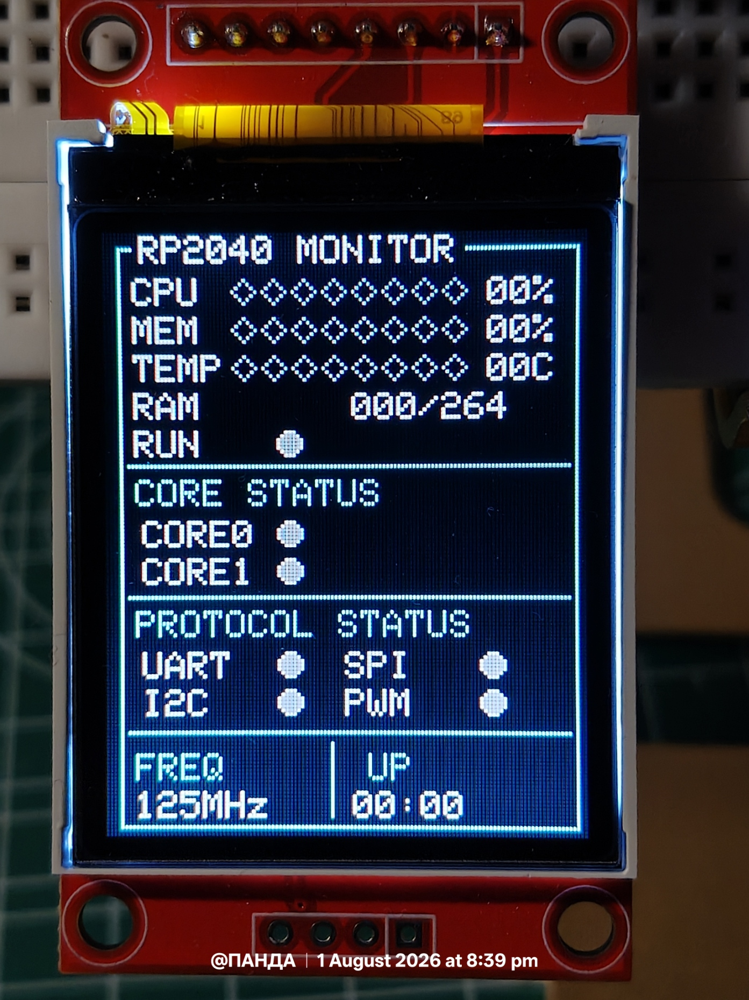

# RP2040 Resource Monitor UI

A lightweight embedded Human Machine Interface (HMI) built for the Raspberry Pi Pico using a 1.8" ST7735 TFT LCD and MicroPython.

This project demonstrates how a small 128×160 TFT display can present live system information using a custom graphics engine and reusable UI widgets without relying on heavyweight GUI libraries.

---

## Features

- Live RP2040 resource monitor
- Optimized partial screen updates
- Modular UI architecture
- Lightweight widget library
- Embedded dashboard design
- Designed and tested on real Raspberry Pi Pico hardware

---

## Preview

### Hardware Setup

<p align="center">
  
</p>

### Static User Interface

<p align="center">
  
</p>

---

## Dashboard Components

The interface currently displays:

- CPU Activity
- Memory Usage
- Temperature
- RAM Status
- System Uptime
- RP2040 Clock Frequency

---

## UI Widgets

The dashboard is built using reusable widgets located inside the graphics library.

### Available Widgets

- Panel
- Status LED
- History Graph
- Segmented Meter
- Battery Indicator
- Button
- Diamond Primitive

Every widget is independent and can be reused in future embedded applications.

---

## Design Philosophy

Instead of continuously refreshing the entire display, the UI only redraws values that have changed.

This approach provides:

- Smooth animations
- Reduced SPI traffic
- Lower CPU overhead
- Flicker-free updates
- Better scalability

---

## Project Structure

```
07_Pico_Resource_Monitor_UI/
├── assets/
├── main.py          # Application entry point
├── monitor.py       # Complete dashboard UI
└── README.md
```

The UI itself is separated from the application logic.

```
main.py
    │
    ▼
monitor.py
    │
    ├── draw_static()
    ├── update_values()
    ├── update_display()
    └── refresh()
```

This modular structure allows the monitor to be reused inside larger Pico applications.

---

## Graphics Library

The monitor uses the custom graphics framework developed in the previous project.

```
06_1.8inch_TFT_LCD/

lcd/
├── st7735.py
├── colors.py
├── fonts.py
└── widgets.py
```

The dashboard is entirely composed using these reusable components.

---

## Performance

Designed specifically for embedded hardware.

- Minimal memory usage
- Selective redraw strategy
- Small code footprint
- Fast rendering
- Real-time updates

---

## Hardware

- Raspberry Pi Pico
- RP2040
- ST7735 1.8" TFT LCD
- MicroPython

---

## Applications

The architecture can be adapted for:

- Embedded Resource Monitor
- Sensor Dashboard
- Robot Control Interface
- Battery Monitor
- Industrial HMI
- IoT Display
- Data Logger
- Embedded Instrumentation

---

## Future Improvements

Planned additions include:

- Multi-page dashboard
- Storage information
- USB communication statistics
- External sensor integration
- Joystick navigation
- Menu system
- Configurable themes

---

## Author

**Rajsekhar Panda**

Designed and developed on real Raspberry Pi Pico hardware using MicroPython.
