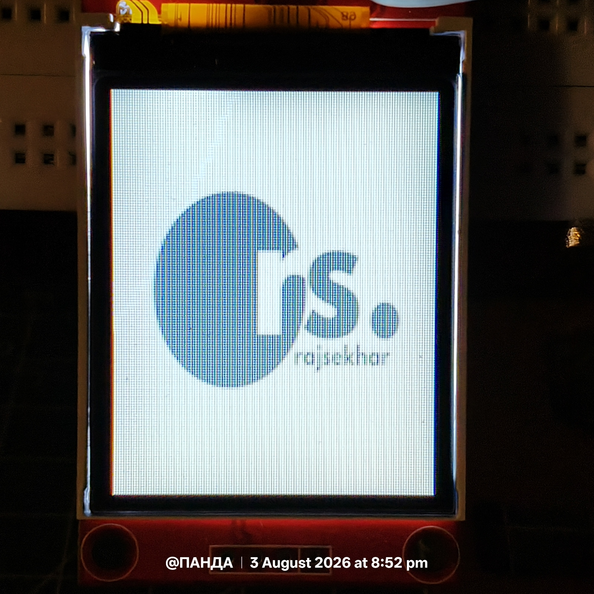
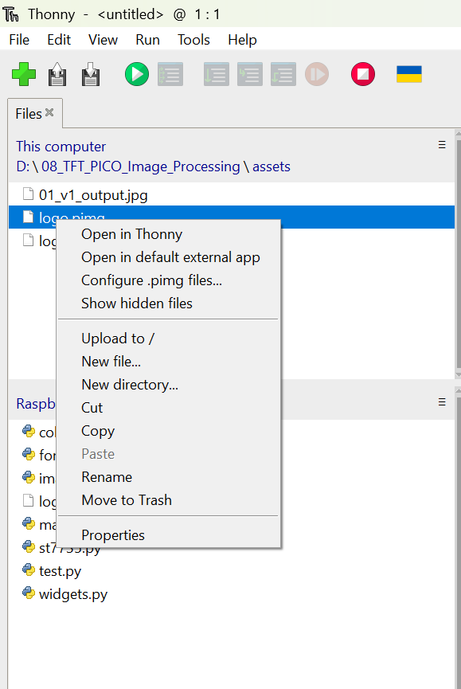

<p align="center">
    
</p>

<h1 align="center">
08_TFT_PICO_Image_Processing
</h1>

<p align="center">
A lightweight image processing engine for the Raspberry Pi Pico using MicroPython and the ST7735 TFT LCD.
</p>

<p align="center">


</p>

---

# Overview

This project implements a lightweight image processing engine for the **Raspberry Pi Pico (RP2040)** using **MicroPython**.

A custom binary image format (**PIMG**) is introduced together with a desktop image converter capable of converting standard image formats into an optimized RGB565 binary representation.

Instead of storing images as Python arrays or decoding bitmap files directly on the microcontroller, the image is streamed directly from flash memory to the TFT display using chunked SPI transfers.

This approach offers:

- Fast image rendering
- Low RAM usage
- Zero framebuffer rendering
- Clean asset management
- Desktop preprocessing
- Reusable graphics pipeline

---

# Features

- Custom **PIMG** binary image format
- Desktop image converter
- PNG/JPG image support
- Automatic RGB conversion
- Automatic image resizing
- RGB565 encoding
- Header validation
- Image metadata parser
- Chunked image streaming
- Optimized using `readinto()`
- Reusable streaming buffer
- Configurable chunk size
- Zero framebuffer rendering
- Direct SPI image transfer
- ST7735 compatible

---

# Hardware

- Raspberry Pi Pico (RP2040)
- ST7735 1.8" TFT LCD
- SPI Interface

Display Resolution

```
128 × 160 Pixels
```

---

# Software

## Desktop

- Python 3.x
- Pillow

Install Pillow

```bash
pip install pillow
```

## Embedded

- MicroPython
- ST7735 Driver

---

# Project Structure

```
08_TFT_PICO_Image_Processing/

│
├── assets/
│   ├── 01_v1_output.jpg
|   ├── file_upload.png
│   ├── logo.png
│   └── logo.pimg
│
├── tools/
│   └── image_converter.py
│
├── image.py
├── test.py
│
├── README.md

```

---

# PIMG File Format

Every PIMG file begins with a compact 12-byte header.

| Offset | Size | Description |
|---------|------|-------------|
| 0 | 4 Bytes | Magic Number ("PIMG") |
| 4 | 2 Bytes | Image Width |
| 6 | 2 Bytes | Image Height |
| 8 | 1 Byte | Pixel Format |
| 9 | 3 Bytes | Reserved |

Header Size

```
12 Bytes
```

Pixel Format

```
RGB565
```

---

# Desktop Conversion Pipeline

```
PNG / JPG
      │
      ▼
image_converter.py
      │
      ▼
Convert to RGB
      │
      ▼
Resize Image
      │
      ▼
RGB565 Encoding
      │
      ▼
Generate PIMG
```

The converter automatically

- Opens the source image
- Converts unsupported image modes to RGB
- Resizes the image
- Encodes every pixel into RGB565
- Generates a compact PIMG file

---

# Rendering Pipeline

```
PIMG File
      │
      ▼
Open Image
      │
      ▼
Read Header
      │
      ▼
Validate Format
      │
      ▼
Set TFT Window
      │
      ▼
Read Image Chunk
      │
      ▼
SPI Write
      │
      ▼
Repeat
```

No framebuffer is used during rendering.

---

# Uploading Images to the Raspberry Pi Pico

After converting an image into the **PIMG** format, upload the generated `.pimg` file to the Raspberry Pi Pico using **Thonny**.

## Steps

1. Connect the Raspberry Pi Pico to your computer.
2. Open **Thonny IDE**.
3. Select the **MicroPython (Raspberry Pi Pico)** interpreter.
4. Open the **Files** panel (`View → Files`) if it is not already visible.
5. Locate the generated `.pimg` file on **This Computer**.
6. Drag and drop the file onto the **Raspberry Pi Pico** file system, or right-click the file and select **Upload to /**.

<p align="center">
    
</p>


Example

```
This Computer

logo.pimg

        │
        ▼

Raspberry Pi Pico

image.py
test.py
logo.pimg
```

Once uploaded, the image can be accessed directly.

```python
logo = Image("logo.pimg")
```

Images may also be organized into folders.

```
/
├── image.py
├── test.py
└── assets/
    ├── logo.pimg
    ├── cpu.pimg
    ├── wifi.pimg
    └── ram.pimg
```

Example

```python
logo = Image("assets/logo.pimg")
```

> **Note**
>
> Images uploaded using Thonny are stored in the Pico's internal flash memory and can be accessed directly using Python's built-in `open()` function. No additional file system setup is required.

---

# Memory Usage

The renderer streams image data directly from flash memory.

Instead of allocating an entire framebuffer, a reusable buffer is used.

Default Configuration

```
Chunk Size : 4096 Bytes
```

Benefits

- Low RAM usage
- Reduced memory allocation
- Reduced garbage collection
- Smooth rendering
- Faster SPI transfers

---

# Example

```python
from st7735 import ST7735
from image import Image

display = ST7735()

logo = Image("logo.pimg")

logo.draw(display, 0, 0)
```

---

# Display Image Information

```python
from image import Image

logo = Image("logo.pimg")

logo.open()

logo.info()

logo.close()
```

Output

```
--------------------------------
PIMG Image Information
--------------------------------
File   : logo.pimg
Width  : 128
Height : 160
Format : RGB565
--------------------------------
```

---

# Performance

| Property | Value |
|----------|-------|
| Display Resolution | 128 × 160 |
| Pixel Format | RGB565 |
| Rendering Method | Chunked SPI Streaming |
| Default Chunk Size | 4096 Bytes |
| Memory Strategy | Zero Framebuffer |

---

# Advantages

Compared to storing images as Python arrays

- Faster rendering
- Smaller source code
- Cleaner project organization
- Lower RAM usage
- Desktop preprocessing
- Easier asset management
- Scalable image pipeline

---

# Future Improvements

- Image clipping
- Transparent image rendering
- Sprite rendering
- Sprite sheet support
- Animation engine
- Image scaling
- Image rotation
- SD Card image loading
- Batch image conversion
- Icon library
- UI asset management

---

# Gallery

Current Version

- Full-screen image rendering
- Desktop image conversion
- Custom PIMG format
- Real hardware implementation on Raspberry Pi Pico

---

# Version

```
PIMG Image Engine v1.1
```

---

# License

This project is licensed under the **MIT License**.

---

# Author

**Rajsekhar Panda**

GitHub

https://github.com/panda-rajsekhar

---

# Jai Jagannath 🙏

Built with ❤️ using Raspberry Pi Pico, MicroPython, and the ST7735 TFT LCD.
