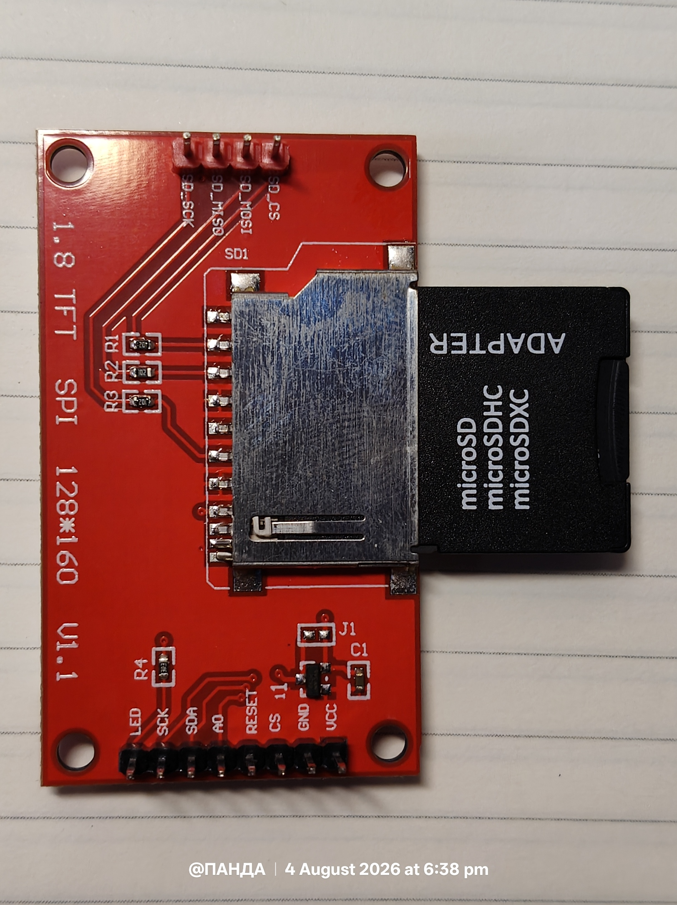
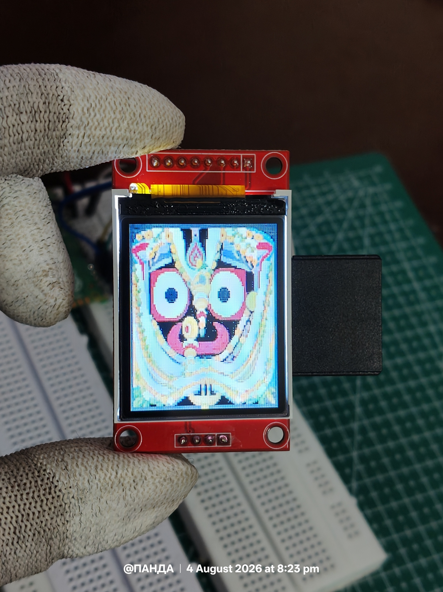
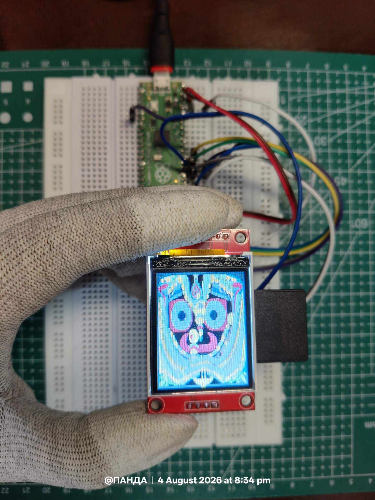

# 09 – SD Card Storage Expansion for Raspberry Pi Pico

Extending the Raspberry Pi Pico graphics framework with external SD storage over SPI.

---

## Preview

<p align="center">
  <br>
  <b>ST7735 TFT module with integrated SD card slot</b>
</p>

<p align="center">
  <br>
  <b>PIMG image rendered directly from the SD card</b>
</p>

---

## Overview

The previous experiment, **08_TFT_PICO_Image_Processing**, introduced a custom graphics framework for the Raspberry Pi Pico featuring the **PIMG (Pico Image)** format and a lightweight image engine capable of efficiently rendering RGB565 images on an ST7735 TFT display.

While the graphics engine performed well, every image asset was stored inside the Pico's onboard flash memory. Since the RP2040 provides only limited internal storage, this approach quickly becomes impractical for applications requiring numerous graphical resources such as:

- Icons
- Logos
- Splash screens
- Background images
- Animations
- Fonts
- Configuration files
- Data logs

To remove this storage limitation, this experiment integrates a SD card using the SPI interface.

Rather than dedicating another communication peripheral, the SD card shares the same SPI bus already used by the TFT display. Each device maintains an independent Chip Select (CS) line, allowing both peripherals to coexist without communication conflicts.

The most significant result is that the previously developed PIMG image engine requires **no modification whatsoever**. Since it already operates on standard file paths, image assets can simply be loaded from `/sd/...` instead of internal flash.

This transforms the graphics framework into a scalable embedded graphics platform capable of supporting significantly larger projects.

---

## Objectives

This experiment demonstrates how to:

- Interface a SD card with the Raspberry Pi Pico
- Share the SPI bus between the TFT display and SD card
- Mount and unmount a FAT filesystem
- Verify successful SD card communication
- Perform standard file operations
- Move graphical assets from internal flash to external storage
- Render PIMG images directly from the SD card
- Prepare the graphics framework for future GUI applications

---

## Repository Structure

```
09_SD_Card_Storage_Expansion
│
├── display.py
├── mount_sd.py
├── move.py
├── sd_verification.py
├── unmount_sd.py
│
├── assets
│   ├── 00_sd_cardslot.jpg
│   ├── 01_circuit_wiring.jpg
│   └── 02_output.jpg
│
└── driver
    └── sdcard.py
```

---

## Hardware Required

| Component                                  | Quantity    |
|--------------------------------------------|-------------|
| Raspberry Pi Pico                          | 1           |
| ST7735 TFT Display (with SD slot)          | 1           |
| SD Card (FAT/FAT32)                        | 1           |
| Jumper Wires                               | As required |
| USB Cable                                  | 1           |

---

## Third-Party Software

This experiment includes the `sdcard.py` driver from the
[MicroPython `micropython-lib` project](https://github.com/micropython/micropython-lib).

The SD card driver is **not an original implementation of this repository**.
It is included for convenience and is used under its original MIT License.

The original copyright and license notices are retained in the driver source.


---

## Hardware Connections

The TFT display and SD card share the **SPI0** peripheral of the Raspberry Pi Pico. Only the Chip Select pins differ.

```
                SPI0 BUS

          +-------------------+
          | Raspberry Pi Pico |
          +-------------------+
             │      │      │
          SCK│   MOSI│   MISO
             │      │      │
      ┌──────┘      │      └────────┐
      │             │               │
      ▼             ▼               ▼

  ST7735 TFT                    SD Card
   CS = GP17                     CS = GP5
```

### TFT Connections

| Raspberry Pi Pico | TFT Display |
|--------------------|-------------|
| GP18               | SCK         |
| GP19               | MOSI        |
| GP21               | DC          |
| GP20               | RESET       |
| GP17               | TFT_CS      |
| 3V3                | VCC         |
| 3V3                | LED         |
| GND                | GND         |

### SD Connections

| Raspberry Pi Pico | SD |
|--------------------|---------|
| GP18               | SCK     |
| GP19               | MOSI    |
| GP16               | MISO    |
| GP5                | CS      |
| 3V3                | VCC     |
| GND                | GND     |

### Circuit Wiring

<p align="center">
  
</p>

---

## Step 1 — Verifying SD Card Communication

Before mounting the filesystem, the SPI interface should be tested.

The script `sd_verification.py` initializes the SD card, verifies communication, mounts the filesystem, and displays the detected files.

**Example output:**

```
--------------------------------
SD Card Status
--------------------------------
Status : Mounted
Mount  : /sd
--------------------------------
Contents
 - System Volume Information
 - pico.txt
 - test.pimg
 - test.text
--------------------------------
```

Successful execution confirms:

- Correct SPI communication
- Correct Chip Select configuration
- SD card detection
- FAT filesystem accessibility

---

## Step 2 — Mounting the Filesystem

The script `mount_sd.py` mounts the SD card to `/sd`.

Once mounted, the SD card behaves like a normal directory:

```python
import os

os.listdir("/sd")

with open("/sd/file.txt") as f:
    print(f.read())
```

Every graphical asset stored on the SD card can now be accessed through standard MicroPython file operations.

---

## Step 3 — Unmounting the Filesystem

Before removing the SD card, the filesystem should always be unmounted:

```python
os.umount("/sd")
```

This is implemented in `unmount_sd.py`.

Unmounting ensures:

- Pending writes are completed
- File corruption is avoided
- Safe removal of the SD card

> **Important**
> Never remove the SD card while it is still mounted.

---

## Step 4 — Moving Image Assets

Initially, images reside inside the Pico's internal flash memory.

```
Internal Flash
      │
      ▼
 test.pimg
```

The script `move.py` copies the file to the SD card.

```
Internal Flash
      │
      ▼
 test.pimg
      │
      ▼
  SD Card
      │
      ▼
 /sd/test.pimg
```

After verifying the copy, the original file may optionally be removed to recover internal flash space.

---

## Step 5 — Rendering Images from the SD Card

One of the biggest advantages of the PIMG engine is that no changes are required.

**Previously:**

```python
img = Image("test.pimg")
```

**Now:**

```python
img = Image("/sd/test.pimg")
img.draw(display, 0, 0)
```

The image is streamed directly from the SD card in small chunks, eliminating the need to load the complete image into RAM.

This provides:

- Lower RAM usage
- Smaller flash usage
- Support for larger image collections
- Better scalability

---

## Experimental Output

The image below shows successful rendering of a PIMG image directly from the SD card.

<p align="center">
  
</p>

---

## Advantages of External Storage

Compared to storing graphical assets in internal flash memory, external storage offers significant benefits.

| Internal Flash           | SD Card                         |
|--------------------------|--------------------------------|
| Limited capacity          | Expandable storage            |
| Difficult to update       | Easy asset replacement        |
| Small image library       | Virtually unlimited resources |
| Uses onboard flash        | Preserves flash memory        |
| Limited scalability       | Suitable for large GUI projects |

Possible applications include:

- Large icon libraries
- Fonts
- Splash screens
- Image galleries
- Animations
- Configuration files
- Sensor logging
- User data
- Future embedded GUI systems

---

## Results

This experiment successfully demonstrates:

- ✅ Shared SPI communication between TFT display and SD card
- ✅ FAT filesystem support in MicroPython
- ✅ Reliable SD card initialization
- ✅ Safe mounting and unmounting procedures
- ✅ Standard file operations on external storage
- ✅ Migration of graphical assets from flash memory
- ✅ Direct rendering of PIMG images from the SD card
- ✅ Seamless compatibility with the graphics framework developed in `08_TFT_PICO_Image_Processing`

---

## `move.py` — Interactive Pico to SD File Copy Manager

The `move.py` utility provides an interactive command-line interface for copying files from the Raspberry Pi Pico's internal filesystem to a mounted microSD card. Unlike a fixed copy script, the program dynamically discovers available files and destination folders, allowing multiple copy operations during a single execution.

### Features

- Automatically mounts the microSD card.
- Detects all files stored in the Pico root directory.
- Displays an indexed menu for easy file selection.
- Scans the SD card and lists all available destination folders.
- Preserves the original filename during the copy operation.
- Supports consecutive copy operations without restarting the program.
- Provides input validation for menu selections.
- Gracefully exits when requested by the user.

### Workflow

1. Mount the SD card.
2. Display all files available in the Pico root directory.
3. Select the source file using its corresponding menu number.
4. Display all destination folders on the SD card.
5. Select the destination folder.
6. Copy the selected file while preserving its original filename.
7. Prompt the user to either continue copying additional files or exit the program.

### Example Execution

```text
========================================
        PICO SD FILE COPY MANAGER
========================================

Files available in Pico root:

1. arb.py
2. colors.py
3. fonts.py
4. image.py
5. keypad.py
6. lcd_api.py
7. main.py
8. mount_sd.py
9. move.py
10. sd_speed_test.py
11. sd_verification.py
12. sdcard.py
13. st7735.py
14. test.py
15. unmount_sd.py
16. widgets.py
17. write.py

0. Exit

Select file number: 8

Destination folders:

1. Package
2. Images
3. System Volume Information

0. Cancel

Select destination folder: 1

Copying...
✅ Copy completed.

Source      : /mount_sd.py
Destination : /sd/Package/mount_sd.py

Copy another file? (Y/N): y

========================================
        PICO SD FILE COPY MANAGER
========================================

Files available in Pico root:

1. arb.py
2. colors.py
3. fonts.py
4. image.py
5. keypad.py
6. lcd_api.py
7. main.py
8. mount_sd.py
9. move.py
10. sd_speed_test.py
11. sd_verification.py
12. sdcard.py
13. st7735.py
14. test.py
15. unmount_sd.py
16. widgets.py
17. write.py

0. Exit

Select file number: 10

Destination folders:

1. Package
2. Images
3. System Volume Information

0. Cancel

Select destination folder: 1

Copying...
✅ Copy completed.

Source      : /sd_speed_test.py
Destination : /sd/Package/sd_speed_test.py

Copy another file? (Y/N): n

Exiting File Manager...
```

### Notes

- Files are copied using a buffered read/write operation, minimizing RAM usage on the RP2040.
- The destination filename is automatically preserved, eliminating the need for manual filename entry.
- The utility is designed as a reusable file management tool and serves as a foundation for future filesystem operations such as file moving, renaming, deletion, directory creation, and storage management.


---

## Conclusion

This experiment extends the custom Raspberry Pi Pico graphics framework by introducing external storage through a microSD card.

By sharing the SPI bus with the ST7735 TFT display, the system gains virtually unlimited storage expansion without requiring additional communication peripherals. Since the PIMG engine operates entirely on file paths, images stored on the SD card can be rendered exactly as those stored in internal flash, requiring no architectural changes to the rendering engine.

With SD card support integrated, the framework is now capable of supporting substantially larger embedded graphics projects, including dashboards, image libraries, animations, configuration management, and future GUI systems.

This experiment establishes the storage layer that future projects in this series will build upon.

---


## Author

Developed and maintained by **Rajsekhar Panda** as part of the **Raspberry Pi Pico Projects** series.

This repository documents practical embedded systems development using the Raspberry Pi Pico, with a focus on building modular, reusable, and well-documented software components for future embedded applications.

**GitHub:** https://github.com/panda-rajsekhar

---

## License
Project License: The original code developed for this repository is licensed under the MIT License. Third-party components retain their respective original licenses.

---

⭐ If you found this project helpful, consider starring the repository on GitHub. Your support helps the project reach more developers and encourages future development.

