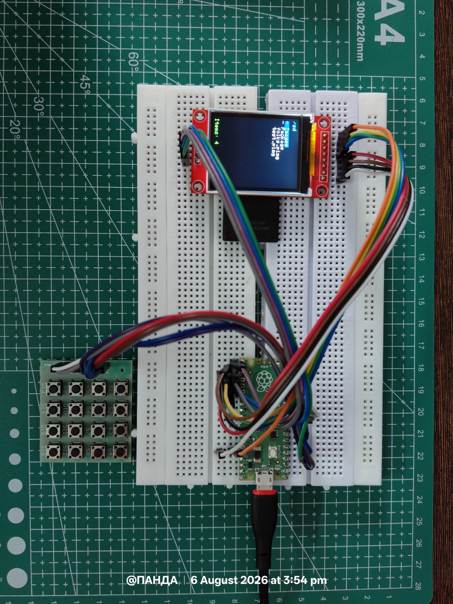
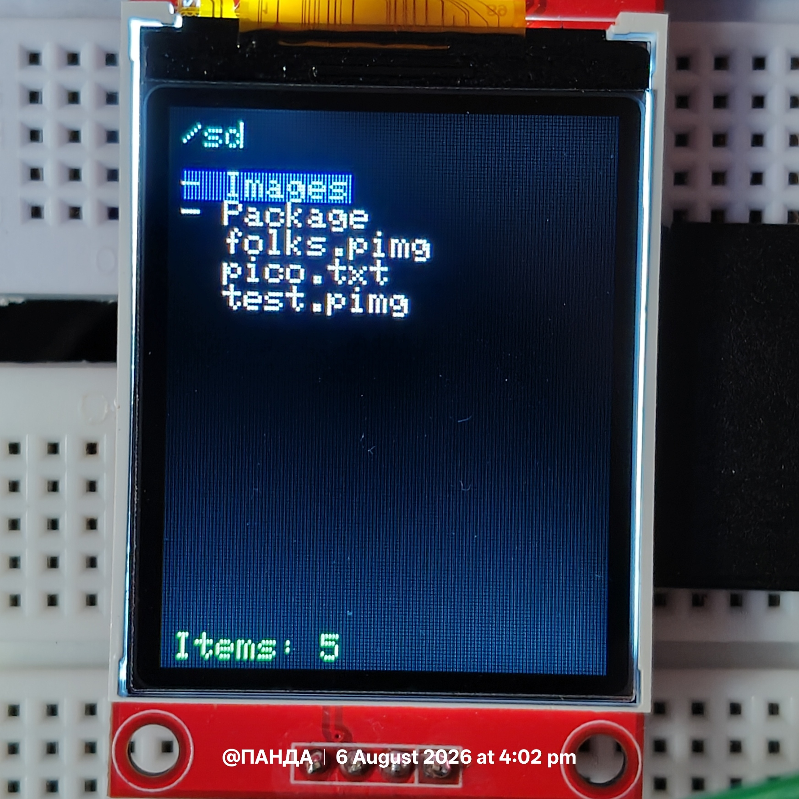
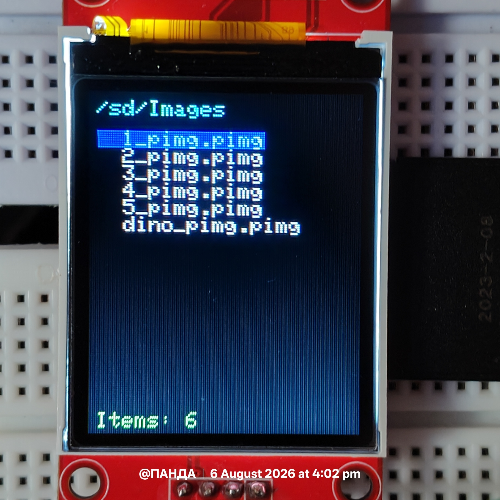
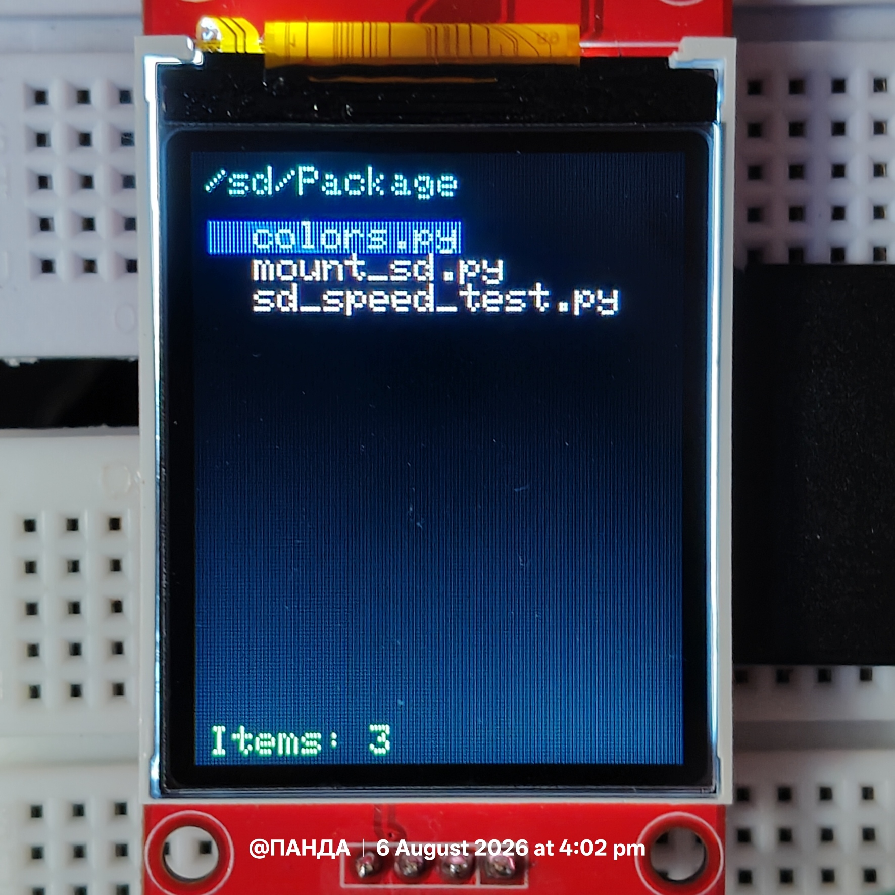

# 10. TFT Photo Gallery for Raspberry Pi Pico

A lightweight, fully embedded **image gallery system** built entirely in **MicroPython** for the **Raspberry Pi Pico (RP2040)**. The project combines a custom ST7735 graphics driver, SD card storage, a directory-aware file browser, and a dedicated full-screen image viewer to deliver a responsive, low-latency photo gallery experience on a resource-constrained microcontroller.

Unlike a simple "display one image" demo, this project is built around **embedded graphics architecture**, **efficient SPI rendering**, and **modular software design**, with an explicit eye toward reuse in future Human Machine Interface (HMI) projects - dashboards, menus, sensor UIs, and similar embedded front-ends.

---


## Features

* Custom, hand-optimized **ST7735 TFT graphics driver**
* SD Card support over SPI with FAT filesystem mounting
* Directory-based file browser with folder/file separation
* Automatic detection of custom **`.pimg`** image files
* Dedicated full-screen image gallery viewer
* Previous / Next image navigation
* Buffered SPI rendering for reduced transaction overhead
* Fast, lightweight text rendering engine
* Modular, layered driver architecture
* Designed from the ground up for low-memory embedded systems

---

## Hardware Used

| Component | Description |
| --------------- | -------------------------------- |
| Microcontroller | Raspberry Pi Pico (RP2040) |
| Display | 1.8" ST7735 TFT LCD (128 × 160) |
| Storage | Micro SD Card (SPI Mode) |
| Input | Matrix Keypad |
| Language | MicroPython |

---

## Project Architecture

```
Application Layer
│
├── File Browser
├── Image Gallery
│
Graphics Layer
│
├── Widgets
├── Image Decoder
│
Display Driver
│
└── ST7735 Graphics Engine
│
Hardware Layer
│
├── RP2040
├── SPI Bus
├── ST7735 TFT
└── SD Card
```

Each software component is designed to perform a single responsibility, allowing future projects to reuse the graphics engine, widgets, storage layer, or gallery independently of one another. This layering keeps hardware-specific code isolated from application logic, so swapping displays, storage media, or input devices requires minimal changes elsewhere in the codebase.

---

## Project Structure

```
10_TFT_Photo_Gallery
│
├── main.py
│
├── drivers
│ ├── colors.py
│ ├── fonts.py
│ ├── gallery.py
│ ├── image.py
│ ├── keypad.py
│ ├── mount_sd.py
│ ├── sdcard.py
│ ├── sd_verification.py
│ ├── st7735_dev.py
│ └── widgets_dev.py
│
└── gallery
 ├── 00_circuit.jpg
 ├── 01_file_browser_ui.jpg
 ├── 02_inside_folder_1.jpg
 ├── 02_inside_folder_2.jpg
 ├── 03_working_output_1.mp4
 └── 03_working_output_2.mp4
```

---

## Software Components

### `main.py`

Acts as the primary application entry point and orchestrates the overall boot sequence.

Responsibilities include:

* Initializing hardware (display, SPI bus, keypad)
* Mounting the SD card and verifying the filesystem
* Reading directory contents
* Rendering the file browser UI
* Handling folder navigation and input events
* Launching the image gallery when an image is selected

---

### `st7735_dev.py`

Custom graphics driver for the ST7735 display, written specifically for performance on the RP2040.

Features include:

* Optimized SPI communication with minimal overhead
* Buffered rendering to reduce redundant writes
* Primitive graphics (rectangles, lines, circles)
* Fast text renderer built for embedded constraints
* Scanline buffering for smoother full-screen updates
* Direct RGB565 streaming to the display

---

### `image.py`

Responsible for decoding and rendering images stored in the custom **PIMG** format.

The decoder streams image data directly from storage to the display in scanline chunks, avoiding large in-memory allocations that would otherwise be infeasible on the Pico's limited RAM.

---

### `gallery.py`

Provides a dedicated full-screen image viewer, decoupled from the file browser.

Features:

* Image navigation (next/previous)
* Automatic image loading on entry
* Clean exit back to the file browser
* Index-based tracking of the currently displayed image

---

### `widgets_dev.py`

Reusable graphical widgets including:

* Panels
* Buttons
* Battery indicator
* Diamond meters
* Graphs
* Status LEDs

These components form the foundation for future embedded HMI projects and are intentionally kept independent of the gallery logic so they can be dropped into unrelated projects.

---

### SD Card Drivers

The SD layer provides:

* Card initialization over SPI
* FAT filesystem mounting
* Low-level file access
* Storage verification utilities to catch mount/read failures early

---

## File Browser

The file browser automatically separates:

* Directories
* Files

Folders can be opened directly from the TFT interface, while supported image files can be launched into the gallery without restarting the application. Navigation redraws only the required screen regions rather than the full frame, which minimizes unnecessary SPI transfers and keeps the UI responsive even on a constrained microcontroller.

---

## Image Gallery

The gallery module receives, at launch:

* The current directory
* The available image list
* The initial image index

Once launched, it operates independently of the file browser, maintaining its own navigation state.

Supported operations include:

* Next Image
* Previous Image
* Exit Gallery

This separation keeps the application modular while simplifying future feature additions such as slideshows or zoom functionality - new gallery behavior can be added without touching file browser code, and vice versa.

---

## Performance

The graphics driver has been optimized using reusable buffers and a reduced number of discrete SPI transactions. Below is an actual boot/runtime trace captured from the device console, showing the time spent in each stage of startup and initial rendering:

```
>>> %Run -c $EDITOR_CONTENT

MPY: soft reboot
Init : 84 ms
Screen : 41 ms
SD card mounted successfully!
Title : 40 ms
Files : 112 ms
Footer : 24 ms
Total : 710 ms
```

Breaking this down by stage:

| Stage | Time | Notes |
| ----------------- | --------- | -------------------------------------------------- |
| Init | 84 ms | Hardware and driver initialization |
| Screen | 41 ms | Display controller setup and clear |
| SD Mount | - | SD card detected and FAT filesystem mounted |
| Title | 40 ms | Header/title bar rendering |
| Files | 112 ms | Directory read and file browser list rendering |
| Footer | 24 ms | Footer/status bar rendering |
| **Total** | **710 ms**| End-to-end boot to interactive file browser |

Full-screen image loading has also been benchmarked separately:

| Operation | Time |
| ------------------------ | ------- |
| Full Screen Image Load | ~700 ms |

For a **128 × 160 RGB565** display, both numbers represent efficient streaming performance directly from an SD card using MicroPython, with no intermediate full-frame buffer held in RAM. Together they indicate that the system reaches an interactive state in well under a second from soft reboot, and that navigating between images maintains a comparable, predictable load time.

---

## Key Design Goals

* Modular architecture
* Minimal RAM usage
* Efficient SPI transfers
* Clean separation of software layers
* Reusable embedded graphics library
* Easy integration into future projects
* Predictable, benchmarked performance at every stage

---

## Future Improvements

* Image thumbnails
* Slideshow mode
* Image rotation
* Brightness adjustment
* Animated transitions
* JPEG/BMP conversion utility
* Directory thumbnails
* Configuration menu
* Additional widget library

---

## Gallery

### Hardware Setup



*Wiring of the Raspberry Pi Pico, ST7735 TFT display, SD card module, and matrix keypad.*

---

### File Browser



*The directory-based file browser rendered on the 128×160 ST7735 display.*

---

### Gallery Navigation





*Browsing image files inside a folder before launching the full-screen gallery.*

---

### Demonstration Videos

**Working Demo 1**

<video src="gallery/03_working_output_1.mp4" controls width="480">
 Your viewer does not support embedded video. 
 <a href="gallery/03_working_output_1.mp4">Download/view the video here</a>.
</video>

**Working Demo 2**

<video src="gallery/03_working_output_2.mp4" controls width="480">
 Your viewer does not support embedded video.
 <a href="gallery/03_working_output_2.mp4">Download/view the video here</a>.
</video>

> **Note:** Inline video playback depends on the Markdown renderer. GitHub's own README viewer does not autoplay embedded `<video>` tags from a repository, but the tags above render correctly on renderers that support HTML5 video (e.g. many static site generators, GitLab, and local Markdown previewers). If the video doesn't play inline, use the links above to open the files directly from `gallery/03_working_output_1.mp4` and `gallery/03_working_output_2.mp4`.

---

## Learning Outcomes

This project demonstrates practical, hands-on implementation of:

* Embedded Graphics Programming
* SPI Display Drivers
* FAT Filesystem Integration
* SD Card Storage
* Buffered Rendering Techniques
* Embedded Software Architecture
* Modular Driver Development
* Human Machine Interface (HMI) Design
* Resource-Constrained Software Optimization
* Performance Profiling on Microcontrollers

---

>**Note**: If you landed directly on this section looking for a way to convert your own images into the .pimg format used by this gallery, the converter tool is available at:
>Micro Py/08_TFT_PICO_Image_Processing/tools
