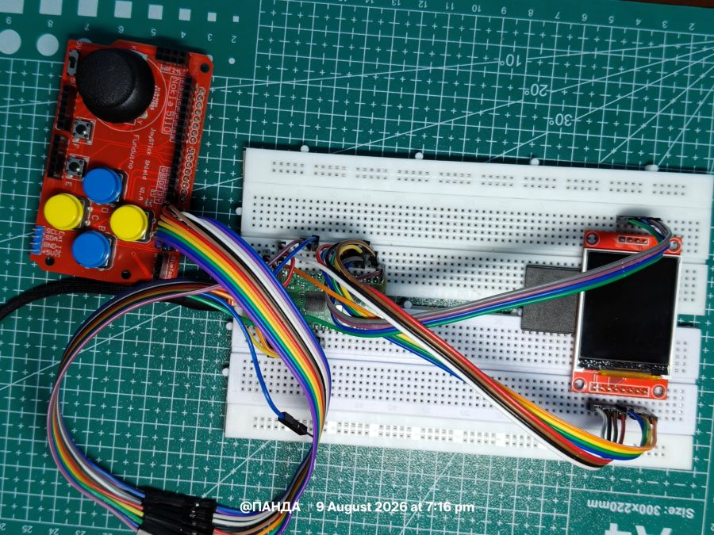
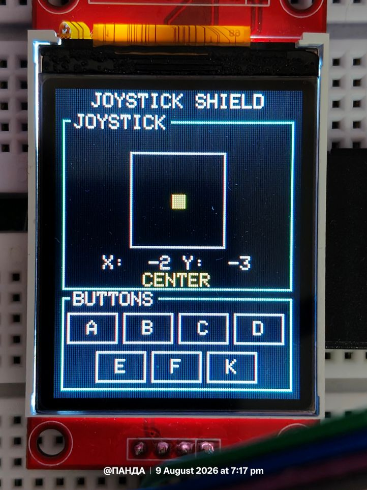
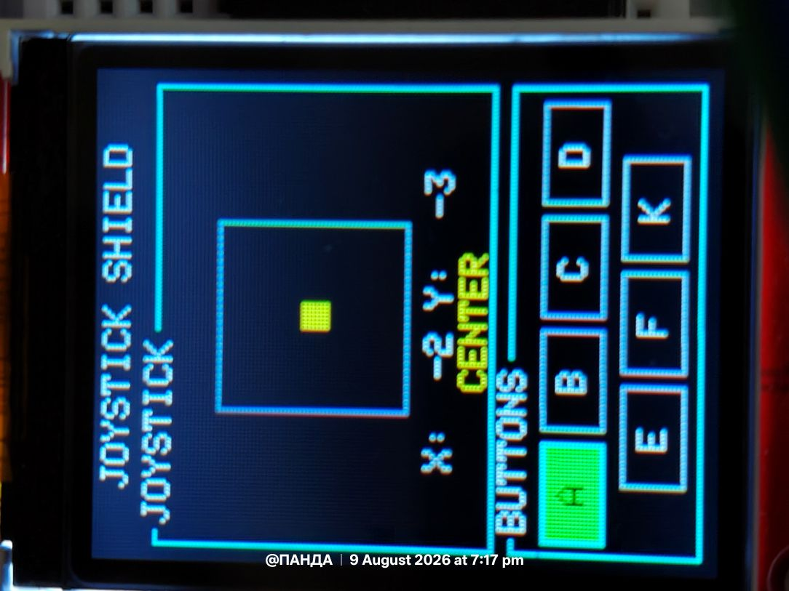
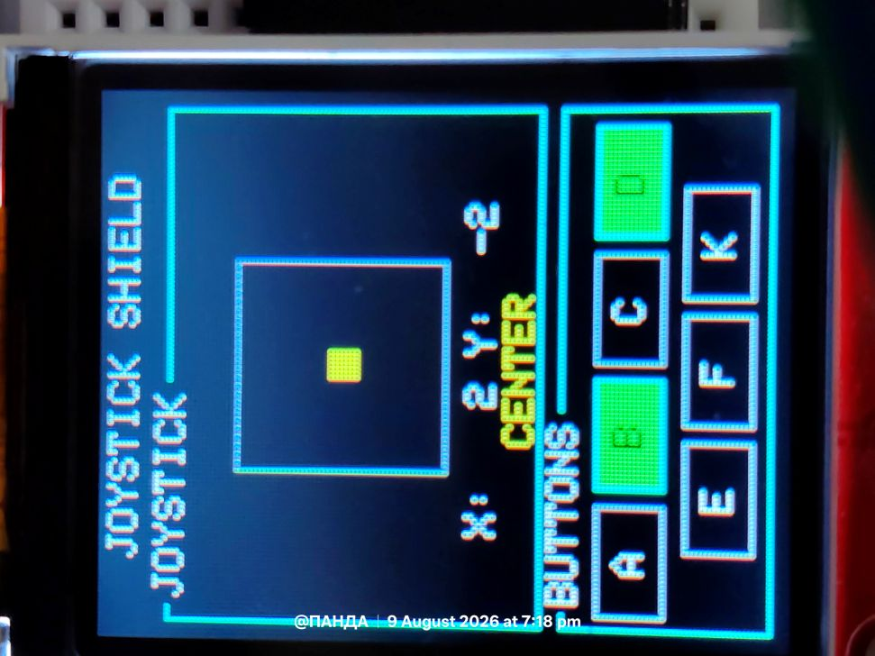
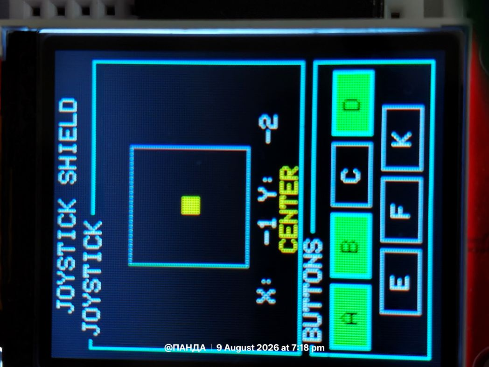
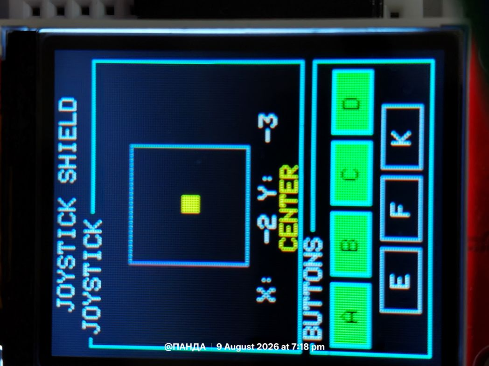
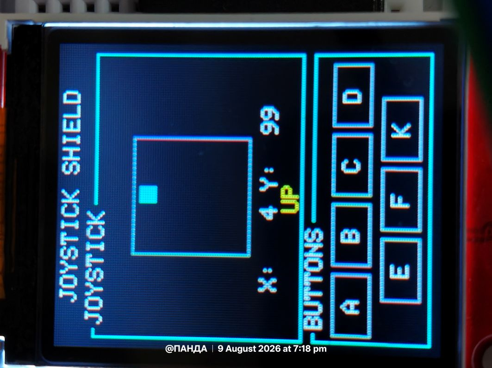
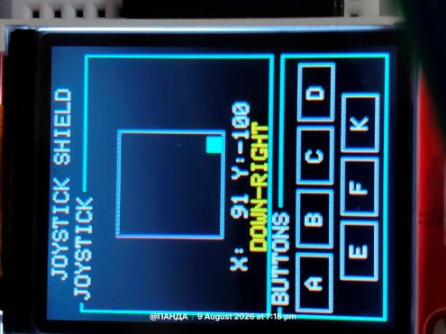
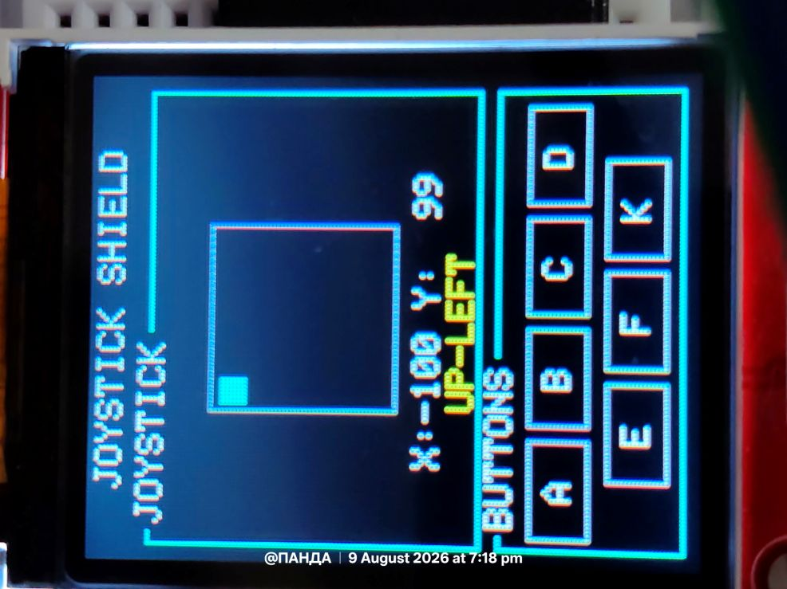

# Pico Joystick Shield Status Display

A MicroPython-based joystick controller and hardware status display for the **Raspberry Pi Pico**, built around the **Funduino Joystick Shield V1.A** and a **128×160 ST7735 SPI TFT display**.

The project reads the joystick's two analog axes and all seven buttons in real time, then visualizes their state on the TFT using an optimized **dirty-rectangle rendering** approach. Only portions of the display that actually change are updated, keeping the interface responsive while minimizing SPI traffic and screen flicker.

---

## 📸 Project Gallery

### Hardware Setup

The complete joystick shield and TFT setup connected to the Raspberry Pi Pico.



---

### Home Screen

The TFT displays the joystick position, raw X/Y values, current direction, and the state of all seven buttons.



---

## 🎮 Button Detection

The controller supports all seven buttons available on the Funduino Joystick Shield:

**A, B, C, D, E, F and K**

Buttons are detected independently and their visual state changes immediately when pressed.

### Single Button Press



### Double Button Press



### Triple Button Press



### Four Button Press



The implementation supports multiple buttons being pressed simultaneously rather than treating the buttons as mutually exclusive inputs.

---

## 🕹️ Joystick Movement

The analog joystick is continuously sampled through the Pico's ADC inputs.

The display converts the raw ADC readings into a normalized **−100 to +100** range and determines the corresponding direction.

### Movement 1



### Movement 2


### Movement 3



### Movement 4



Supported direction states include:

- `CENTER`
    
- `UP`
    
- `DOWN`
    
- `LEFT`
    
- `RIGHT`
    
- `UP-LEFT`
    
- `UP-RIGHT`
    
- `DOWN-LEFT`
    
- `DOWN-RIGHT`
    

---

# ✨ Features

- Real-time joystick position monitoring
    
- Two-axis analog input using the Pico ADC
    
- Seven-button digital input
    
- Simultaneous multi-button detection
    
- 128×160 ST7735 SPI TFT interface
    
- Normalized joystick values from **−100 to +100**
    
- Automatic direction detection
    
- Configurable joystick deadzone
    
- Visual button state indication
    
- Flicker-free incremental rendering
    
- Dirty-rectangle display updates
    
- ~25 Hz control/display update loop
    
- No external pull-down resistors required for buttons
    
- Raspberry Pi Pico / Pico W compatible
    

---

# 🧩 Hardware

|Component|Description|
|---|---|
|**Raspberry Pi Pico (RP2040)**|Main microcontroller|
|**ST7735 TFT**|128×160 SPI RGB565 display|
|**Funduino Joystick Shield V1.A**|2-axis analog joystick + 7 buttons|

The project uses **SPI0**, two ADC channels, and seven GPIO inputs.

---

# 🔌 Wiring

## TFT → Raspberry Pi Pico

|TFT Pin|Pico Pin|GPIO|
|---|--:|--:|
|VCC|3V3(OUT)|—|
|GND|GND|—|
|SCK|Physical Pin 24|GP18|
|MOSI / SDA|Physical Pin 25|GP19|
|CS|Physical Pin 22|GP17|
|DC|Physical Pin 27|GP21|
|RST|Physical Pin 26|GP20|

The default TFT configuration is:

```python
ST7735(
    spi_id=0,
    baudrate=20_000_000,
    sck=18,
    mosi=19,
    cs=17,
    dc=21,
    rst=20
)
```

---

## Joystick Shield → Raspberry Pi Pico

|Shield Pin|Pico GPIO|Physical Pin|Function|
|---|--:|--:|---|
|V|3V3(OUT)|36|Power|
|G|GND|38|Ground|
|X|GP26 / ADC0|31|Horizontal axis|
|Y|GP27 / ADC1|32|Vertical axis|
|K|GP2|4|Joystick press|
|A|GP3|5|Button A|
|B|GP4|6|Button B|
|C|**GP9**|12|Button C|
|D|GP6|9|Button D|
|E|GP7|10|Button E|
|F|GP8|11|Button F|

> ⚠️ **Important:** Set the joystick shield's voltage switch to **3V** before connecting it to the Pico.

### Wiring discrepancy

During bring-up, the original test script contained a stale comment indicating `C → GP5`, while the actual working code used `GP9`.
> Because GP5 is used for the SD Card Operations!
Testing confirmed that **GP9 is the correct working connection for Button C**.

Therefore:

```text
C → GP9
GP5 → unused
```

This README documents the **tested hardware configuration**, not the outdated comment.

---

# 🖥️ Display Interface

The 128×160 TFT is divided into two main panels.

```text
┌────────────────────────────┐
│      JOYSTICK SHIELD       │
│ ┌─ JOYSTICK ──────────────┐│
│ │      ┌────────┐         ││
│ │      │    ●   │         ││
│ │      └────────┘         ││
│ │       X:   2 Y:   3    ││
│ │          CENTER        ││
│ └─────────────────────────┘│
│ ┌─ BUTTONS ───────────────┐│
│ │  [A][B][C][D]           ││
│ │   [E][F][K]             ││
│ └─────────────────────────┘│
└────────────────────────────┘
```

## Joystick Panel

The upper panel contains:

- Joystick travel box
    
- Center crosshair
    
- Live joystick position
    
- X-axis value
    
- Y-axis value
    
- Direction indicator
    

The position dot is:

- **Yellow** when the joystick is centered
    
- **Cyan** when the joystick is displaced
    

---

## Button Panel

The lower panel contains seven button indicators.

```text
[A][B][C][D]
 [E][F][K]
```

### Idle

Buttons are displayed as outlined cells with a white label.

### Pressed

The corresponding cell changes to a filled active state with a cyan border.

Because every button is sampled independently, multiple buttons can be pressed simultaneously.

---

# ⚙️ How It Works

## 1. ADC Sampling

The Pico ADC provides a 16-bit value from:

```text
0 → 65535
```

The project converts this into a normalized range:

```text
-100 → +100
```

using:

```python
def read_axis(adc):
    raw = adc.read_u16()
    return round((raw - 32768) / 32768 * 100)
```

The joystick axes are then inverted at the input stage to match the physical movement of the shield:

```python
x = -read_axis(x_axis)
y = -read_axis(y_axis)
```

This keeps the numerical values, graphical dot movement, and direction detection consistent.

---

# 🎯 Direction Detection

A configurable deadzone prevents small ADC fluctuations around the center position from producing false movement.

```python
DEADZONE = 15
```

The direction algorithm independently evaluates the vertical and horizontal axes.

For example:

```text
X > deadzone
Y > deadzone
        ↓
    UP-RIGHT
```

while:

```text
|X| ≤ deadzone
|Y| ≤ deadzone
        ↓
     CENTER
```

This also allows diagonal directions such as:

```text
UP-LEFT
UP-RIGHT
DOWN-LEFT
DOWN-RIGHT
```

---

# 🚀 Dirty-Rectangle Rendering

One of the main technical features of this project is the use of **incremental display updates**.

The ST7735 driver writes directly to the display over SPI and does not maintain a framebuffer. Redrawing the entire 128×160 screen continuously would therefore require sending a large amount of pixel data repeatedly.

Instead, the project divides rendering into:

### Static UI

Drawn once during startup:

- Panel borders
    
- Panel titles
    
- Crosshair
    
- Button outlines
    

### Dynamic UI

Only updated when something changes:

- Joystick position dot
    
- X/Y values
    
- Direction text
    
- Button states
    

For example, the joystick dot is updated using a small rectangle:

```python
def redraw_dot(cx, cy, color):
    tft.fill_rectangle(
        cx - DOT_R,
        cy - DOT_R,
        DOT_R * 2 + 1,
        DOT_R * 2 + 1,
        color
    )
```

Instead of repainting the complete joystick panel, the program:

1. Erases the old dot
    
2. Draws the new dot
    
3. Leaves everything else untouched
    

This dramatically reduces unnecessary SPI transfers.

---

# 🧠 State Tracking

The program keeps track of the previous display state:

```python
prev_pressed
prev_dot
prev_line1
prev_line2
```

A UI element is redrawn **only when its state changes**.

For example, holding Button A does not continuously redraw the A button. The display is updated once when the button becomes pressed and once again when it is released.

The same principle is used for:

- Joystick position
    
- X/Y values
    
- Direction text
    
- Button states
    

---

# 📁 Project Structure

The current repository structure is intentionally simple:

```text
11_Joystick_Controller/
│
├── main.py
│
└── assets/
    ├── 00_Ckt.jpg
    ├── 01_homescreen.jpg
    ├── 03_Double_Button_Press.jpg
    ├── 03_four_press.jpg
    ├── 03_Single_Button_Press.jpg
    ├── 03_Triple_Button_Press.jpg
    ├── 04_joystick_movement_1.jpg
    ├── 04_joystick_movement_2.jpg
    ├── 04_joystick_movement_3.jpg
    └── 04_joystick_movement_4.jpg
```

The `assets` directory contains the project documentation photographs used throughout this README.

---

# 📦 Required Pico Files

The complete runtime environment requires the following files:

```text
main.py
st7735_dev.py
colors.py
fonts.py
widgets_dev.py
```
The fonts and colors can be obtained from the 6th chapter : `06_1.8inch_TFT_LCD` in the `lcd` section
The Latest Files with `_dev` identification mark is in the Games Section in the 1st Games Driver Section 
I am not going to upload the same files again in different projects, I don't think so its a good habit to upload the same file again and again. 

---

# 🔄 Main Program Flow

The main loop follows this basic sequence:

```text
                 ┌──────────────┐
                 │ Initialize   │
                 │ TFT + GPIO   │
                 └──────┬───────┘
                        ↓
                ┌───────────────┐
                │ Draw Static UI │
                └───────┬───────┘
                        ↓
              ┌────────────────────┐
              │ Read Joystick ADC  │
              │ Read 7 Buttons     │
              └─────────┬──────────┘
                        ↓
              ┌────────────────────┐
              │ Calculate Direction│
              │ Calculate Position │
              └─────────┬──────────┘
                        ↓
              ┌────────────────────┐
              │ Compare With       │
              │ Previous State     │
              └─────────┬──────────┘
                        ↓
              ┌────────────────────┐
              │ Update Only Changed│
              │ Display Regions    │
              └─────────┬──────────┘
                        ↓
                    40 ms delay
                        │
                        └───────────→ repeat
```

The loop runs approximately **25 times per second**:

```python
time.sleep_ms(40)
```

This provides responsive joystick monitoring without unnecessarily consuming the Pico's processing time.

---

# 🛠️ Customization

Several parameters can be changed directly in `main.py`.

### Deadzone

If the joystick is too sensitive around its center:

```python
DEADZONE = 15
```

Increase the value.

If the joystick feels too unresponsive near the center, decrease it.

---

### Joystick Direction

Axis inversion is centralized here:

```python
x = -read_axis(x_axis)
y = -read_axis(y_axis)
```

The `-` can be removed independently for either axis if the physical direction is reversed.

---

### Button Layout

The button arrangement can be modified through:

```python
ROW1
ROW2
CELL_W
CELL_H
GAP
```

This allows the display layout to be changed without redesigning the entire UI.

---

### Update Rate

The polling frequency can be changed using:

```python
time.sleep_ms(40)
```

For example:

```python
time.sleep_ms(20)
```

would increase the update frequency to approximately 50 Hz.

---

# ⚠️ Known Driver Quirk

`widgets_dev.py` contains a `draw_status_led()` widget that calls:

```python
display.fill_circle(...)
```

However, `fill_circle()` is not implemented in `st7735_dev.py`.

Calling that widget will therefore raise:

```text
AttributeError
```

This project does **not** use `draw_status_led()`.

The joystick position indicator instead uses `fill_rectangle()`, so the current implementation is unaffected.

If the widget is required in a future project, a `fill_circle()` implementation will need to be added to the TFT driver.

---

# 📌 Current Status

**Status: ✅ Working**

The project has successfully achieved:

- ✅ Raspberry Pi Pico joystick input
    
- ✅ Analog X/Y movement detection
    
- ✅ Direction detection
    
- ✅ 7-button detection
    
- ✅ Simultaneous button presses
    
- ✅ ST7735 TFT output
    
- ✅ Live joystick visualization
    
- ✅ Live button visualization
    
- ✅ Deadzone filtering
    
- ✅ Dirty-rectangle rendering
    
- ✅ Flicker-free UI
    
- ✅ Tested physical wiring
    
- ✅ Hardware documentation photographs
    

---

## 🔭 Possible Future Improvements

Potential extensions for the controller include:

- Joystick calibration screen
    
- Configurable deadzone from the TFT
    
- Button event logging
    
- Game-controller HID functionality
    
- USB HID joystick implementation
    
- Input latency measurement
    
- ADC filtering / smoothing
    
- Configurable UI themes
    
- Menu-driven controller diagnostics
    
- FPS / update-rate indicator
    
- Joystick-to-game control mapping
    

---

## 📜 License

This project is intended as an educational and experimental Raspberry Pi Pico / MicroPython hardware project.
