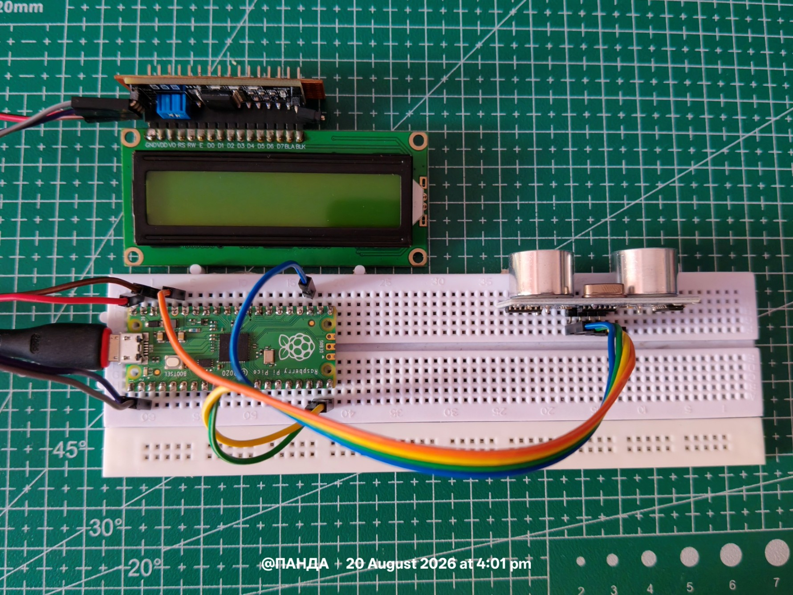
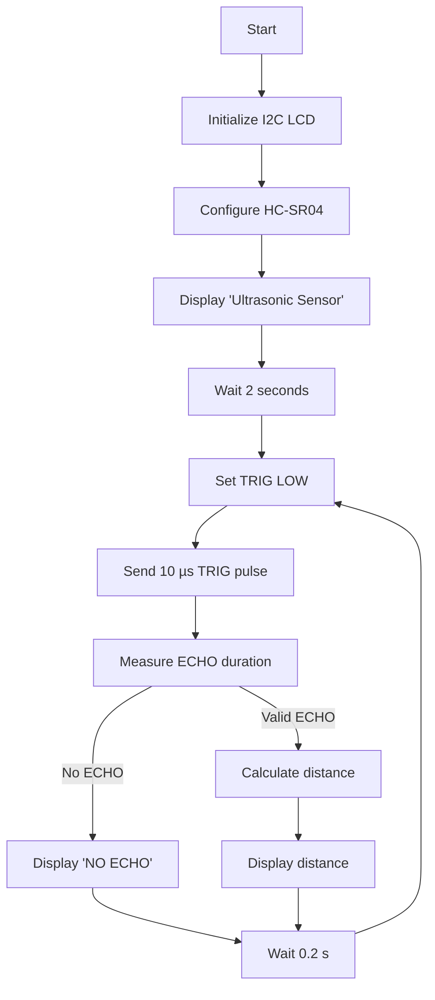
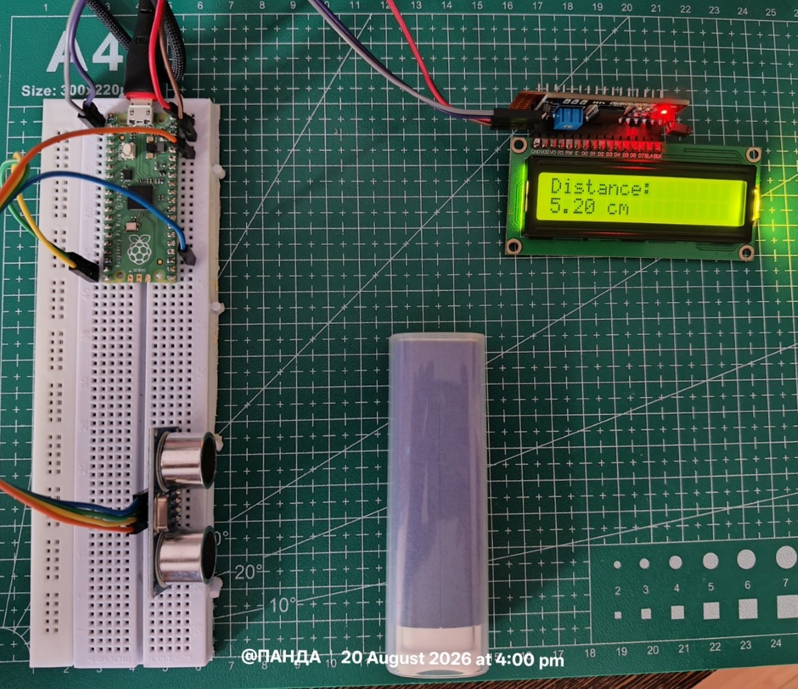

# Ultrasonic Distance Meter with I2C LCD (MicroPython)
 
A MicroPython program for a microcontroller (e.g. Raspberry Pi Pico / Pico W) that measures distance using an **HC-SR04 ultrasonic sensor** and displays the result on a **16x2 I2C LCD**.
 
## Overview
 
The program continuously triggers the HC-SR04 sensor, measures how long it takes for the ultrasonic pulse to bounce back, converts that time into a distance in centimeters, and prints the result to the LCD screen. If no echo is detected within a timeout window, it displays an error message instead.
 
## Hardware Requirements
 
| Component | Purpose |
|---|---|
| Microcontroller (Pico/Pico W or similar) | Runs the MicroPython script |
| HC-SR04 ultrasonic distance sensor | Measures distance via sound pulses |
| 16x2 I2C LCD (with PCF8574 backpack) | Displays the distance reading |
| Jumper wires + breadboard | Wiring |

### Connections 

| Component    | Pico Pin |
| ------------ | -------- |
| LCD SDA      | GP0      |
| LCD SCL      | GP1      |
| HC-SR04 TRIG | GP15     |
| HC-SR04 ECHO | GP14     |
| GND          | GND      |
| LCD VCC      | 5V/VBUS* |
| HC-SR04 VCC  | 3.3V VSYS |

### Circuit : 




## Pin Configuration
 
| Signal | Microcontroller Pin |
|---|---|
| I2C SDA | Pin 0 |
| I2C SCL | Pin 1 |
| HC-SR04 TRIG | Pin 15 (output) |
| HC-SR04 ECHO | Pin 14 (input) |
 
> **Note:** The HC-SR04's ECHO pin outputs 5V logic on most modules, while many microcontrollers (like the Pico) use 3.3V logic. A voltage divider or logic level shifter is recommended on the ECHO line to avoid damaging the board.
 
## Dependencies
 
- `machine` - built-in MicroPython module for hardware I/O (`Pin`, `I2C`, `time_pulse_us`)
- `i2c_lcd` - a third-party driver (`I2cLcd` class) that handles communication with the I2C LCD backpack. This must be uploaded to the device alongside `main.py`.
- `time` - built-in module for `sleep` and `sleep_us`

## Features

- Measures object distance using the HC-SR04 ultrasonic sensor.
- Displays distance on a 16x2 I2C LCD.
- Uses MicroPython on Raspberry Pi Pico/Pico W.
- Measures echo pulse duration with microsecond resolution.
- Displays distance with 2 decimal places.
- Detects missing/timeout echo conditions.
- Continuously updates the measurement approximately every 200 ms.
- Uses a simple and easy-to-understand hardware interface.

## Repo Structure 

```
PS D:\14_HC-SR04_Distance_Measurement> tree /f
D:.
│   main.py
│   README.md
│   
└───assets
        00_Ckt.jpg
        01_det.jpg        
```

>Note : To conduct this experiment you are required to import the $i^2c$LCD libraries which are available in this `05_16x2_LCD_i2c` directory , link : [05_16x2_LCD_i2c](https://github.com/panda-rajsekhar/RaspberryPi-Pico/tree/main/Micro%20Py/05_16x2_LCD_i2c)

## Measurement Principle

The HC-SR04 determines distance using the time-of-flight principle.

1. The microcontroller sends a 10 µs pulse to the TRIG pin.
2. The HC-SR04 emits an ultrasonic burst.
3. The ultrasonic wave travels toward the object.
4. The reflected wave returns to the sensor.
5. The ECHO pin remains HIGH for the duration of the round trip.
6. The microcontroller measures this pulse duration.
7. The round-trip time is converted into distance.

The distance is calculated using:

d = (t × v) / 2

where:

- `d` = distance to the object
- `t` = ECHO pulse duration
- `v` = speed of sound
- `2` = accounts for the outgoing and returning paths


## Code Walkthrough
 
### 1. LCD Initialization
 
```python
i2c = I2C(0, sda=Pin(0), scl=Pin(1), freq=400000)
lcd = I2cLcd(i2c, 0x27, 2, 16)
```
 
- Sets up I2C bus `0` using pins 0 (SDA) and 1 (SCL) at 400 kHz (I2C fast mode).
- Creates an `I2cLcd` object pointed at I2C address `0x27` (the default address for most PCF8574-based LCD backpacks), configured for a 2-row, 16-column display.
### 2. Sensor Pin Setup
 
```python
trig = Pin(15, Pin.OUT)
echo = Pin(14, Pin.IN)
```
 
- `trig` is configured as an output - the microcontroller uses this pin to send the trigger pulse that starts a measurement.
- `echo` is configured as an input - the HC-SR04 drives this pin high for a duration proportional to the round-trip time of the ultrasonic pulse.
### 3. Startup Splash Screen
 
```python
lcd.clear()
lcd.putstr("Ultrasonic")
lcd.move_to(0, 1)
lcd.putstr("Sensor")
sleep(2)
```
 
- Clears the LCD and displays "Ultrasonic" on row 0 and "Sensor" on row 1 for 2 seconds as a simple boot message before entering the main loop.
### 4. Main Loop
 
The program then enters an infinite `while True` loop that repeats the measure-and-display cycle indefinitely.
 
#### a. Reset the Trigger Pin
 
```python
trig.low()
sleep_us(2)
```
 
Ensures the TRIG pin starts from a clean LOW state, with a brief 2 µs settling delay, as recommended by the HC-SR04 datasheet.
 
#### b. Send the Trigger Pulse
 
```python
trig.high()
sleep_us(10)
trig.low()
```
 
A 10 µs HIGH pulse on TRIG tells the HC-SR04 to emit an 8-cycle burst of 40 kHz ultrasonic sound.
 
#### c. Measure the Echo Duration
 
```python
duration = time_pulse_us(echo, 1, 30000)
```
 
- `time_pulse_us()` waits for the ECHO pin to go HIGH, then measures how long it stays HIGH (in microseconds) before returning LOW.
- The second argument (`1`) tells it to time the HIGH pulse.
- The third argument (`30000`) is a timeout in microseconds (30 ms). If no echo is received within this window, the function returns a negative value, signaling a timeout/error (this corresponds to roughly a 5-meter maximum range, beyond which the sensor's typical response would exceed the timeout).
- The 30 ms timeout corresponds to approximately 5.15 m of theoretical
round-trip travel at 343 m/s. The actual usable range is lower and
depends on the HC-SR04 module, target, environment, and signal quality.
#### d. Display the Result
 
```python
lcd.clear()
 
if duration < 0:
 lcd.putstr("NO ECHO")
 lcd.move_to(0, 1)
 lcd.putstr("Check Sensor")
else:
 distance = (duration * 0.0343) / 2
 lcd.putstr("Distance:")
 lcd.move_to(0, 1)
 lcd.putstr("{:.2f} cm".format(distance))
```
 
- **Error case:** If `duration` is negative (timeout occurred), the LCD shows `NO ECHO` / `Check Sensor`, indicating the pulse was never received - often due to no object in range, a wiring issue, or a faulty sensor.
- **Success case:** If a valid echo duration was captured, the distance is calculated using the speed of sound formula:
```
 distance (cm) = (duration_us × 0.0343 cm/us) / 2
```
 
 - `0.0343 cm/µs` is the speed of sound in air (~343 m/s).
 - The result is divided by 2 because `duration` represents the round-trip time (sensor → object → sensor), so only half the distance-time product corresponds to the actual distance to the object.
 - The result is formatted to 2 decimal places and displayed as `X.XX cm`.
#### e. Loop Delay
 
```python
sleep(0.2)
```
 
Waits 200 ms before the next measurement cycle, giving the sensor time to settle and preventing excessive echo interference between readings, while still refreshing the display roughly 5 times per second.
 
## Flowchart
 

 

## Demo 




## Program Flow Summary
 
1. Initialize I2C bus and LCD.
2. Configure TRIG (output) and ECHO (input) pins.
3. Show a 2-second splash screen.
4. Loop forever:
 - Send a 10 µs trigger pulse.
 - Measure the echo pulse width (with a 30 ms timeout).
 - Calculate distance from pulse duration, or report an error if no echo was received.
 - Update the LCD with the result.
 - Wait 200 ms and repeat.
## Known Limitations
 
- No debouncing/averaging of readings - each cycle displays a single raw measurement, which can be noisy.
- The 30 ms timeout limits maximum reliable measurement range to roughly 5 meters.
- Assumes a fixed speed of sound (doesn't compensate for temperature/humidity variation).
- The I2C LCD address (`0x27`) is hardcoded; some backpacks use `0x3F` instead - scan the I2C bus if the display doesn't initialize.

## Troubleshooting

### LCD does not display anything

- Check the LCD power and ground connections.
- Verify SDA and SCL connections.
- Check the I2C address.
- The LCD backpack may use `0x3F` instead of `0x27`.

### LCD displays correctly but distance is not measured

- Check the TRIG connection to GP15.
- Check the ECHO connection to GP14.
- Make sure the HC-SR04 is powered correctly.
- Check the ECHO voltage level before connecting it to the Pico.

### `NO ECHO` is displayed

- Make sure an object is within the sensor's effective range.
- Check the sensor wiring.
- Make sure the sensor is facing the object.
- Check whether the HC-SR04 is receiving power.

### Distance readings fluctuate

- The current program displays individual raw measurements.
- Try averaging multiple measurements.
- Keep the sensor perpendicular to the target.
- Avoid soft, angled, or irregular surfaces that may absorb or scatter ultrasound.

## Future Improvements

Possible improvements include:

- Add averaging/filtering to reduce measurement noise.
- Add a configurable minimum and maximum distance.
- Add an LED or buzzer for proximity warnings.
- Add temperature compensation for the speed of sound.
- Automatically detect the LCD I2C address.
- Add a graphical interface or serial monitoring.
- Store measurement history.
- Add Wi-Fi-based monitoring using the Pico W.
- Add an OLED or larger display.

## Accuracy and Testing

The measured distance can differ slightly from the actual distance due to:

- Sensor characteristics
- Speed-of-sound variation with temperature
- Object shape and surface
- Sensor alignment
- Electrical noise
- Timing and measurement limitations

For best results, keep the sensor perpendicular to a flat target and perform measurements at several known distances.

Example:

| Actual Distance | Measured Distance | Error |
|---:|---:|---:|
| 10 cm | 10.2 cm | +0.2 cm |
| 20 cm | 20.1 cm | +0.1 cm |
| 30 cm | 30.3 cm | +0.3 cm |


## Author's Note

This project is created primarily for **learning, experimentation, and educational purposes**. I am not a professional embedded-systems engineer, and the code, circuit design, explanations, and documentation may contain mistakes, inaccuracies, or areas that could be improved.

The implementation represents my current understanding while learning MicroPython, microcontrollers, sensors, and hardware interfacing. It should therefore **not be considered professional, production-ready, or authoritative engineering documentation**.

If you find an error or have a better approach, corrections and suggestions are welcome. The main purpose of this repository is to document the learning process, share what I have built, and hopefully help others who are learning similar concepts.

**Use the information and hardware connections at your own discretion, and verify specifications against the relevant component documentation before building or modifying a circuit.**