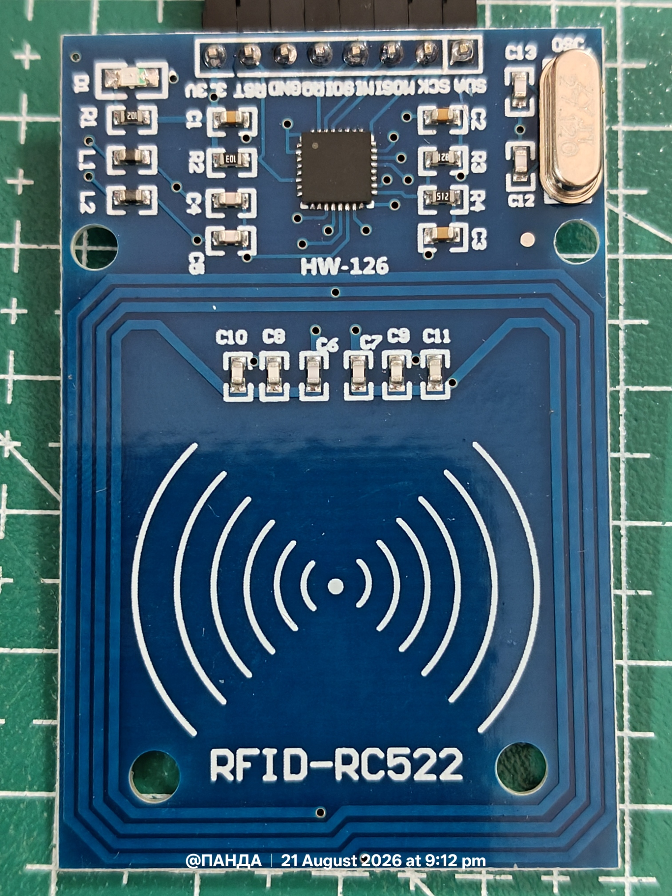
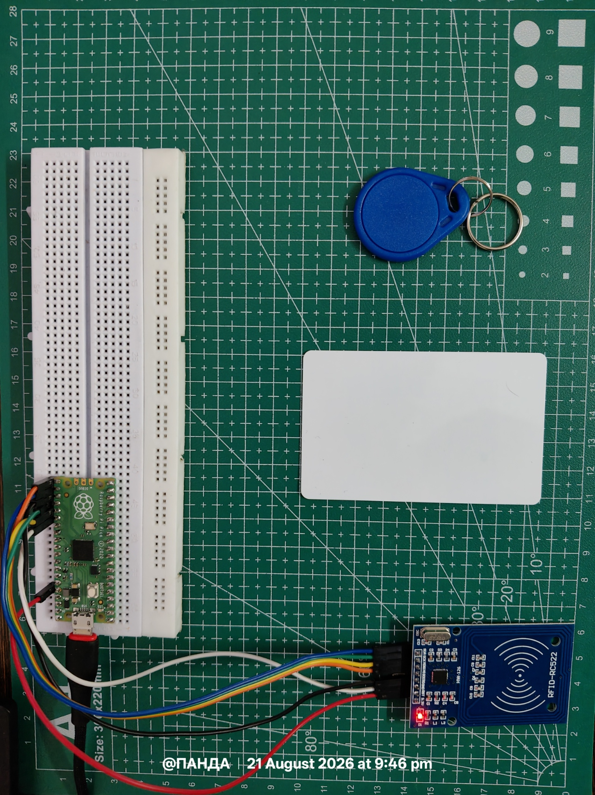
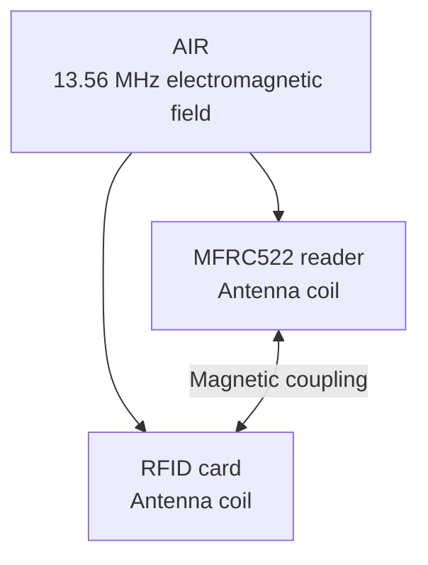
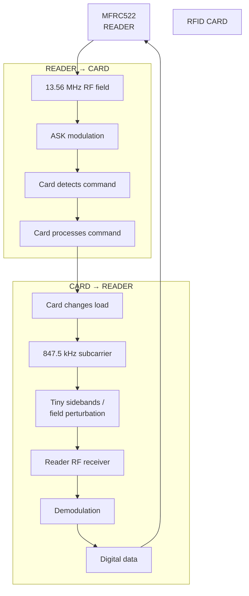
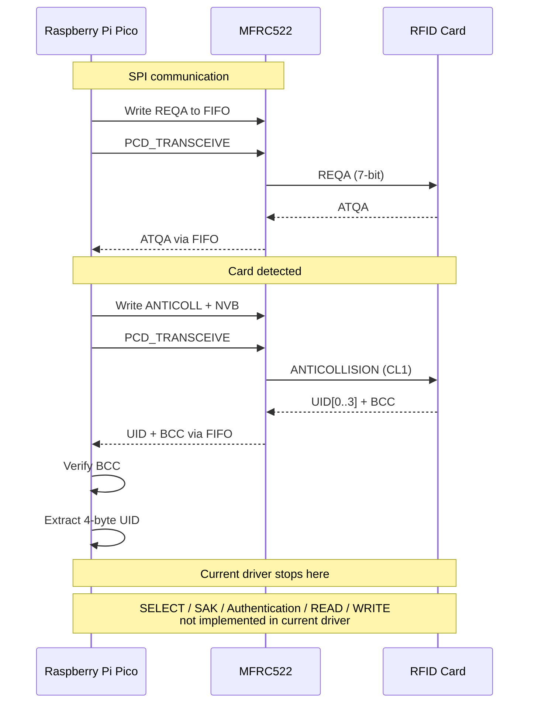

<!-- Jai Jagannath -->
# RFID - USING RC522
 

<p align="center">
 
 <br>
 <em>RFID Module </em>
</p>


## 1. Overview
 
This chapter deals with the basic RFID system using the MFRC522 RFID module interfaced with a Raspberry Pi Pico, and the core concepts behind how it actually works - not just "wire it up and read a UID."
 
---



>Red light denotes a powered up module. 
 
## 2. What RFID Actually Is
 
RFID = Radio Frequency Identification.
 
The fundamental idea: use electromagnetic waves to transfer information between a reader and a tag, without requiring a physical electrical connection. (This system is typically introduced in Class 12 Physics in India, under EM induction / AC circuits, though never tied explicitly to RFID.)
 
For the MFRC522 system specifically, we are talking about:
 
- 13.56 MHz carrier frequency
- NFC-like high-frequency (HF) RFID
- ISO/IEC 14443 Type A protocol
- Passive tags/cards (no onboard battery)
- Short-range inductive coupling (near-field, not radiative far-field)
### 2.1 Typical System
 

 
---
 
## 3. Physics: Inductive Coupling (Why No Battery Is Needed)
 
This is the part most tutorials skip, and it's the actual "core concept" worth understanding.
 
### 3.1 Near-Field vs Far-Field
 
At 13.56 MHz, the wavelength is roughly 22 m. The reader and card operate within a few centimeters of each other - deep inside the **near field**, where the dominant coupling mechanism is magnetic (inductive), not the propagating EM wave used in far-field radio (like Wi-Fi or GPS).
 
This is why RFID at this frequency behaves more like a **loosely coupled transformer** than a radio link.
 
### 3.2 The Transformer Model
 
- The reader's antenna coil carries an alternating current at 13.56 MHz, generating an oscillating magnetic field.
- The card's antenna coil sits within this field. By Faraday's law, the changing flux induces an EMF (voltage) across the card's coil.
- A passive ISO/IEC 14443A card uses an RF rectifier/power harvesting circuit, but calling it specifically a diode bridge is unnecessarily specific and can be misleading. The actual IC implementation can use semiconductor rectifier structures rather than a textbook four-diode bridge.
- OR we can write it as : This induced AC voltage is rectified by the card's RF power-harvesting circuit and stored on an internal capacitor, providing the DC supply needed by the IC
- It is then used to charge a small capacitor, which powers the card's IC - the chip, memory, and logic all run off this harvested energy.
- No battery. The card is entirely **passive**; it "wakes up" only when it enters the reader's field.
### 3.3 Load Modulation (How the Card "Talks Back")
 
The card cannot transmit its own RF signal - it has no active transmitter. Instead, it uses **load modulation**:
 
1. The card switches its load in a way that produces a modulation component at the 847.5 kHz subcarrier frequency (13.56 MHz / 16). This creates small sidebands around the 13.56 MHz carrier that can be detected by the reader.
2. This changes the impedance the card's coil presents to the magnetic field.
3. Because the reader and card coils are magnetically coupled (like a transformer), this impedance change reflects back and slightly perturbs the current in the *reader's* coil.
4. The reader detects this tiny amplitude variation and decodes it as data.
So communication card → reader isn't "transmission" at all - it's the card modulating how much it "loads" the reader's own field, and the reader listening to itself.

In a sense, the reader is 'listening to itself': it generates the carrier and detects the tiny changes that the card induces in that field.
 
| Direction | Mechanism |
|---|---|
| Reader → Card | Amplitude Shift Keying (ASK) of the 13.56 MHz carrier |
| Card → Reader | Load modulation at 847.5 kHz subcarrier, sensed as a tiny amplitude ripple on reader's antenna |
 
---


>Note : Open in Wide-Screen to see diagrams properly! 




## 4. The MFRC522 Module
 
The MFRC522 is a highly integrated reader/writer IC for 13.56 MHz contactless communication, handling the analog front-end (modulation/demodulation) so the host MCU only deals with digital frame data.
 
### 4.1 Key Specs
 
| Parameter | Value |
|---|---|
| Operating frequency | 13.56 MHz |
| Supported protocol | ISO/IEC 14443 Type A (also supports MIFARE Classic/Ultralight, some NTAG) |
| Host interface | SPI (also supports I2C / UART variants on the die, but common breakout boards wire only SPI) |
| Logic supply | 3.3 V (IMPORTANT - not 5 V tolerant on most breakout boards) |
| Typical read range | 0-60 mm (card-dependent, antenna-size dependent) |
| Max SPI clock | ~10 Mbit/s |
 
### 4.2 Pinout (Common Breakout Board)
 
| MFRC522 Pin | Function | Raspberry Pi Pico Pin (suggested) |
|---|---|---|
| SDA (SS/CS) | SPI Chip Select | GP17 |
| SCK | SPI Clock | GP18 |
| MOSI | SPI Data Out (host → module) | GP19 |
| MISO | SPI Data In (module → host) | GP16 |
| IRQ | Interrupt (optional, unused in basic polling) | - |
| GND | Ground | GND |
| RST | Reset (active low) | GP20 |
| 3.3V | Power | 3V3(OUT) |
 
**Note:** The Pico's SPI0 bus defaults to these GP16-GP19 pins, but any SPI-capable GPIO can be reassigned in software. Always confirm 3.3 V logic - driving RST/CS from a 5 V source will damage the module.
 
---


## RFID Communication Sequence - REQA to UID




` "Talk is cheap. Show me the code."- Linus Torvalds `


---

>Source File : rfid.py

# MFRC522 RFID Reader Driver - Line-by-Line Explanation

This is a MicroPython driver for the **MFRC522 RFID reader module** (13.56 MHz, ISO14443A) running on a Raspberry Pi Pico over SPI.

---

## 1. Imports

```python
from machine import Pin, SPI
```
`Pin` controls GPIO pins (digital in/out); `SPI` gives access to the Pico's hardware SPI peripheral.

```python
from time import sleep_ms
```
Millisecond-resolution delay function, used for reset timing and the polling loop.

---

## 2. Register Constants

```python
CommandReg = 0x01
```
Address of the register that controls the chip's internal command state machine (idle, transceive, calibrate, soft-reset, etc.).

```python
ComIEnReg = 0x02
```
Interrupt **enable** register - not actually used in this code (interrupts aren't wired up; the code polls instead), but kept for reference/completeness.

```python
ComIrqReg = 0x04
```
Interrupt **request** register - flags get set here when an event happens (RX complete, timer expires, etc.). This is polled in `transceive()`.

```python
ErrorReg = 0x06
```
Holds error flags from the last operation (collision, parity error, buffer overflow, protocol error). Checked after every transceive.

```python
FIFODataReg = 0x09
```
A single address that acts as a window into the 64-byte FIFO - every write pushes one byte in, every read pops one byte out.

```python
FIFOLevelReg = 0x0A
```
Reports how many bytes currently sit in the FIFO; also used to flush the FIFO (writing bit 7 = 1 clears it).

```python
ControlReg = 0x0C
```
Miscellaneous status/control bits (e.g. number of valid bits in the last received byte). Defined but not directly used here.

```python
BitFramingReg = 0x0D
```
Controls bit-level framing: how many valid bits are in the last byte of a TX frame, and has the "StartSend" bit (0x80) that kicks off transmission.

```python
CollReg = 0x0E
```
Records at which bit position a collision occurred (relevant for anti-collision when multiple cards respond). Defined but not read here - the code just checks for errors generically instead.

```python
ModeReg = 0x11
```
General mode settings - CRC preset, MSB/LSB behavior for the internal CRC coprocessor, etc.

```python
TxModeReg = 0x12
RxModeReg = 0x13
```
Configure the transmit/receive data rate and framing (both set to `0x00` = default 106 kbit/s ISO14443A here).

```python
TxControlReg = 0x14
```
Controls the two antenna driver pins TX1/TX2 - bit 0 and bit 1 enable each pin's output. This is what actually turns the antenna's RF field on.

```python
TxASKReg = 0x15
```
Configures ASK modulation (specifically the 100% ASK modulation used by ISO14443A) for the transmitter.

```python
TModeReg = 0x2A
TPrescalerReg = 0x2B
TReloadHReg = 0x2C
TReloadLReg = 0x2D
```
The four registers that configure the chip's internal timer, used to time out a `transceive` if a card never responds. `TModeReg` sets the timer's clock source/auto-start behavior, `TPrescalerReg` divides the clock down, and the two `TReload` registers set the 16-bit countdown starting value (split high/low byte).

```python
VersionReg = 0x37
```
Read-only register containing the chip's silicon version ID - used as a "is this chip actually there and alive" sanity check.

---

## 3. Command Constants

```python
PCD_IDLE = 0x00
```
"PCD" = Proximity Coupling Device (the reader itself, as opposed to "PICC" = the card). Writing this to `CommandReg` cancels whatever the chip is doing and returns it to idle.

```python
PCD_TRANSCEIVE = 0x0C
```
Tells the chip to simultaneously transmit the FIFO contents and then listen for a reply - this is the workhorse command for talking to a card.

```python
PCD_RESETPHASE = 0x0F
```
Soft-reset command - reinitializes internal registers to power-up defaults.

```python
PICC_REQA = 0x26
```
The ISO14443A "Request Type A" command byte - a short-frame (7-bit, not 8-bit) command broadcast to wake up any idle card in range.

```python
PICC_ANTICOLL = 0x93
```
First byte of the anti-collision command sequence (cascade level 1), used to read out a card's UID when multiple cards might be present.

---

## 4. SPI Object Setup

```python
spi = SPI(
 0,
 baudrate=1_000_000,
```
Uses hardware SPI bus 0 at 1 MHz - conservative but safe; the MFRC522 supports up to 10 MHz.

```python
 polarity=0,
 phase=0,
```
SPI mode 0 (clock idle low, data sampled on rising edge) - this is the mode the MFRC522 requires.

```python
 sck=Pin(18),
 mosi=Pin(19),
 miso=Pin(16)
)
```
Assigns the physical GPIO pins on the Pico to the SPI clock, master-out, and master-in lines respectively.

```python
cs = Pin(17, Pin.OUT, value=1)
```
Chip-select pin, active-low, driven manually (not by the SPI peripheral's automatic CS) - initialized high (deselected).

```python
rst = Pin(20, Pin.OUT, value=1)
```
Hardware reset pin for the MFRC522, active-low, initialized high (not in reset).

---

## 5. Low-Level SPI Register Access

```python
def write_reg(reg, value):
 cs.value(0)
```
Pull chip-select low to begin an SPI transaction with the MFRC522.

```python
 spi.write(bytes([(reg << 1) & 0x7E, value]))
```
Sends two bytes: the address byte (register shifted into bits 6:1, write bit clear, bit 0 clear) followed by the data byte to write.

```python
 cs.value(1)
```
Release chip-select, ending the transaction.

```python
def read_reg(reg):
 cs.value(0)
 spi.write(bytes([((reg << 1) & 0x7E) | 0x80]))
```
Sends the address byte with bit 7 set (`0x80`) to signal a read.

```python
 value = spi.read(1)[0]
```
Clocks out one dummy byte to receive the register's content (SPI is full-duplex, so a read requires clocking something out too); `spi.read()` sends 0x00 bytes by default while capturing the incoming byte.

```python
 cs.value(1)
 return value
```
End transaction, return the single byte read.

```python
def set_bit_mask(reg, mask):
 write_reg(reg, read_reg(reg) | mask)
```
Read-modify-write: OR the mask into the current register value to set specific bits without disturbing others.

```python
def clear_bit_mask(reg, mask):
 write_reg(reg, read_reg(reg) & (~mask))
```
Same idea but AND with the inverted mask to clear specific bits.

---

## 6. Reset Routine

```python
def reset():
 rst.value(0)
 sleep_ms(2)
```
Pull the hardware reset line low and hold for 2ms - triggers a hard reset of the chip.

```python
 rst.value(1)
 sleep_ms(50)
```
Release reset, then wait 50ms for the chip's oscillator to stabilize before talking to it.

```python
 write_reg(CommandReg, PCD_RESETPHASE)
 sleep_ms(50)
```
Additionally issue a **soft** reset command over SPI (belt-and-suspenders alongside the hardware reset), then wait again for it to complete.

---

## 7. Initialization

```python
def init_rc522():
 reset()
```
Start from a clean, known chip state.

```python
 write_reg(TModeReg, 0x8D)
 write_reg(TPrescalerReg, 0x3E)
```
Configure the timer: `0x8D` sets TAuto=1 (timer starts automatically after transmission ends) and the upper 4 bits of the prescaler; `0x3E` sets the lower 8 bits of the prescaler. Together these set the timer's tick period (a standard value from the datasheet's example init sequence, giving ~25µs per tick / ~25ms timeout with the reload values below).

```python
 write_reg(TReloadLReg, 30)
 write_reg(TReloadHReg, 0)
```
Sets the 16-bit timer reload value to 30 (low byte 30, high byte 0) - determines how long the chip waits before timing out.

```python
 write_reg(TxASKReg, 0x40)
```
Forces 100% ASK modulation, which ISO14443A requires.

```python
 write_reg(ModeReg, 0x3D)
```
Sets the CRC coprocessor's preset value to `0x6363` (the ISO14443A standard) and other default mode bits - standard value from the datasheet.

```python
 write_reg(TxModeReg, 0x00)
 write_reg(RxModeReg, 0x00)
```
Both set to default: 106 kbit/s, standard framing, no special speed modes.

```python
 # Turn antenna ON
 if (read_reg(TxControlReg) & 0x03) != 0x03:
 set_bit_mask(TxControlReg, 0x03)
```
Reads the current antenna control bits; if TX1 and TX2 aren't both already enabled (bits 0 and 1), sets them - this energizes the antenna's 13.56 MHz field. The `if` check avoids unnecessarily re-triggering the antenna driver if it's already on.

---

## 8. Transceive - the Core Communication Function

```python
def transceive(data, valid_bits=0):
 write_reg(CommandReg, PCD_IDLE)
```
Cancel any command in progress before starting a new one.

```python
 write_reg(ComIrqReg, 0x7F)
```
Clear all pending interrupt flags by writing 1s to them (on this chip, writing 1 to an IRQ bit clears it), so old flags don't cause a false "done" detection.

```python
 write_reg(FIFOLevelReg, 0x80)
```
Setting bit 7 of `FIFOLevelReg` flushes the FIFO buffer, clearing out any leftover bytes from a previous operation.

```python
 for byte in data:
 write_reg(FIFODataReg, byte)
```
Pushes each byte of the outgoing command into the FIFO - writes to this one address just keep queuing bytes.

```python
 write_reg(BitFramingReg, valid_bits)
```
Sets how many bits of the *last* byte in the FIFO are valid - needed because ISO14443A short frames like REQA are only 7 bits, not a full byte. `0` here means "all 8 bits valid" (used for the anti-collision command).

```python
 write_reg(CommandReg, PCD_TRANSCEIVE)
```
Tells the chip to begin the combined transmit-then-receive operation.

```python
 set_bit_mask(BitFramingReg, 0x80)
```
Sets the "StartSend" bit - this is what actually kicks the transmission off (the command register alone arms it, this bit fires it).

```python
 for _ in range(100):
 irq = read_reg(ComIrqReg)

 if irq & 0x30:
 break

 if irq & 0x01:
 break

 sleep_ms(1)
```
Polls the interrupt register up to 100 times (≈100ms max). `0x30` checks bits 4 and 5 - RxIRq (data received) and IdleIRq (command finished). `0x01` checks TimerIRq (the internal timer expired = no card responded, timeout). Whichever comes first ends the wait; 1ms delay between polls.

```python
 clear_bit_mask(BitFramingReg, 0x80)
```
Clears the StartSend bit again, resetting it for the next call.

```python
 if read_reg(ErrorReg) & 0x1B:
 return None
```
Checks the error register for any of: buffer overflow, parity error, protocol error, or collision error (bits making up mask `0x1B`). If any occurred, abort and signal failure with `None`.

```python
 length = read_reg(FIFOLevelReg)

 if length == 0:
 return None
```
Reads how many bytes came back into the FIFO. Zero bytes means nothing was received (e.g. timeout with no card) - treat as failure.

```python
 response = []
 for _ in range(length):
 response.append(read_reg(FIFODataReg))

 return response
```
Pops each received byte out of the FIFO one at a time into a list, and returns it.

---

## 9. REQA Wrapper

```python
def request():
 response = transceive([PICC_REQA], 0x07)
 return response
```
Sends the REQA byte, telling `transceive` that only 7 bits of it are valid (per the ISO14443A short-frame spec) - this is what wakes idle cards in the field and asks them to respond with their ATQA (answer to request).

---

## 10. UID Reading

```python
def read_uid():
 response = transceive([PICC_ANTICOLL, 0x20])
```
Sends the anti-collision command: `0x93` (cascade level 1) followed by `0x20` (NVB - number of valid bits - meaning "I'm sending no UID bits yet, give me the full UID"). This is a simplified anti-collision that assumes only one card is present.

```python
 if response is None:
 return None

 if len(response) != 5:
 return None
```
A valid anti-collision reply is exactly 5 bytes: 4 UID bytes + 1 BCC (checksum) byte. Anything else is treated as invalid/failed.

```python
 checksum = 0
 for i in range(4):
 checksum ^= response[i]

 if checksum != response[4]:
 return None
```
The BCC is defined as the XOR of the 4 UID bytes. This recomputes it and compares against the byte the card sent, to catch corrupted reads.

```python
 return response[:4]
```
Returns just the 4-byte UID, dropping the checksum byte.

---

## 11. Main Program

```python
print("MFRC522 test")
print("----------------")

init_rc522()
```
Banner text, then runs the full chip initialization sequence described above.

```python
version = read_reg(VersionReg)
print("Version register:", hex(version))
```
Reads the chip's fixed version ID as a sanity check and prints it in hex.

```python
if version not in (0x00, 0xFF):
 print("RC522 detected! (version 0x%02X)" % version)
else:
 print("RC522 NOT detected - check wiring/power.")
```
`0x00` and `0xFF` are the values you'd read if the SPI bus is disconnected/floating or dead (all-low or all-high lines), so anything else implies a real chip responded.

```python
print("----------------")
print("Bring an RFID card/tag near the antenna...")
print()
```
User prompt before entering the main polling loop.

```python
while True:
 card = request()
```
Infinite loop: on each iteration, sends REQA to check if any card is in range.

```python
 if card is not None:
 uid = read_uid()
```
If a card answered REQA, attempt to read its UID via anti-collision.

```python
 if uid is not None:
 uid_string = ":".join(
 "{:02X}".format(x) for x in uid
 )
```
If the UID was read successfully, formats the 4 bytes as a colon-separated hex string, e.g. `"DE:AD:BE:EF"`.

```python
 print("RFID TAG DETECTED!")
 print("UID:", uid_string)
 print()

 sleep_ms(1000)
```
Prints the detected UID, then sleeps 1 second - this debounces the loop so a card held near the reader doesn't spam duplicate detections dozens of times per second.

```python
 sleep_ms(100)
```
A shorter 100ms delay on every loop iteration (even when no card is found) to avoid hammering the SPI bus and CPU in a tight busy-loop.

---

# Output 
```
>>> %Run -c $EDITOR_CONTENT

MPY: soft reboot
MFRC522 test
----------------
Version register: 0xb2
RC522 detected! (version 0xB2)
----------------
Bring an RFID card/tag near the antenna...

RFID TAG DETECTED!
UID: 31:60:01:16

RFID TAG DETECTED!
UID: C2:71:F7:05
```


## Note on the Anti-Collision Logic

`read_uid()` only handles the single-card case (NVB=`0x20`, full UID request). If two cards are in the field simultaneously, both will respond and their signals will collide on the RF channel, producing a garbled or failed read rather than a proper collision-resolution cascade - that's a reasonable simplification for a basic test script, but worth knowing if you plan to extend this for multi-card scenarios.


## 11. Limitations

This implementation is intentionally simplified and is primarily intended for learning and experimentation.

* The current anti-collision implementation handles only a single-card scenario and only implements the first cascade level.
* Full UID cascade handling for 7-byte and 10-byte UIDs is not implemented.
* The driver does not currently implement the complete `SELECT → SAK` sequence.
* MIFARE Classic authentication and `READ` / `WRITE` operations are not implemented in the current version.
* The driver uses polling rather than the MFRC522's interrupt mechanism.
* Error handling and protocol handling are intentionally kept simple for clarity.
* The implementation has been tested primarily with the hardware setup documented in this repository and may require modification for other cards, modules, or configurations.

These limitations are intentional. The goal of this project is to understand what happens beneath a high-level RFID library and gradually build the driver from the register level upward.

---

## 12. Experiments / Results

The driver was developed and tested using a Raspberry Pi Pico connected to an MFRC522 RFID module through SPI.

The current implementation successfully demonstrates:

1. MFRC522 hardware reset and initialization.
2. Reading the MFRC522 `VersionReg` to verify communication with the chip.
3. Enabling the RF antenna.
4. Sending a Type A `REQA` command.
5. Receiving and processing the `ATQA` response.
6. Performing a simplified anti-collision procedure.
7. Reading a 4-byte UID and its BCC.
8. Verifying the UID using the BCC.
9. Printing the detected UID through the Pico's serial output.

The purpose of these experiments is not to provide a complete production-ready RFID stack, but to progressively understand the relationship between the MicroPython code, SPI transactions, MFRC522 registers, ISO/IEC 14443A commands, and the underlying RF communication.

---

## 13. Further Work

There are several directions in which this project can be extended:

* Implement complete ISO/IEC 14443A anti-collision and cascade-level handling.
* Implement the `SELECT` command and process the resulting `SAK`.
* Support 7-byte and 10-byte UIDs.
* Implement MIFARE Classic authentication.
* Implement MIFARE Classic block `READ` and `WRITE` operations.
* Add proper collision handling for multiple cards in the field.
* Explore the MFRC522 interrupt system instead of polling.
* Investigate the MFRC522's CRC coprocessor in greater detail.
* Measure and characterize the SPI communication and transaction timing.
* Investigate the RF side of the system further, including antenna matching, coupling, load modulation, and read range.
* Eventually compare the hand-written driver against established MFRC522 libraries and verify each implementation detail against the datasheet.

The long-term goal is to move from simply *using* an RFID reader to understanding and implementing the complete communication stack from the microcontroller interface all the way to the RF layer.

---

## Author's Note

> I am still learning, and this project is very much a work in progress. I have tried to understand and explain the hardware, protocol, and implementation as accurately as I can, but I am still a student and I can absolutely get things wrong.
>
> If you find an error, an inaccurate explanation, or something that could be improved, please feel free to point it out. I would genuinely appreciate the correction.
>
> This project is primarily a learning exercise, and every mistake is part of the process of understanding the system better.
>
> **I'm not claiming to be an expert - I'm just a student trying to understand what is happening underneath the abstractions.**
>


<!-- Jai Jagannath -->
