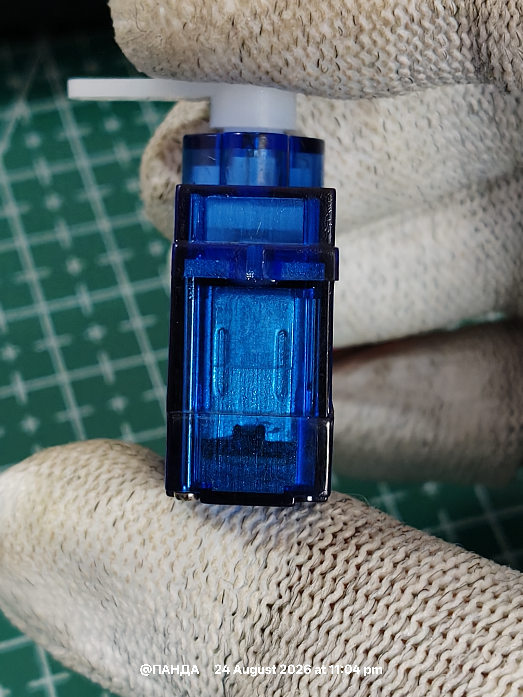
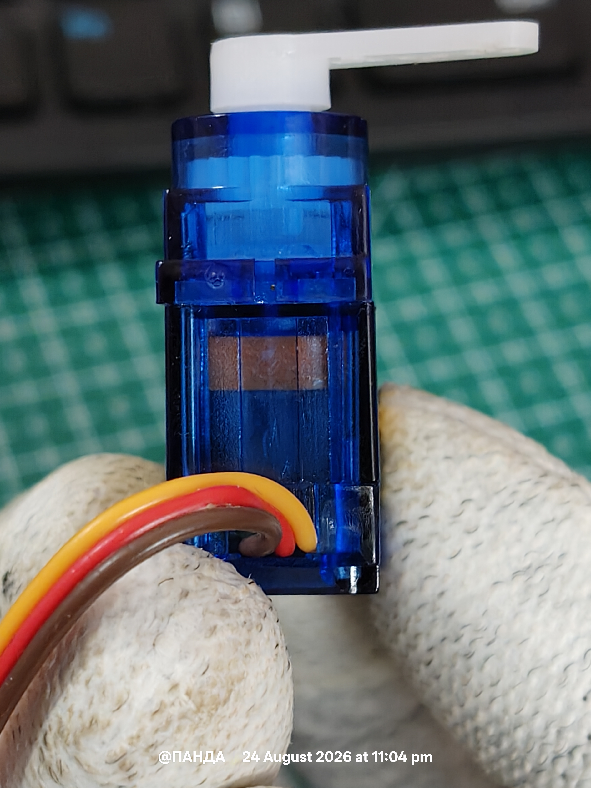
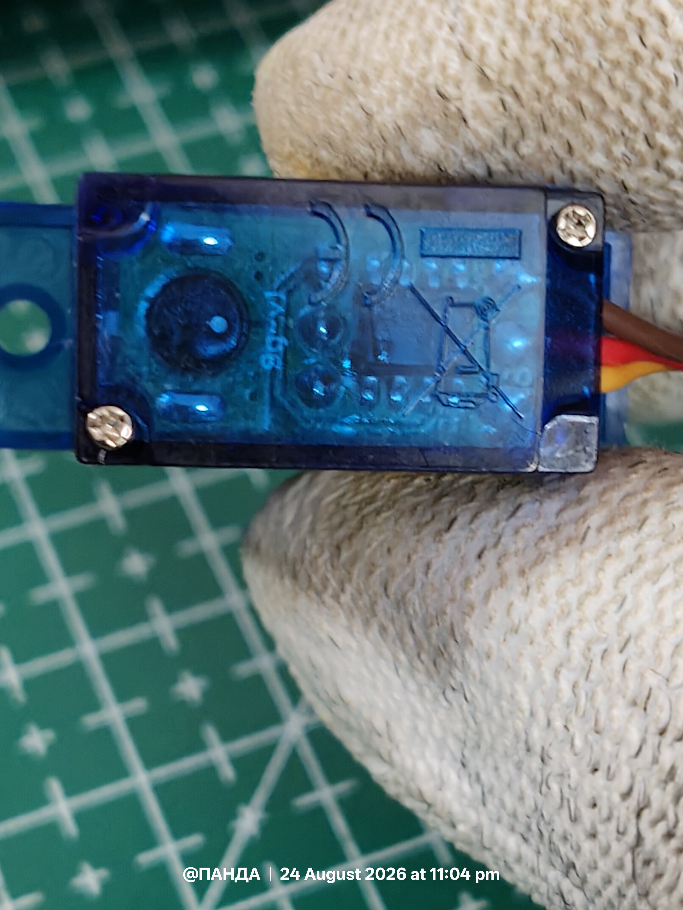
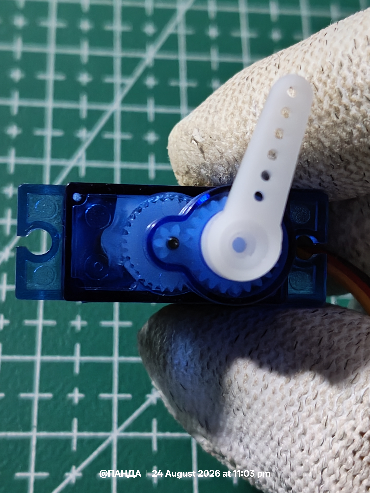
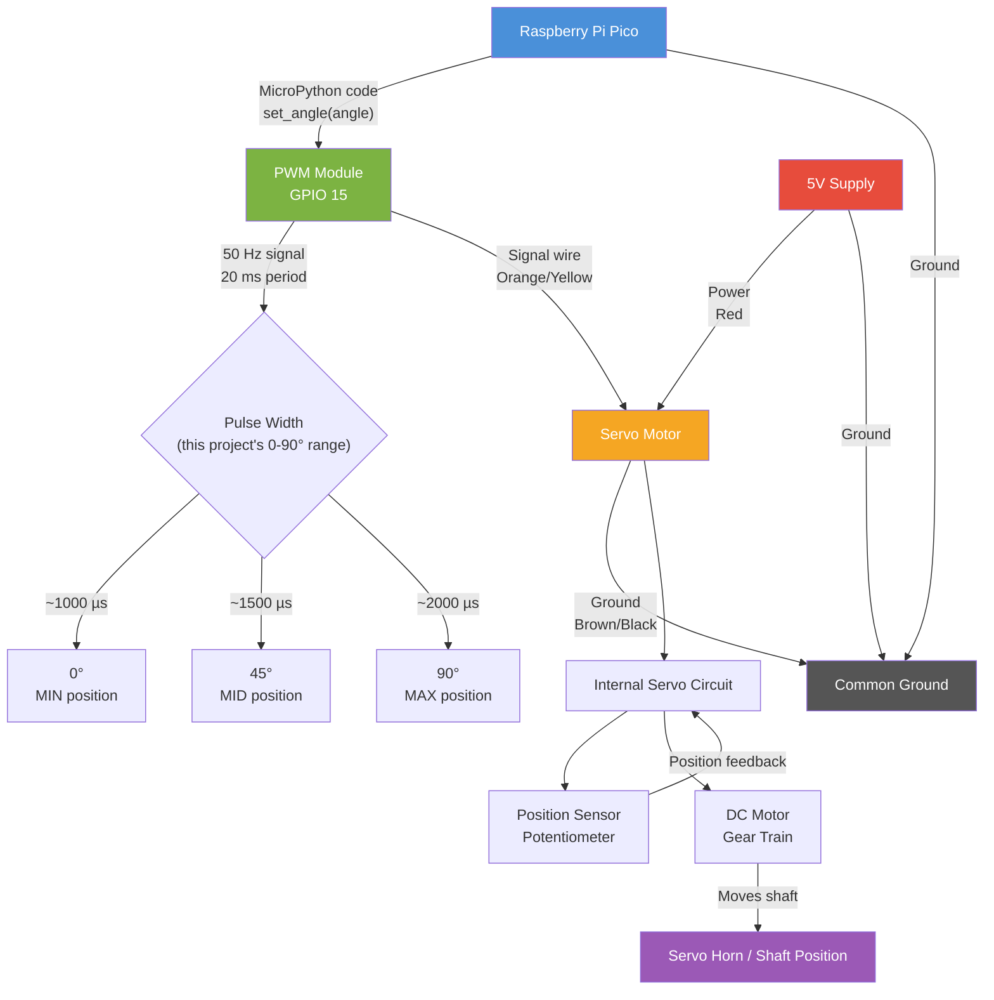
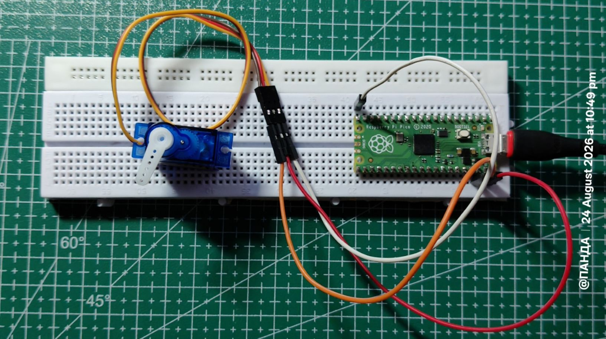
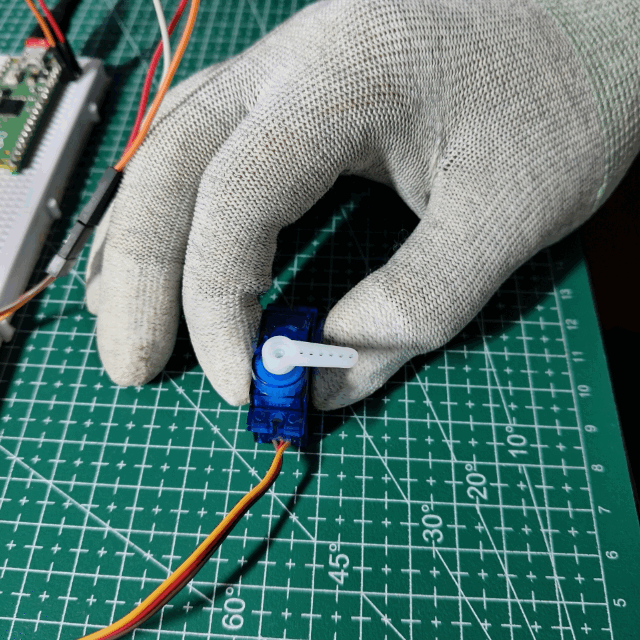

# Servo Motor and PWM

A **servo motor** is a motor packaged with built-in **position (or speed) feedback and control electronics**. Instead of simply spinning when powered, a servo drives its output shaft toward a specific commanded position and automatically corrects its position if an external force moves it away from the target.

## What's Inside a Servo Motor?

A typical hobby servo, such as the **SG90** or **MG996R**, combines four main components inside a single housing:

| Component | Function |
| ------------------- | ------------------------------------------------------------------------------------------------------------------------ |
| **DC Motor** | Provides the actual rotational torque. |
| **Gear Train** | Reduces the motor's high RPM while increasing torque at the output shaft. |
| **Position Sensor** | Usually a potentiometer mechanically coupled to the output shaft, providing feedback proportional to the shaft position. |
| **Control Circuit** | Compares the commanded position with the measured position and drives the motor to reduce the error. |

This feedback mechanism makes the servo a **closed-loop control system**.

## What Makes It a "Servo"?

A conventional **DC motor** primarily responds to the applied voltage and does not inherently know the position of its shaft. It cannot automatically maintain a specific position when an external disturbance is applied.

A servo, on the other hand, continuously:

1. Receives a commanded position.
2. Measures its current position using the feedback sensor.
3. Calculates the position error.
4. Drives the motor to reduce that error.
5. Repeats the process to maintain the desired position.

This closed-loop behavior is what makes it a **servomechanism**.

The same fundamental concept is used beyond hobby robotics, including **industrial motion control, RADAR dish positioning, camera systems, and CNC machines**.

## Servo Motor Images

<div align="center">






</div>


## Role of PWM 

PWM (Pulse Width Modulation) is the standard way to control the position of a hobby/RC-type servo motor. Here's how they connect:

## The basic idea

A servo doesn't respond to the PWM signal's "average power" the way a DC motor does. Instead, it interprets the **width of each pulse** as a position command.

## How it works

1. The control wire receives a repeating pulse, typically every **20 ms** (50 Hz).
2. The **width of the "on" portion** of that pulse tells the servo what angle to move to:
 - ~1.0 ms pulse → 0° (one extreme)
 - ~1.5 ms pulse → 90° (center/neutral)
 - ~2.0 ms pulse → 180° (other extreme)
3. Inside the servo, a small control circuit compares the pulse width to the feedback from a potentiometer (which reports the shaft's current angle), and drives the motor until the two match.

So it's really a **feedback control loop**: PWM sets the *target* angle, the potentiometer reports the *actual* angle, and internal circuitry drives the motor to close that gap.





## Key points

- **Frequency stays fixed** (usually 50 Hz); only the **pulse width** changes - this is different from motor-speed PWM control, where duty cycle (not pulse width in a fixed small range) controls speed.
- Exact pulse-width ranges vary slightly by manufacturer, but 1-2 ms is the common standard.
- This is why servos are easy to drive from microcontrollers like Arduino - you just need one digital pin capable of generating precisely timed pulses (or a library like `Servo.h` that handles the timing for you).

## Servo vs. DC motor PWM (quick contrast)

| | Hobby Servo | DC Motor |
|---|---|---|
| What PWM controls | Position (angle) | Speed |
| What matters | Pulse **width** (absolute, in ms) | Duty **cycle** (%) |
| Frequency | Fixed (~50 Hz) | Can vary, often higher (kHz) |
| Feedback | Built-in (potentiometer) | Usually none (open-loop) unless externally added |

---

# Hardware Requirement 


| Component | Quantity | Purpose |
|---|---:|---|
| **Raspberry Pi Pico** | 1 | Microcontroller and PWM generation |
| **90° Positional Servo Motor** | 1 | Motor being controlled |
| **Jumper Wires** | 3 | Power, ground, and PWM signal connections |
| **USB Cable** | 1 | Powering and programming the Pico |

### Optional

| Component | Purpose |
|---|---|
| **External 5V Power Supply** | Recommended when using a servo that draws more current than the Pico's USB/VBUS supply can comfortably provide |
| **Breadboard** | Makes wiring and prototyping easier |

> Please note , you can modify the program to use any other servo , i used this particular one because it was selling cheap (I got this one for 50 INR) we cant expect more from this ! 

# Circuit 



## Connections 

| Servo Wire | Connection   |
| ---------- | ------------ |
| Signal     | Pico GPIO 15 |
| VCC        | External 5 V |
| GND        | Common GND   |


# Experiments 


# Servo Sweep Test 


`File : servo_test.py`

## 1. Overview

This program drives a standard hobby servo motor connected to GP15 on the Pico, cycling it through three fixed positions - minimum, center, and maximum - using PWM (Pulse Width Modulation), with a 2-second pause at each position.

## 2. Code Breakdown

### 2.1 Imports and Setup

```python
from machine import Pin, PWM
from time import sleep

servo = PWM(Pin(15))
servo.freq(50)
```

- `Pin(15)` - configures GP15 as the output pin.
- `PWM(...)` - wraps that pin in a PWM object so its output can be varied.
- `servo.freq(50)` - sets the PWM frequency to **50 Hz**, i.e., a 20 ms period. This is the standard frequency expected by analog hobby servos (e.g., SG90, MG995).

### 2.2 Pulse Width → Duty Cycle Conversion

```python
def set_pulse(us):
 duty = int(us * 65535 / 20000)
 servo.duty_u16(duty)
```

Servos are position-controlled by **pulse width**, not by duty cycle percentage directly - but MicroPython's `duty_u16()` only accepts a 16-bit duty value (0-65535) relative to the full 20 ms period, so this function converts:

duty = (pulse width in µs / 20000 µs) × 65535

| Pulse width | Meaning | Approx. duty_u16 |
|---|---|---|
| 1000 µs (1 ms) | Minimum angle (~0°) | ~3277 |
| 1500 µs (1.5 ms) | Center (~45°) | ~4915 |
| 2000 µs (2 ms) | Maximum angle (~90°) | ~6553 |

These 1-2 ms pulse widths are the de facto standard range for hobby servos (some extend slightly beyond, e.g. 500-2500 µs, for full range).

### 2.3 Main Loop

```python
while True:
 print("MIN")
 set_pulse(1000)
 sleep(2)

 print("CENTER")
 set_pulse(1500)
 sleep(2)

 print("MAX")
 set_pulse(2000)
 sleep(2)
```

Runs forever, moving the servo to min → center → max → (repeat), holding 2 seconds at each position and printing a label to the REPL/console for tracking.

## 3. Wiring Assumption

| Servo wire | Pico pin |
|---|---|
| Signal (orange/yellow) | GP15 |
| VCC (red) | VBUS/5V or external 5V supply |
| GND (brown/black) | GND (common with Pico) |

**Note:** The Pico's 3.3V rail typically can't supply a servo's stall current - power it from **VBUS (5V)** or an external 5V source, sharing ground with the Pico. Driving multiple/larger servos should use an external supply, not the Pico's regulator.

## 4. Purpose

This is a **calibration/test sketch** - useful for verifying wiring, confirming the servo responds correctly across its range, and dialing in the actual min/max pulse widths for a specific servo model before using it in a real project (since exact endpoints vary slightly by manufacturer).


---

# Servo 4-Step Angle Sweep 
`File : test.py`

## 1. Overview

This program drives a servo on GP15 through four fixed angles - 0°, 30°, 60°, 90° - using an angle-to-pulse mapping function, holding each position for 1 second before moving to the next. It's a hybrid of the earlier two scripts: automated looping (like the sweep test) combined with angle-based control (like the calibration tool).

## 2. Code Breakdown

### 2.1 Setup

```python
from machine import Pin, PWM
from time import sleep

servo = PWM(Pin(15))
servo.freq(50)
```

Configures GP15 as a PWM output at **50 Hz** (20 ms period) - the standard frequency for analog hobby servos.

### 2.2 Angle → Pulse Width → Duty Cycle

```python
def set_angle(angle):
 pulse_us = 1000 + (1000 * angle // 90)
 duty = int(pulse_us * 65535 / 20000)
 servo.duty_u16(duty)
```

$$
\mathrm{pulse\_us} = 1000 + \frac{1000 \times \mathrm{angle}}{90}
$$


$$
\mathrm{duty} = \frac{\mathrm{pulse\_us}}{20000} \times 65535
$$

Maps a 0-90° angle to a 1000-2000 µs pulse, then converts that to a 16-bit duty value:


| Angle | Pulse width | Approx. duty_u16 |
|---|---|---|
| 0° | 1000 µs | ~3277 |
| 30° | ~1333 µs | ~4369 |
| 60° | ~1666 µs | ~5461 |
| 90° | 2000 µs | ~6553 |

**Note the `//` (integer floor division):** unlike the calibration tool's version (which used `/` and accepted `float` angles), this uses integer division on `1000 * angle // 90`. Since `angle` here is always passed as an `int` literal (`0`, `30`, `60`, `90`), this works fine - but it does mean any future float input, or angles not evenly dividing 90, would be truncated rather than rounded, introducing small quantization error.

### 2.3 Main Loop

```python
while True:
 print("0°")
 set_angle(0)
 sleep(1)

 print("30°")
 set_angle(30)
 sleep(1)

 print("60°")
 set_angle(60)
 sleep(1)

 print("90°")
 set_angle(90)
 sleep(1)
```

Runs forever, stepping through 0° → 30° → 60° → 90° → (repeat), holding each position for **1 second** and printing the current target angle to the console.

## 3. Wiring Assumption

| Servo wire | Pico pin |
|---|---|
| Signal (orange/yellow) | GP15 |
| VCC (red) | VBUS/5V or external 5V supply |
| GND (brown/black) | GND (common with Pico) |

**Note:** Power the servo from **VBUS (5V)** or an external supply sharing ground with the Pico - not the 3.3V rail, which can't reliably supply servo stall current.

## 4. Purpose

This is a **demonstration/visual test sweep** that shows smooth, evenly-spaced intermediate motion (not just endpoints and center), useful for confirming that the angle-mapping function behaves linearly across the range and that the servo tracks commanded intermediate positions correctly - a step up from the binary min/center/max test toward validating proportional control.

## 5. Comparison with Earlier Versions

| Aspect | Sweep test (v1) | Calibration tool (v2) | This version (v3) |
|---|---|---|---|
| Control | Automatic, fixed loop | Manual, user-driven via REPL | Automatic, fixed loop |
| Input | Raw pulse widths (µs) | Angle (0-90°), user-typed | Angle (0-90°), hardcoded |
| Positions | 3 (min/center/max) | Any (continuous) | 4 (0°/30°/60°/90°) |
| Division type | N/A | Float (`/`) | Integer floor (`//`) |
| Hold time | 2 s | N/A (waits for input) | 1 s |


---


# Servo Calibration Tool 

`File : angle.py`

## 1. Overview

This program lets you interactively drive a servo on GP15 to any angle between 0° and 90° by typing values into the REPL, instead of cycling through fixed positions automatically. It's designed as a **calibration and manual-control tool** for a 0-90° servo range.

## 2. Code Breakdown

### 2.1 Setup

```python
from machine import Pin, PWM

servo = PWM(Pin(15))
servo.freq(50)
```

Same as before: GP15 is configured as a PWM output at **50 Hz** (20 ms period), which is the standard signal frequency hobby servos expect.

### 2.2 Angle → Pulse Width → Duty Cycle

```python
def set_angle(angle):
 MIN_PULSE = 1000 # µs
 MAX_PULSE = 2000 # µs

 pulse_us = MIN_PULSE + (
 (MAX_PULSE - MIN_PULSE) * angle / 90
 )

 duty = int(pulse_us * 65535 / 20000)
 servo.duty_u16(duty)
```

This is the key upgrade from the sweep-test version: instead of hardcoding three pulse widths, it **linearly maps an angle (0-90°) to a pulse width (1000-2000 µs)**, then converts that pulse width to a 16-bit duty value.

$$
\mathrm{pulse\_us} = \mathrm{MIN\_PULSE} + (\mathrm{MAX\_PULSE} - \mathrm{MIN\_PULSE}) \times \frac{\mathrm{angle}}{90}
$$

$$
\mathrm{duty} = \frac{\mathrm{pulse\_us}}{20000} \times 65535
$$

| Angle | Pulse width | Approx. duty_u16 |
|---|---|---|
| 0° | 1000 µs | ~3277 |
| 45° | 1500 µs | ~4915 |
| 90° | 2000 µs | ~6553 |

`MIN_PULSE` and `MAX_PULSE` are exposed as adjustable constants specifically so they can be tuned per-servo during calibration (the comment flags this).

### 2.3 Interactive Input Loop

```python
print("=== Pico Servo Calibration ===")
print("Enter an angle from 0 to 90.")
print("Type 'q' to quit.\n")

while True:
 value = input("angle> ")

 if value.lower() == "q":
 break

 try:
 angle = float(value)

 if 0 <= angle <= 90:
 set_angle(angle)
 print("Servo ->", angle, "degrees")
 else:
 print("Enter a value between 0 and 90.")

 except ValueError:
 print("Invalid input. Enter a number.")
```

Runs a REPL-driven command loop:

1. Prompts the user with `angle>` and blocks on `input()`.
2. **Quit condition:** typing `q` (case-insensitive) breaks the loop.
3. **Parsing:** attempts `float(value)`; a `ValueError` (e.g. typing letters or garbage) is caught and reported without crashing the program.
4. **Range check:** only angles in `[0, 90]` are sent to the servo; out-of-range numeric input is rejected with a message, but the loop continues.
5. Valid input calls `set_angle()` and echoes the commanded angle back to the console.

This is a standard **read-validate-act** loop pattern, robust to both non-numeric and out-of-range input.

### 2.4 Cleanup

```python
servo.deinit()
print("Servo PWM stopped.")
```

Once the loop is exited (via `q`), `deinit()` releases the PWM peripheral on GP15 cleanly, rather than leaving it driving the last commanded pulse indefinitely.

## 3. Wiring Assumption

| Servo wire | Pico pin |
|---|---|
| Signal (orange/yellow) | GP15 |
| VCC (red) | VBUS/5V or external 5V supply |
| GND (brown/black) | GND (common with Pico) |

**Note:** As before, power the servo from **VBUS (5V)** or an external supply sharing ground with the Pico - not the 3.3V rail.

## 4. Purpose

This script turns the earlier automated sweep test into a **manual calibration console**: it's meant to be run over serial (Thonny, `mpremote`, `screen`, etc.) so you can nudge a servo to specific angles by hand, verify real-world response against commanded values, and fine-tune `MIN_PULSE`/`MAX_PULSE` for a particular servo before locking those constants into a real project.

## 5. Comparison with the Sweep Test Version

| Aspect | Sweep test | This version |
|---|---|---|
| Control | Automatic, fixed loop (min/center/max) | Manual, user-driven via REPL |
| Range | 3 fixed points | Any angle, 0-90° (continuous) |
| Input validation | None needed | Handles bad input and out-of-range values |
| Shutdown | Never (infinite loop) | Clean exit via `q`, calls `deinit()` |


## 6. Output 

``` bash
>>> %Run -c $EDITOR_CONTENT MPY: soft reboot 
=== Pico Servo Calibration === 
Enter an angle from 0 to 90. 
Type 'q' to quit. 
angle> 22 
Servo -> 22.0 degrees 
angle> 1 
Servo -> 1.0 degrees 
angle> 0 
Servo -> 0.0 degrees 
angle> 10 
Servo -> 10.0 degrees 
angle> 90 
Servo -> 90.0 degrees 
angle> 85 
Servo -> 85.0 degrees
```

---

# Working Output 




## Limitations

* The exact relationship between **PWM pulse width and servo angle** varies between servo models and may require calibration.
* The commonly used **1000-2000 µs range** is only an approximate reference and may not correspond exactly to 0°-180° for every servo.
* Hobby servos have a **limited rotation range**, typically around 180°, and cannot provide continuous rotation unless a continuous-rotation servo is used.
* The servo's **torque and speed are limited** by its motor, gearing, and supply voltage.
* A servo may experience **position error, jitter, or instability** under excessive mechanical load or an inadequate power supply.
* The Raspberry Pi Pico should generally **not power a high-current servo directly**; an appropriate external power supply is recommended.
* The **Pico and external servo supply must share a common ground** for the PWM control signal to be interpreted correctly.
* Rapid or frequent position changes can cause **increased current consumption and mechanical stress**.
* The actual achievable position accuracy is affected by the servo's **internal potentiometer, control electronics, gear backlash, and mechanical construction**.


## Possible Improvements

The project can be extended and improved in several ways:

* **Servo Calibration:** Add adjustable minimum and maximum pulse-width values to compensate for differences between individual servo motors.
* **Smooth Servo Movement:** Instead of immediately changing to the target angle, gradually increase or decrease the angle to produce smoother motion.
* **User Input Control:** Add buttons, a potentiometer, or a rotary encoder to allow the user to control the servo position manually.
* **Multiple Servo Control:** Extend the program to control multiple servo motors using different PWM-capable GPIO pins.
* **Display Integration:** Add an I2C LCD or OLED display to show the currently commanded servo angle.
* **Remote Control:** With a Raspberry Pi Pico W, the servo could be controlled remotely through a web interface or other wireless communication method.
* **Feedback Monitoring:** Add external position sensing to compare the commanded angle with the actual shaft position and analyze positioning error.
* **Motion Profiles:** Implement controlled acceleration and deceleration to reduce sudden movements, mechanical stress, and current spikes.
* **Power Monitoring:** Monitor the servo supply voltage and current to detect insufficient power or excessive load conditions.
* **Closed-Loop External Control:** Implement a higher-level feedback controller that can compensate for positioning errors beyond the servo's internal control system.

## Author's Note

This project is created for **educational and learning purposes**. The author is not a professional in embedded systems or servo motor control, and the information, explanations, calculations, or implementation may contain mistakes or inaccuracies.

The project is intended to document the author's understanding and practical experimentation with **PWM, servo motors, and Raspberry Pi Pico**. Readers are encouraged to verify technical details using official datasheets and reliable documentation before using the project in real-world or safety-critical applications.
