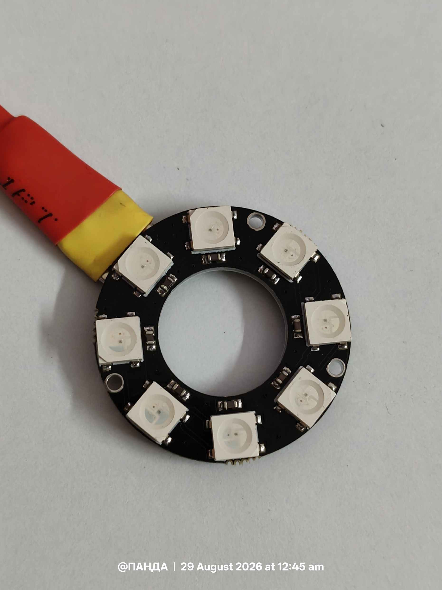
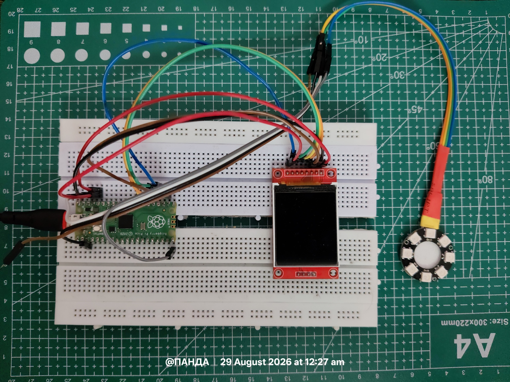
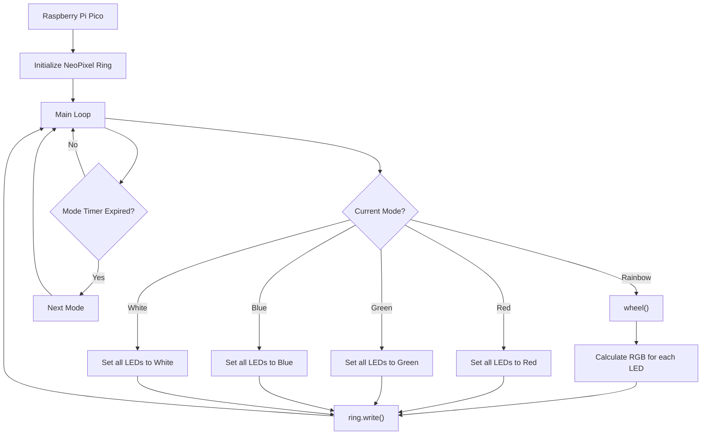
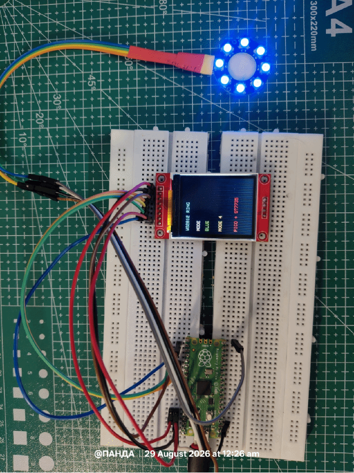

# WS2812 RGB Ring + ST7735 Display Demo

<p align="center">
  
</p>

A MicroPython project for the Raspberry Pi Pico (or any RP2040-based board) that drives an 8-LED WS2812 ("NeoPixel") ring in sync with a small ST7735 TFT status display. The ring automatically cycles through a rainbow animation and four solid colors, while the display shows the currently active mode. This is a good reference project for learning how to combine addressable LEDs, a SPI display, and non-blocking timing on MicroPython.

---

## Table of Contents

- [WS2812 RGB Ring + ST7735 Display Demo](#ws2812-rgb-ring--st7735-display-demo)
  - [Table of Contents](#table-of-contents)
  - [Features](#features)
  - [Hardware Requirements](#hardware-requirements)
  - [Wiring](#wiring)
    - [NeoPixel Ring](#neopixel-ring)
    - [ST7735 Display](#st7735-display)
  - [Software Requirements](#software-requirements)
  - [Configuration](#configuration)
  - [How It Works](#how-it-works)
  - [Code Walkthrough](#code-walkthrough)
    - [Initialization](#initialization)
    - [LED Effects](#led-effects)
    - [Display Update](#display-update)
    - [Main Loop](#main-loop)
  - [Color Math: How `wheel()` Works](#color-math-how-wheel-works)
  - [Timing Model](#timing-model)
  - [Modes Reference](#modes-reference)
  - [Troubleshooting](#troubleshooting)
  - [Customization Ideas](#customization-ideas)
- [Output](#output)
  - [Limitations](#limitations)
  - [Future Scope](#future-scope)


---

## Features

- **Rainbow animation** - a smoothly scrolling color wheel across all 8 LEDs, updated every 30 ms.
- **Solid color modes** - dim Red, Green, Blue, and White fills.
- **Automatic mode cycling** - advances to the next mode every 3 seconds (configurable) without any button input.
- **Non-blocking timing** - uses `time.ticks_ms()` / `time.ticks_diff()` instead of `time.sleep()` for the mode timer, so the animation keeps running smoothly instead of freezing between mode switches.
- **Live status screen** - the ST7735 TFT redraws on every mode change, showing the ring project name, current mode name, mode number, and a footer label.
- **Low, eye-safe brightness** - colors are intentionally dimmed (rainbow at 25% brightness, solids using small RGB values) to avoid a blindingly bright ring and reduce current draw.

---

## Hardware Requirements

| Component | Notes |
|---|---|
| RP2040 board (e.g. Raspberry Pi Pico / Pico W) | Must be running MicroPython (not CircuitPython - the `neopixel` module used here is the MicroPython built-in) |
| WS2812 / WS2812B addressable LED ring, 8 pixels | Any WS2812-compatible ring or strip segment of 8 LEDs works; adjust `NUM_LEDS` for other sizes |
| ST7735 SPI TFT display (typically 128×160 or 128×128) | Requires a compatible `st7735.py` driver exposing `fill_screen()` and `draw_text_fast()` |
| 5V power source for the LED ring | See [Power Notes](#troubleshooting) - Pico's 3V3 pin is usually insufficient for more than a couple of LEDs at full brightness |
| Jumper wires / breadboard | For prototyping connections |
| (Optional) 470Ω resistor on the LED data line | Recommended to protect the first LED from voltage spikes |
| (Optional) Large capacitor (e.g. 1000µF) across ring's 5V/GND | Recommended to smooth inrush current |

---

## Wiring



### NeoPixel Ring

| Ring Pin | Pico Pin |
|---|---|
| DIN (data in) | GPIO 15 (`LED_PIN`, via a ~470Ω resistor recommended) |
| 5V | External 5V supply (or Pico VBUS if only a few LEDs, at low brightness) |
| GND | Common ground with the Pico |

### ST7735 Display

The exact pin mapping depends on your `st7735.py` driver implementation - this script does **not** define SPI pins itself, it only instantiates `ST7735()` with no arguments, meaning your driver module must set its own defaults (or you'll need to edit `display = ST7735()` to pass pin numbers). Typical ST7735 modules need:

| Display Pin | Typical Function |
|---|---|
| SCK | SPI clock |
| SDA / MOSI | SPI data |
| RES / RST | Reset |
| DC / A0 | Data/Command select |
| CS | Chip select |
| BLK / LED | Backlight (often tied to 3V3) |
| VCC | 3V3 |
| GND | Ground |

> ⚠ **Check your `st7735.py` driver's constructor** to confirm which GPIO pins it expects and update your wiring (or the driver's defaults) accordingly - this README can't specify exact pins since the driver source isn't included in the script shown.

---

## Software Requirements

This script expects the following modules to exist on the device's filesystem:

| Module | Source | Purpose |
|---|---|---|
| `machine` | MicroPython built-in | `Pin` object for GPIO control |
| `neopixel` | MicroPython built-in | `NeoPixel` driver for WS2812 LEDs |
| `time` | MicroPython built-in | Non-blocking timing via `ticks_ms()` / `ticks_diff()`, plus `sleep_ms()` |
| `st7735` | - **not included in this script** | Must expose an `ST7735` class with `.fill_screen(color)` and `.draw_text_fast(x, y, text, fg_color, bg_color)` methods |
| `colors` | **not included in this script** | Must define at minimum: `BLACK`, `WHITE`, `CYAN`, `GREEN`, `YELLOW`, `RED`, `BLUE` |

Both `st7735.py` and `colors.py` must be present alongside the main script on the device - this repository/gist only shows the main control logic, not the display driver or color palette definitions.

These drivers can be found in the projects directory 


---

## Configuration

All key parameters are grouped at the top of the file under the `Configuration` section:

```python
LED_PIN = 15 # GPIO pin driving the NeoPixel ring's data line
NUM_LEDS = 8 # Number of LEDs in the ring/strip
MODE_TIME_MS = 3000 # Duration each mode is shown, in milliseconds
```

| Setting | Default | Description |
|---|---|---|
| `LED_PIN` | `15` | The GPIO pin number (not physical pin number) connected to the ring's data line |
| `NUM_LEDS` | `8` | Must match the physical number of LEDs on your ring/strip, or the animation will look wrong or leave LEDs dark |
| `MODE_TIME_MS` | `3000` | How long (ms) each mode plays before auto-advancing. Lower this for faster cycling, raise it for a slower demo |

---

## How It Works

At a high level, the program runs one infinite loop that does two things every iteration:

1. **Renders the current mode's LED effect** (rainbow animation frame, or a solid color re-fill).
2. **Checks whether it's time to switch modes**, and if so, advances `mode_index`, resets any animation state, and redraws the TFT.

Because the mode switch check uses `time.ticks_diff()` against a stored start time rather than counting loop iterations, the 3-second timing stays accurate regardless of how long each mode's rendering step takes.




## Code Walkthrough

### Initialization

```python
ring = neopixel.NeoPixel(Pin(LED_PIN), NUM_LEDS)
display = ST7735()
```

- `neopixel.NeoPixel` binds the WS2812 driver to a `Pin` object and pixel count. This object behaves like a list - `ring[i] = (r, g, b)` sets pixel `i`, and `ring.write()` pushes the buffer out over the data line.
- `ST7735()` is constructed with no arguments here, so all SPI pin assignments and screen dimensions must be handled by the driver's defaults.

### LED Effects

**`rainbow(offset)`** - draws one frame of the color-wheel animation:

```python
def rainbow(offset):
 for i in range(NUM_LEDS):
 color = wheel((i * 256 // NUM_LEDS + offset) & 255)
 ring[i] = (color[0] // 4, color[1] // 4, color[2] // 4)
 ring.write()
```

- Each LED `i` gets a color sampled from a different point on the 256-step color wheel, spaced evenly around the ring (`i * 256 // NUM_LEDS`).
- Adding `offset` and incrementing it each frame makes the whole pattern appear to rotate around the ring.
- `& 255` wraps the value back into the valid 0-255 range (equivalent to `% 256`, but faster).
- Dividing each channel by 4 caps brightness at 25% of maximum to keep the ring comfortable to look at and reduce power draw.

**`solid(color)`** - fills every pixel with one RGB tuple and writes it out:

```python
def solid(color):
 ring.fill(color)
 ring.write()
```

**`off()`** - convenience function to blank the ring (defined but not currently called anywhere in `main`; available for future use, e.g. a "power off" mode or button handler).

### Display Update

**`show_mode(mode, number)`** redraws the entire screen each time the mode changes:

```python
def show_mode(mode, number):
 display.fill_screen(BLACK)
 display.draw_text_fast(8, 10, "WS2812 RING", CYAN, BLACK)
 display.draw_text_fast(8, 35, "MODE", WHITE, BLACK)
 display.draw_text_fast(8, 55, mode, GREEN, BLACK)
 display.draw_text_fast(8, 85, "MODE {}".format(number), YELLOW, BLACK)
 display.draw_text_fast(8, 120, "PICO + ST7735", RED, BLACK)
```

This clears the screen to black, then draws five lines of text at fixed y-coordinates: a title, a "MODE" label, the current mode's name (e.g. `"RAINBOW"`), the mode number (e.g. `"MODE 1"`), and a footer. It's called once at startup and again every time the mode auto-advances.

### Main Loop

```python
mode_index = 0
mode_start = time.ticks_ms()
show_mode(modes[mode_index], mode_index + 1)
offset = 0

while True:
 if mode_index == 0:
 rainbow(offset)
 offset = (offset + 2) & 255
 time.sleep_ms(30)
 elif mode_index == 1:
 solid((40, 0, 0))
 time.sleep_ms(50)
 elif mode_index == 2:
 solid((0, 40, 0))
 time.sleep_ms(50)
 elif mode_index == 3:
 solid((0, 0, 40))
 time.sleep_ms(50)
 elif mode_index == 4:
 solid((20, 20, 20))
 time.sleep_ms(50)

 if time.ticks_diff(time.ticks_ms(), mode_start) >= MODE_TIME_MS:
 mode_index += 1
 if mode_index >= len(modes):
 mode_index = 0
 mode_start = time.ticks_ms()
 offset = 0
 show_mode(modes[mode_index], mode_index + 1)
```

Key details:

- The `if/elif` chain re-renders the ring **every loop iteration**, even for solid colors (which is slightly wasteful - see [Customization Ideas](#customization-ideas) - but keeps the logic simple and uniform).
- `time.sleep_ms(30)` in rainbow mode controls the animation frame rate (~33 FPS); solid modes use a longer `50`ms sleep since nothing is animating, mainly just to avoid pegging the CPU in a tight loop.
- `offset` is reset to `0` every time the mode changes, so the rainbow animation always restarts from the same visual starting point when its mode comes back around.
- `time.ticks_diff(a, b)` safely computes `a - b` even when the internal tick counter has wrapped around (`ticks_ms()` is not guaranteed to be monotonically unbounded on all ports), which is why it's used instead of plain subtraction.

---

## Color Math: How `wheel()` Works

`wheel(pos)` maps a single integer `0-255` to an RGB tuple, tracing a smooth rainbow gradient. It divides the 256-value range into three 85-step bands and linearly interpolates between two color channels within each band:

| `pos` range (after inversion) | Behavior |
|---|---|
| `0-84` | Red fades out, Blue fades in (Red → Blue) |
| `85-169` | Blue fades out, Green fades in (Blue → Green) |
| `170-255` | Green fades out, Red fades in (Green → Red) |

```python
def wheel(pos):
 pos = 255 - pos
 if pos < 85:
 return (255 - pos * 3, 0, pos * 3)
 if pos < 170:
 pos -= 85
 return (0, pos * 3, 255 - pos * 3)
 pos -= 170
 return (pos * 3, 255 - pos * 3, 0)
```

The initial `pos = 255 - pos` inversion just flips the direction the wheel is traversed in (a stylistic choice - removing it would simply reverse which way the rainbow appears to rotate). This is a very common pattern seen across Adafruit/MicroPython NeoPixel examples.

---

## Timing Model

| Behavior | Value | Notes |
|---|---|---|
| Rainbow frame rate | ~33 FPS (30ms/frame) | Set by `time.sleep_ms(30)` in the rainbow branch |
| Solid mode refresh | ~20 FPS (50ms/frame) | Solid colors don't need to re-render this often; could be reduced further |
| Mode duration | 3000ms (3s) | Set by `MODE_TIME_MS`; checked once per loop iteration, so actual duration may run slightly over by up to one frame's `sleep_ms()` |
| Total cycle length | ~15 seconds | 5 modes × 3 seconds each |

Note: since the mode-switch check happens **after** rendering and sleeping each frame, the true mode duration is `MODE_TIME_MS` plus up to one frame's sleep delay (so up to ~30-50ms of drift per mode) - this is generally imperceptible but worth knowing if precise timing matters for your use case.

---

## Modes Reference

| # | `mode_index` | Name | Effect | Color (approx.) |
|---|---|---|---|---|
| 1 | 0 | `RAINBOW` | Animated rotating color wheel | Full spectrum, 25% brightness |
| 2 | 1 | `RED` | Solid fill | `(40, 0, 0)` - dim red |
| 3 | 2 | `GREEN` | Solid fill | `(0, 40, 0)` - dim green |
| 4 | 3 | `BLUE` | Solid fill | `(0, 0, 40)` - dim blue |
| 5 | 4 | `WHITE` | Solid fill | `(20, 20, 20)` - dim white |

After mode 5 (`WHITE`), the sequence wraps back to mode 1 (`RAINBOW`) and repeats indefinitely.

---

## Troubleshooting

**LEDs don't light up at all**
- Double-check `LED_PIN` matches the GPIO number (not physical pin number) the ring's DIN is wired to.
- Confirm the ring has adequate 5V power - the Pico's 3V3 output is often not sufficient, and WS2812 chips typically expect ~5V logic (many will tolerate 3.3V data with a short wire, but it's not guaranteed).
- Verify common ground between the Pico and the LED ring's power supply.

**LEDs light up but show wrong/garbled colors**
- Some WS2812 variants use GRB byte order while others use RGB - if colors look swapped (e.g. red shows as green), your `neopixel.NeoPixel` object or ring hardware may expect a different channel order. Check your specific LED datasheet.
- Long or unshielded data wires can introduce noise - keep the data line short or add the recommended series resistor.

**Only some LEDs light up / pattern looks cut off**
- `NUM_LEDS` doesn't match the physical LED count - update it to match your ring.

**Display stays blank or shows garbage**
- Verify your `st7735.py` driver's SPI pin defaults match your actual wiring, or edit `display = ST7735()` to pass explicit pin arguments if your driver supports them.
- Check the backlight pin - many ST7735 boards need `BLK`/`LED` pin tied high (3V3) to show anything at all.

**Animation looks choppy or the board resets unexpectedly**
- Likely a power issue - drawing too much current for the ring (especially at full brightness with many LEDs) can brown out the board. This script already dims brightness to reduce this risk, but a dedicated 5V supply for the ring is the more robust fix.

**`ImportError` on `st7735` or `colors`**
- These are not built-in MicroPython modules - make sure you've uploaded your own `st7735.py` and `colors.py` files to the device alongside `main.py`.

---

## Customization Ideas

- **Manual mode control** - wire a push button to a `Pin` with an interrupt or polling loop to skip to the next mode on demand instead of (or in addition to) the automatic timer.
- **Brightness control** - expose a `BRIGHTNESS` constant (e.g. a 0.0-1.0 float) and multiply it into the `rainbow()`/`solid()` color values instead of the hardcoded `// 4` divisor and fixed solid-color tuples.
- **More effects** - add new branches to the `modes` list and the main loop's `if/elif` chain: e.g. a "chase" effect (one lit pixel moving around the ring), "breathing" (a solid color pulsing in brightness via a sine wave), "twinkle" (randomly flickering pixels), or a "fire" effect.
- **Reduce redundant redraws** - the solid-color modes currently call `ring.fill()` + `ring.write()` every loop iteration even though nothing changes; you could render once per mode entry and just `sleep_ms()` in a loop instead, saving a small amount of CPU/power.
- **Use `off()`** - currently defined but unused; could be wired up as a dedicated "off" mode or triggered by a button for a manual power-save state.
- **Non-blocking display updates** - if your `st7735` driver supports partial redraws, updating only the changed text region (rather than `fill_screen()` clearing everything) would reduce flicker on mode change.
- **Persist last mode** - save `mode_index` to a file or use the RTC to resume on the same mode after a power cycle, rather than always restarting at `RAINBOW`.

---
# Output



## Limitations

- Automatic mode cycling only; no manual input control.
- Fixed LED brightness during operation.
- Demonstrated using an 8-LED NeoPixel ring.
- Limited to basic Rainbow and solid-color effects.
- TFT is currently used only as a status display.
- No wireless or Wi-Fi control.
- Low brightness is used to reduce power consumption.

## Future Scope

- Add push-button or joystick control
- Add adjustable brightness
- Add more lighting effects
- Add music-reactive lighting
- Add Wi-Fi control using Pico W
- Add web-based control