# Pico Morse Code Telegraph and Decoder
<p align="center">
  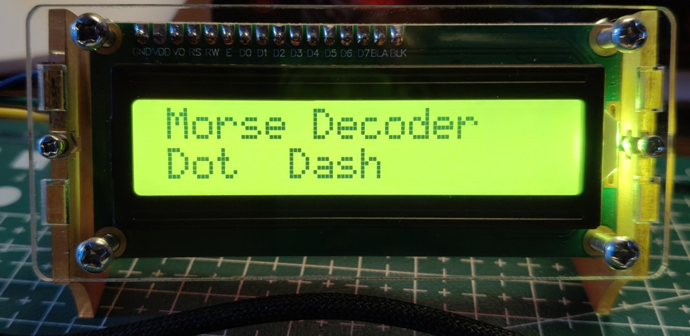
</p>

A Morse-code telegraph system built with a Raspberry Pi Pico and a 16x2 I2C LCD.

The system uses two physical buttons:

* DOT button -> `.`
* DASH button -> `-`

The Pico collects the Morse symbols, determines when a letter has finished based on the amount of silence between button presses, decodes the Morse sequence, and displays the resulting message on the LCD.

---

## Features

* Two-button Morse input
* DOT and DASH as separate physical inputs
* Internal GPIO pull-up resistors
* Software button debouncing
* Automatic Morse letter detection
* Automatic word detection
* Real-time Morse sequence preview
* Support for A-Z
* Support for 0-9
* Support for common punctuation and special characters
* Message history displayed on the LCD
* I2C LCD interface
* Non-blocking timing for Morse decoding
* Use of `ticks_ms()` for reliable millisecond timing

---

## Hardware

<p align="center">
  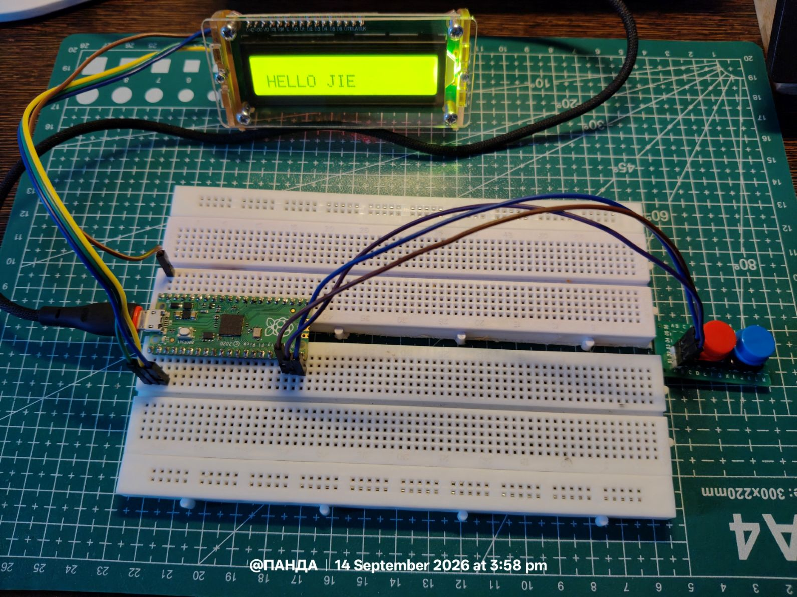
</p>

### Components

* Raspberry Pi Pico
* 16x2 I2C LCD
* 2 x push buttons
* Jumper wires
* Breadboard

### Pin Configuration

| Component | Pico GPIO |
| ----------- | --------: |
| I2C SDA | GP0 |
| I2C SCL | GP1 |
| DOT button | GP14 |
| DASH button | GP15 |

The buttons are connected between the GPIO pin and GND.

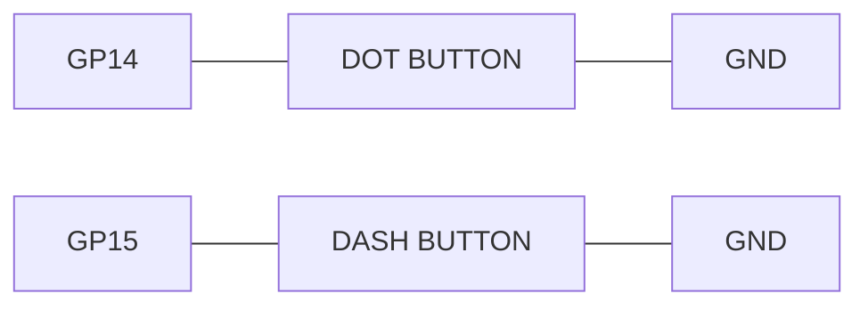

The program uses the Pico's internal pull-up resistors, so no external resistors are required.

---

## System Overview

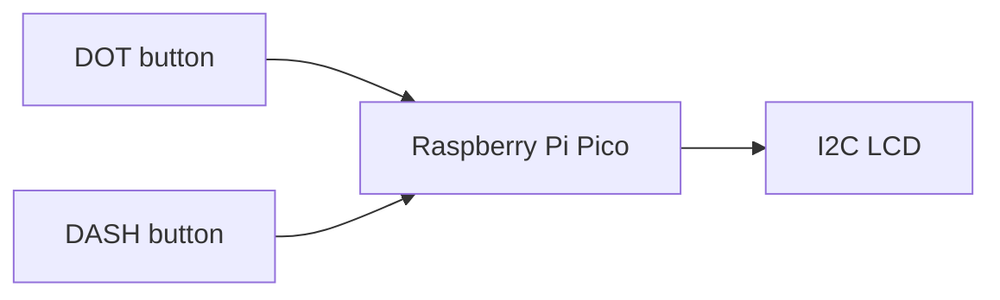

Example: entering the message "SOS".

The Morse input is:

```text
S = ...
O = ---
S = ...
```

The corresponding button sequence is:

```text
DOT DOT DOT
DASH DASH DASH
DOT DOT DOT
```

The Pico groups the symbols using time intervals, described below.

---

## Morse Timing

The system does not require a dedicated "Enter" button. Instead, it uses the silence between button presses to determine when a symbol, letter, or word is complete.

Two timeout values are defined:

```python
LETTER_TIMEOUT = 800
WORD_TIMEOUT = 1800
```

### Letter Timeout

If no button is pressed for more than 800 ms, the current Morse sequence is considered complete.

Example:

```text
. - .
```

After the final DOT, if the user waits longer than 800 ms, the sequence `.-.` is decoded as `R`.

### Word Timeout

If the user remains silent for more than 1800 ms, a space is added to the message.

Example: the sequence

```text
.... .
```

decodes to `HE` under normal timing, while a longer pause between the two letters produces `H E`.

The two timeouts allow the Pico to distinguish between symbol, letter, and word boundaries without requiring additional buttons.

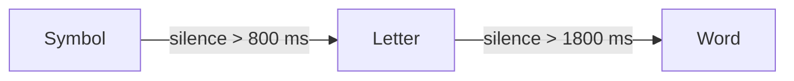

---

## Morse Dictionary

The `MORSE` dictionary maps Morse sequences to their corresponding characters.

Example:

```python
MORSE = {
 '.-': 'A',
 '-...': 'B',
 '-.-.': 'C',
 '-..': 'D',
 '.': 'E',
 '-': 'T',
}
```

Therefore `MORSE[".-"]` returns `A`.

This is a lookup-table approach. Rather than using a large number of `if/elif` statements, the program performs a dictionary lookup. The dictionary includes:

* Letters A-Z
* Numbers 0-9
* Punctuation
* Mathematical and other special characters

---

## Hardware Initialization

The I2C interface is initialized as follows:

```python
i2c = I2C(
 0,
 sda=Pin(I2C_SDA),
 scl=Pin(I2C_SCL),
 freq=400_000
)
```

This configures:

* I2C bus: `I2C(0)`
* SDA: GP0
* SCL: GP1
* Frequency: 400 kHz

The LCD address is detected automatically:

```python
addr = i2c.scan()[0]
```

This avoids hard-coding an address such as `0x27`.

The LCD is then initialized:

```python
lcd = I2cLcd(i2c, addr, LCD_ROWS, LCD_COLS)
```

For a standard 16x2 LCD:

```python
LCD_ROWS = 2
LCD_COLS = 16
```

---

## Button Configuration

The two buttons are configured as inputs:

```python
dot_btn = Pin(DOT_PIN, Pin.IN, Pin.PULL_UP)
dash_btn = Pin(DASH_PIN, Pin.IN, Pin.PULL_UP)
```

With `PULL_UP` enabled:

| Button state | GPIO value |
| ------------- | :--------: |
| Released | 1 |
| Pressed | 0 |

The program therefore detects a button press with:

```python
if dot_btn.value() == 0:
```

and:

```python
elif dash_btn.value() == 0:
```

---

## Program State

The decoder maintains the following state variables:

```python
current_morse = ""
message = ""
last_input_time = 0
last_press_time = 0
```

### `current_morse`

Stores the Morse symbols currently being entered. For example, `".-"` represents a DOT followed by a DASH, corresponding to `A`.

### `message`

Stores all characters decoded so far, e.g. `"HELLO"`. This allows the LCD to retain the previously decoded message while the next character is being entered.

### `last_input_time`

Stores the timestamp of the most recent Morse symbol. Used to determine whether the user has stopped entering input.

### `last_press_time`

Stores the timestamp of the previous button press. Used for debouncing.

---

## LCD Display

The `update_display()` function redraws the LCD whenever the displayed information changes.

```python
def update_display():
```

The first line displays the Morse sequence currently being entered, along with its decoded preview:

```python
preview = MORSE.get(current_morse, "?")
```

For example, while entering `.-`, the display shows `.- -> A`, giving immediate feedback before the letter is finalized.

### Message History

The second LCD line displays the decoded message. If the message exceeds the LCD width, only the most recent characters are shown:

```python
message[-LCD_COLS:]
```

For example, if the message is `"HELLO WORLD THIS"`, the LCD displays only the portion that fits on the screen.

---

## Adding a Morse Symbol

The `add_symbol()` function handles DOT and DASH input.

```python
def add_symbol(symbol):
```

When a button is pressed, the symbol is appended to the current sequence:

```python
current_morse += symbol
```

Example progression:

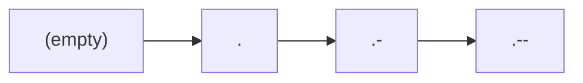

Each new symbol also updates the input timestamp:

```python
last_input_time = ticks_ms()
```

The LCD is then refreshed.

---

## Finishing a Letter

When the user stops pressing buttons for longer than `LETTER_TIMEOUT`, the program calls:

```python
finish_letter()
```

The Morse sequence is looked up:

```python
letter = MORSE.get(current_morse, "?")
```

For example, `current_morse = ".-"` produces `letter = "A"`.

The decoded character is appended to the message:

```python
message += letter
```

The Morse input buffer is then reset:

```python
current_morse = ""
```

This allows the next letter to be entered.

---

## Detecting a Word

The `add_space()` function adds a space to the decoded message:

```python
add_space()
```

It checks the following condition before adding a space:

```python
if message and not message.endswith(" "):
```

This prevents multiple consecutive spaces from being inserted. Even though the main loop runs continuously, a prolonged period of silence adds only a single space rather than producing repeated spaces.

---

## Button Debouncing

Mechanical buttons do not produce a perfectly clean electrical transition. When pressed, the contacts can rapidly toggle, for example:

```text
1 0 1 0 1 0 0 0
```

instead of transitioning cleanly from `1` to `0`. This phenomenon is known as button bounce.

The program addresses this with a debounce interval:

```python
DEBOUNCE_MS = 40
```

and the following check:

```python
if ticks_diff(now, last_press_time) > DEBOUNCE_MS:
```

This prevents a single physical press from generating multiple, unintended Morse symbols.

---

## Waiting for Button Release

After detecting a press, the program executes:

```python
while dot_btn.value() == 0:
 sleep_ms(10)
```

This blocks until the button is released. The same mechanism applies to the DASH button.

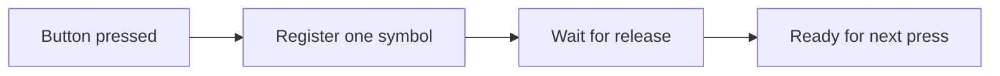

This ensures that holding a button down does not generate a continuous stream of symbols. Instead, each physical press generates exactly one symbol, and the next symbol is only registered after the button is released and pressed again.

---

## Main Loop

The main loop continuously performs three tasks:

1. Check buttons
2. Check Morse timing
3. Update system state

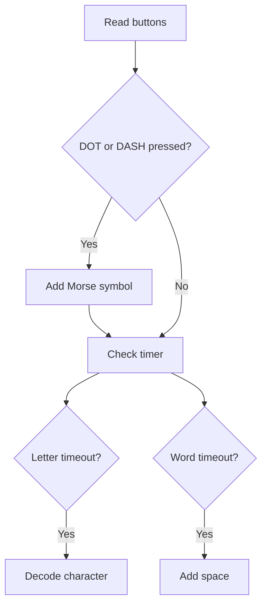

The loop runs on a short delay:

```python
sleep_ms(5)
```

This provides sufficient responsiveness while avoiding unnecessary CPU usage.

---

## Rationale for `ticks_ms()`

The program uses `ticks_ms()` rather than `sleep()` for Morse timing:

```python
now = ticks_ms()
silence = ticks_diff(now, last_input_time)
```

This allows the Pico to measure elapsed silence while continuing to run the main loop. This non-blocking approach is more appropriate for interactive embedded systems than pausing execution for 800 or 1800 ms at a time.

---

## Example Walkthrough

Suppose the user enters:

```text
DOT DOT DOT
```

The Pico accumulates the sequence:

```text
.
..
...
```

The LCD preview shows `... -> S`. After approximately 800 ms of silence, the sequence is finalized as `S`, and the message buffer becomes `"S"`. The Morse input buffer is then cleared for the next character.

If the user next enters:

```text
DASH DASH DASH
```

the sequence `---` is decoded as `O`, and the message becomes `"SO"`.

A final:

```text
...
```

produces `"SOS"`.

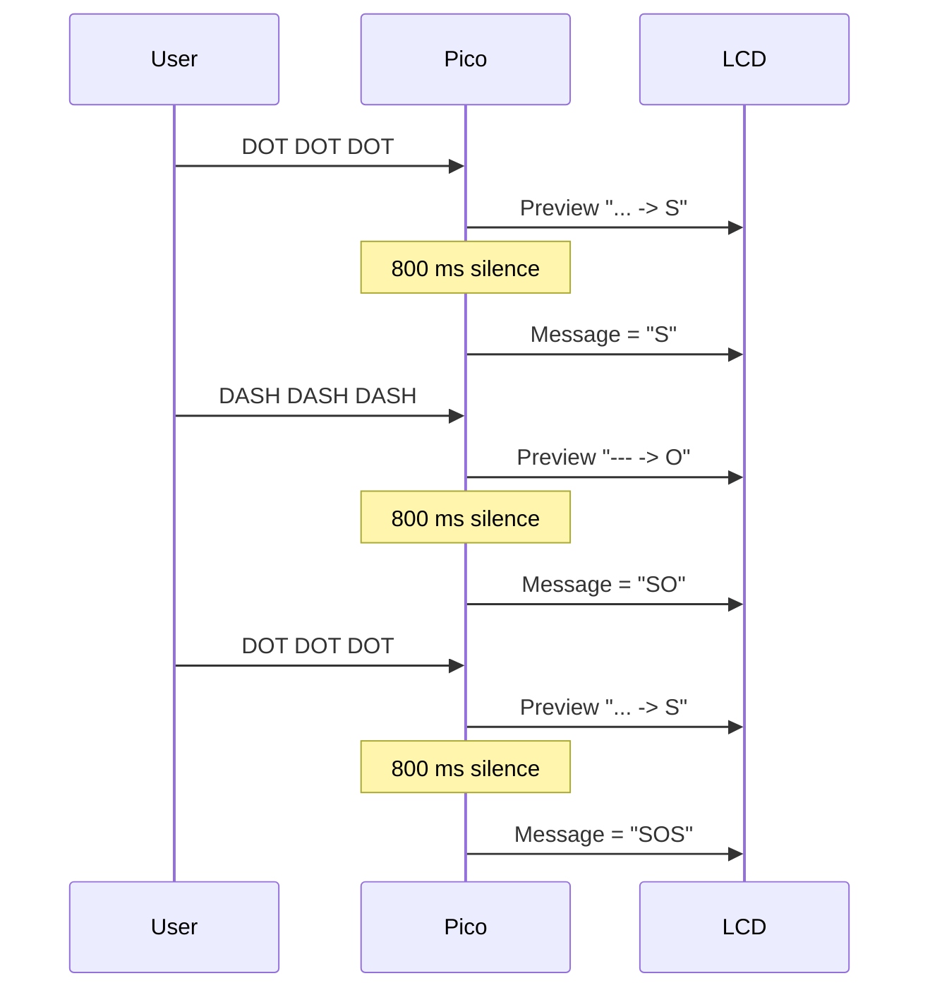

---

## Complete Data Flow

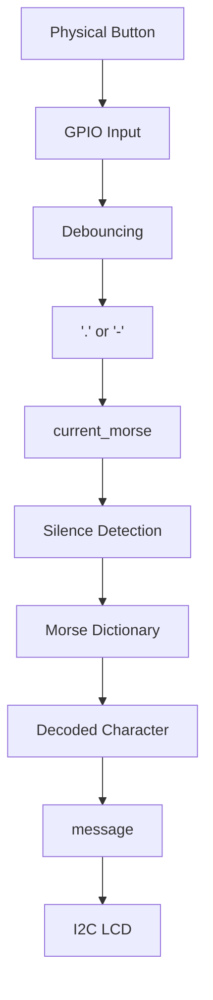

---

## Adjusting Typing Speed

The key configuration values are:

```python
LETTER_TIMEOUT = 800
WORD_TIMEOUT = 1800
DEBOUNCE_MS = 40
```

If letters are finalized too quickly, increase `LETTER_TIMEOUT`, for example:

```python
LETTER_TIMEOUT = 1200
```

If a longer pause should be required between words, increase `WORD_TIMEOUT`:

```python
WORD_TIMEOUT = 2500
```

The debounce value typically does not require adjustment.

---

## Possible Future Improvements

This project can be extended in several directions:

**Buzzer feedback**
Add an audio output, where DOT produces a short beep and DASH produces a long beep, more closely emulating a traditional telegraph.

**Message storage**
Store completed messages in a file or external memory.

**Wireless telegraph**
Use a second Pico with an nRF24L01 module, Wi-Fi, or a Bluetooth-capable Pico 2 W to transmit Morse messages wirelessly.

**Two-way telegraph**

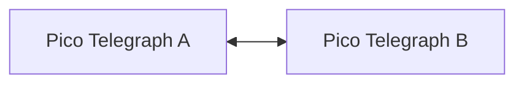

Build two identical units capable of both sending and receiving Morse messages over a wireless link.

**Improved display**
Use a larger LCD or OLED display to show both the raw Morse sequence and the decoded text simultaneously.

**Hardware interrupts**
Replace polling with GPIO interrupts for button handling. For this project, however, polling is simple, predictable, and sufficient.

---

## Project Concept

This project demonstrates a number of embedded-systems concepts within a small circuit:

* GPIO configuration
* Digital input handling
* Pull-up resistors
* Mechanical switch debouncing
* I2C communication
* LCD interfacing
* Timing measurement
* State management
* Lookup tables
* Human-machine interaction
* Real-time event processing

What appears to be a simple two-button Morse machine is, in practice, a compact and practical exercise in embedded programming.

## Core Concept

Two buttons, timing, and a lookup table combine to form a working digital telegraph. The Raspberry Pi Pico acts as the decoder between the physical telegraph keys and the human-readable LCD output.