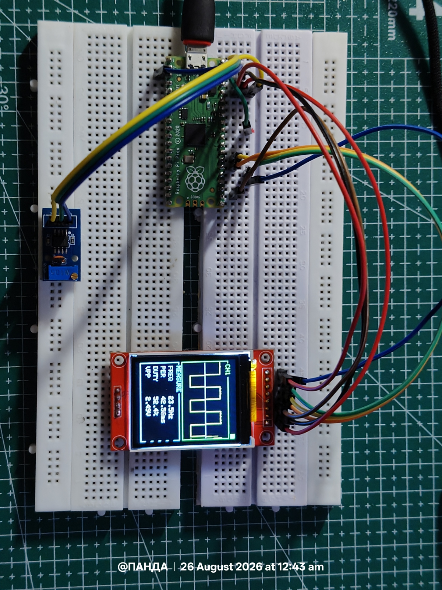
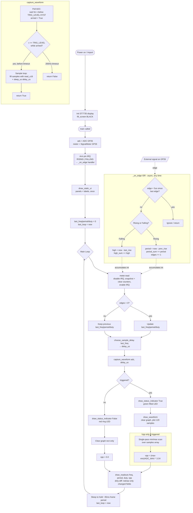

# Raspberry Pi Pico as a Makeshift Oscilloscope



## 1. Overview

A digital storage oscilloscope (DSO) performs three core functions:

1. **Acquisition** - sample an analog voltage at fixed intervals
2. **Triggering** - align repeated captures to a consistent point in the waveform for a stable display
3. **Measurement & Display** - render the sampled data and derive timing parameters (frequency, period, duty cycle, amplitude)

The RP2040 (Pico) can approximate all three using its on-chip ADC, GPIO interrupt controller, and an SPI-driven TFT for output. This document describes the architecture and the electrical/timing constraints that separate this implementation from a bench-grade instrument.

## 2. Hardware Interface

| Signal | Pico Resource | Notes |
|---|---|---|
| Analog input | ADC0 (GP26) | 12-bit SAR ADC, internally reported as 16-bit via `read_u16()` |
| Digital edge input | GP26 (same pin, digital mode) | Used concurrently for interrupt-based timing |
| Display | SPI (ST7735 driver) | 1.8" TFT, 128×160 typical |

**Input range constraint**: The RP2040 ADC accepts 0-3.3 V single-ended, referenced to `ADC_VREF`. There is no attenuator, no differential input, and no overvoltage protection on the raw pin - any signal outside this range requires external conditioning (voltage divider, clamp diodes, or an op-amp buffer stage) before reaching GP26.

**Dual-mode pin usage**: GP26 is sampled two ways simultaneously:
- As an **analog** input via `ADC(Pin(26))`, polled for waveform capture
- As a **digital** input via `Pin(26, Pin.IN, Pin.PULL_DOWN)` with edge IRQs, for frequency/duty timing

This works because both peripherals can independently latch the pin's electrical state; MicroPython does not prevent binding a GPIO to both an ADC channel and a digital IRQ concurrently on the RP2040.

>Note : All the drivers can be found in the Driver Directory.

## 3. Acquisition Path (Polled ADC Sampling)

```python
for i in range(NUM_SAMPLES):
 samples[i] = adc.read_u16()
 time.sleep_us(sample_delay_us)
```

- Samples are stored in a pre-allocated `array('H', ...)` - a fixed-type unsigned short buffer - to avoid heap churn and GC pauses during the capture loop, which would otherwise introduce non-deterministic timing jitter mid-capture.
- Effective sample rate = `1 / (t_conversion + sample_delay_us)`, where `t_conversion` is the ADC's inherent conversion latency (a few µs on RP2040) plus Python/MicroPython interpreter overhead per loop iteration.
- **This is a software-timed acquisition loop**, not a hardware-clocked ADC-to-DMA pipeline. Sample-to-sample spacing therefore has jitter on the order of the interpreter's per-iteration overhead (typically low microseconds in compiled/native MicroPython, more in pure bytecode), which sets a practical ceiling on usable input frequency - well below the RP2040 ADC's nominal ~500 ksps hardware capability.

### Timebase (Auto-Ranging)

```python
delay = int((period_us * TARGET_CYCLES) / NUM_SAMPLES)
```

Given a frequency estimate from the interrupt-based meter, the inter-sample delay is chosen so `NUM_SAMPLES` samples span `TARGET_CYCLES` periods - analogous to a scope's time/div control, but auto-computed rather than manually set. Bounded to `[MIN_SAMPLE_DELAY_US, MAX_SAMPLE_DELAY_US]` to prevent pathological delay values at very low or unknown frequencies.

## 4. Triggering

```python
while not_timed_out:
 v = adc.read_u16()
 if not armed:
 if v < (TRIG_LEVEL - TRIG_HYST):
 armed = True
 else:
 if v >= TRIG_LEVEL:
 break # trigger point
```

This implements a **rising-edge trigger with hysteresis**, functionally equivalent to a Schmitt-trigger comparator:

- `TRIG_LEVEL` - nominal trigger threshold (here, mid-scale, ADC_MAX/2)
- `TRIG_HYST` - hysteresis band (5% of full scale) that the signal must first fall below before the trigger can re-arm

Without hysteresis, noise riding on a signal near the threshold would cause spurious re-triggers, producing a jittery or duplicated waveform. This mirrors the trigger hysteresis found in real scope front-ends, implemented here entirely in software against ADC samples rather than in a dedicated comparator IC.

A `TRIG_TIMEOUT_MS` bound prevents indefinite blocking if the signal never crosses the threshold (e.g., DC input, or amplitude below the trigger level) - analogous to a scope's "auto" trigger mode falling back to free-run, except here it simply reports no capture for that frame.

## 5. Frequency / Period / Duty Measurement (Interrupt-Driven)

```python
self.pin.irq(trigger=Pin.IRQ_RISING | Pin.IRQ_FALLING, handler=self._on_edge)
```

Timing measurements are derived independently of the polled acquisition path, using a **hardware GPIO interrupt** on both edges. This is the more metrologically sound half of the design:

- **Rising edge**: `period = t_rise[n] - t_rise[n-1]` accumulated into `period_sum_us`; edge count incremented
- **Falling edge**: `high_time = t_fall - t_rise` accumulated into `high_sum_us`

Each `meter.read()` call computes:

```
avg_period = period_sum_us / edges
freq = 1e6 / avg_period
duty = (high_sum_us / (edges * avg_period)) * 100
```

This is a **boxcar/rolling average** over however many edges occurred between successive `read()` calls (i.e., over one main-loop iteration, ~35 ms) - not an average over a fixed number of cycles. At low input frequencies, a single `read()` may see zero or one edge; at high frequencies, many edges are averaged, improving measurement stability.

### Timing Accuracy Considerations

- ISR entry latency on RP2040 (MicroPython) is on the order of a few microseconds, and `time.ticks_us()` has 1 µs resolution - this bounds the best-case timing accuracy of the frequency/duty measurement.
- `MIN_EDGE_SPACING_US` acts as a software debounce/glitch filter: any edge arriving less than this interval after the prior one is discarded before it can corrupt `period_sum`/`high_sum`. This is necessary because real-world signals (especially mechanical switches or noisy digital lines) can produce spurious multi-edges within a single logical transition.
- **Race condition handling**: `machine.disable_irq()` / `enable_irq()` bracket the read-and-clear of the shared accumulator variables in `read()`. This is a critical-section pattern - without it, an edge interrupt firing mid-read could partially update a counter that `read()` is simultaneously consuming, producing corrupted or inconsistent statistics. This is the same class of hazard as any producer/consumer shared state between an ISR and main-line code on a single-core (or even multi-core, without proper locking) MCU.

### Why split acquisition and timing into two paths?

Coupling frequency measurement to the polled ADC loop would inherit that loop's jitter directly into the timing measurement. By using a hardware-interrupt-timestamped digital path instead, frequency/period/duty accuracy is decoupled from however long waveform rendering or SPI transfers take in a given frame - the ISR fires and timestamps edges regardless of what the main loop is doing.

## 6. Amplitude (Vpp) Measurement

```python
vpp = (max(samples) - min(samples)) / ADC_MAX * ADC_VREF
```

A single-pass min/max scan over the captured buffer, scaled from ADC codes to volts using the known reference voltage. This is only valid for the specific `NUM_SAMPLES` window just captured - it is a **windowed peak-to-peak**, not a true continuous Vpp tracker, so a signal with amplitude variation between captures (e.g., AM-modulated or bursty signals) will show frame-to-frame Vpp fluctuation rather than a stable reading.

## 7. Display Update Strategy

- **Partial redraws**: The waveform region is cleared and redrawn each frame, but the surrounding UI chrome (panel borders, labels) is drawn once at startup - reducing SPI bus traffic, which is the dominant time cost on a bit-banged/SPI-driven TFT at typical MicroPython SPI clock rates.
- **Dirty-string diffing on readouts**: Each numeric field (`FREQ`, `PER`, `DUTY`, `VPP`) is only erased and redrawn if its formatted string differs from the previous frame's value - avoiding unnecessary SPI writes for fields that haven't visibly changed, which also reduces flicker.
- **Frame pacing**: The main loop targets a fixed period (`LOOP_PERIOD_MS`) using `time.sleep_ms()` to consume whatever time remains after acquisition + render, giving a roughly constant refresh rate independent of per-frame processing cost.

## 8. Fidelity Limits vs. a Bench Oscilloscope

| Parameter | This implementation | Typical entry-level bench DSO |
|---|---|---|
| Input range | 0-3.3 V, single-ended, unprotected | mV to hundreds of V, with attenuated/protected probes |
| Effective bandwidth | Low kHz range (software-timed ADC loop) | 10s-100s of MHz |
| Vertical resolution | 12-bit ADC (RP2040), no analog front-end | 8-12 bit with calibrated analog conditioning |
| Channels | 1 | 2-4 |
| Trigger modes | Rising-edge with hysteresis only | Edge, pulse-width, slope, video, serial protocol decode, etc. |
| Timebase | Software-computed, auto-only | Hardware-clocked, manually adjustable |
| Acquisition | Polled, software-timed | Hardware ADC-to-memory DMA, often GHz-equivalent effective sampling via interleaving |

## 9. Practical Use Cases

Despite the above limitations, this architecture is well suited to:

- Verifying PWM duty cycle output from a microcontroller or driver IC
- Visually confirming presence/shape of low-frequency oscillator or sensor output signals
- Rough frequency/period sanity checks on digital or clipped-analog signals within the 0-3.3 V window
- Educational use: the trigger/hysteresis, timebase auto-ranging, and edge-interrupt timing techniques used here are conceptually identical to those in real oscilloscope front-ends, just implemented entirely in software against a general-purpose MCU's peripherals rather than dedicated acquisition hardware.


# Program Flow



**Notes on the diagram:**
- The **ISR subgraph** runs asynchronously at any moment, triggered by real edges on GP26 - it's not part of the sequential loop, it just keeps depositing data (`period_sum`, `high_sum`, `edges`) that `meter.read()` drains each iteration.
- The **capture_waveform subgraph** is the only blocking, timing-critical stretch of the main loop: it polls the ADC for a trigger condition, then samples 120 points, either back-to-back or spaced by `delay_us`.
- The **Vpp block** only runs when a trigger succeeded, since it scans the same `samples` buffer that `draw_waveform` just populated.
- The final pacing step is what keeps the loop close to a constant ~35 ms frame period regardless of how long capture/render took that iteration.


# `oscilloscope.py` - Line-by-Line Explanation

Pico makeshift oscilloscope: captures a 0-3.3 V signal on GP26 and renders the waveform plus Frequency, Period, Duty Cycle, and Vpp on a 1.8" ST7735 TFT.

## 1. Header / Imports

```python
import time
import machine
from machine import ADC, Pin
from array import array
from st7735 import ST7735
from widgets import draw_panel
from colors import BLACK, WHITE, GREEN, RED, GRAY, CYAN, YELLOW
```

Standard MicroPython imports plus your own driver modules - `ST7735` for the display, `draw_panel` as a UI helper (presumably draws a bordered box with a title), and named color constants. `array` is used later for a fixed-type, memory-efficient sample buffer instead of a plain list.

## 2. Config Block

```python
ADC_PIN = 26
DIGITAL_PIN = 26
```
Same physical pin (GP26) used two ways: as an analog input for waveform capture and as a digital input for edge-based frequency measurement. This works because GP26 is one of the ADC-capable pins but can still be read as a digital `Pin` for IRQs.

```python
ADC_MAX = 65535
ADC_VREF = 3.3
```
`read_u16()` returns 0-65535 regardless of the ADC's actual 12-bit resolution (it's left-shifted internally), so 65535 maps to 3.3 V.

```python
NUM_SAMPLES = 120
WAVEFORM_OFFSET_Y = 9
```
120 points per captured frame; a 9px vertical offset is subtracted later, likely to visually center or nudge the trace within the graph panel.

```python
TRIG_LEVEL = ADC_MAX // 2
TRIG_HYST = int(ADC_MAX * 0.05)
TRIG_TIMEOUT_MS = 200
```
Trigger sits at mid-scale (like a real scope's edge trigger). `TRIG_HYST` (5% of full scale) prevents noise near the trigger level from re-arming/firing spuriously. If no valid trigger appears within 200 ms, capture gives up.

```python
MIN_SAMPLE_DELAY_US = 0
MAX_SAMPLE_DELAY_US = 4000
TARGET_CYCLES = 3
```
Bounds for the auto-timebase delay between ADC samples, and a target of fitting ~3 signal cycles across the capture window.

```python
LOOP_PERIOD_MS = 35
MIN_EDGE_SPACING_US = 5
```
Caps the main loop to ~28 fps. `MIN_EDGE_SPACING_US` is the glitch-filter window for the IRQ-based edge detector.

## 3. Display Layout

```python
display = ST7735()
display.fill_screen(BLACK)
```
Instantiate and blank the screen once at import time (this runs on module load, before `main()`).

```python
PANEL_X, PANEL_Y = 2, 12
PANEL_W, PANEL_H = 124, 75

GRAPH_X = PANEL_X + 2
GRAPH_Y = PANEL_Y + 4
GRAPH_W = PANEL_W - 4
GRAPH_H = PANEL_H - 8

MEAS_X, MEAS_Y = 2, PANEL_Y + PANEL_H + 4
MEAS_W, MEAS_H = 124, 62

LED_X, LED_Y, LED_R = 122, 6, 3

ROW_FREQ_Y = MEAS_Y + 10
ROW_PERIOD_Y = MEAS_Y + 22
ROW_DUTY_Y = MEAS_Y + 34
ROW_VPP_Y = MEAS_Y + 46

LABEL_X = MEAS_X + 6
VALUE_X = MEAS_X + 54
```
Pure geometry: a waveform panel on top, a measurement panel below it (stacked using `PANEL_Y + PANEL_H + 4`), a small trigger-status LED in the corner, and fixed row y-coordinates plus two x-columns (label vs. value) for the readout text. All derived arithmetically from a few anchors rather than hardcoded absolutes - makes resizing easier.

## 4. `draw_static_ui()`

Draws the two bordered panels (`draw_panel`) with titles "CH1" (green) and "MEASURE" (cyan), then writes the four static labels ("FREQ", "PER ", "DUTY", "VPP ") once. Called once at startup - nothing here needs redrawing every frame, avoiding flicker/waste.

## 5. `draw_status_indicator(triggered)`

```python
display.fill_rectangle(LED_X - LED_R - 1, LED_Y - LED_R - 1,
 LED_R * 2 + 3, LED_R * 2 + 3, BLACK)
```
Clears a small box slightly larger than the LED circle (to erase whatever was drawn before - filled square or outline circle, either fits). Then:

```python
if triggered:
 display.fill_rectangle(...) # filled green square = "triggered"
else:
 display.draw_circle(...) # red ring = "waiting/timeout"
```
A cheap "scope trigger" LED analog.

## 6. `SignalMeter` Class - Frequency/Duty via Interrupts

```python
def __init__(self, pin_num):
 self.pin = Pin(pin_num, Pin.IN, Pin.PULL_DOWN)
 ...
 self.pin.irq(trigger=Pin.IRQ_RISING | Pin.IRQ_FALLING, handler=self._on_edge)
```
Sets up the digital pin with a pull-down (so it reads a clean low when undriven) and registers an ISR on both edges. All timing math happens in the interrupt handler, which is the right approach for accurate frequency measurement - polling in the main loop would be far too jittery.

```python
def _on_edge(self, pin):
 now = time.ticks_us()
 if self.last_edge_us:
 if time.ticks_diff(now, self.last_edge_us) < MIN_EDGE_SPACING_US:
 return
 self.last_edge_us = now
```
Glitch filter: if an edge arrives less than 5 µs after the previous one, it's discarded as noise/bounce before any state updates.

```python
if pin.value(): # Rising edge
 if self.prev_rise_us is not None:
 period = time.ticks_diff(now, self.prev_rise_us)
 if period > MIN_EDGE_SPACING_US:
 self.period_sum_us += period
 self.edges += 1
 self.prev_rise_us = now
 self.last_rise_us = now
```
On a rising edge, if we've seen a previous rising edge, compute the period between them and accumulate it (plus a running edge count) - this is how multiple periods get averaged over the read interval rather than trusting a single noisy measurement. `pin.value()` is read *inside* the ISR to determine edge direction, which is a bit unusual (normally you'd trust the IRQ trigger type) but works since the ISR fires on both edges and the pin state at call time tells you which one just happened.

```python
else: # Falling edge
 if self.last_rise_us:
 high = time.ticks_diff(now, self.last_rise_us)
 if high > 0:
 self.high_sum_us += high
```
On a falling edge, measures how long the signal was high since the last rise, accumulating total "high time" for duty-cycle calculation.

```python
def read(self):
 state = machine.disable_irq()
 edges = self.edges
 period_sum = self.period_sum_us
 high_sum = self.high_sum_us
 self.edges = 0
 self.period_sum_us = 0
 self.high_sum_us = 0
 machine.enable_irq(state)
```
This is the important concurrency-safety bit: IRQs are disabled while snapshotting and resetting the shared counters, so the ISR can't fire mid-read and corrupt values (a classic embedded race condition). It's a "read-and-clear" accumulator pattern - each call to `read()` reports stats accumulated since the last call.

```python
 if edges == 0 or period_sum <= 0:
 return 0.0, 0.0, 0.0, 0
 avg_period = period_sum / edges
 freq = 1_000_000.0 / avg_period
 duty = (high_sum / (edges * avg_period)) * 100.0
 duty = max(0.0, min(100.0, duty))
 return freq, avg_period, duty, edges
```
Averages the period across however many were captured, converts to Hz (µs → Hz via `1e6/period`), computes duty cycle as high-time fraction of total time observed, and clamps it to a sane `[0, 100]` range in case of measurement artifacts.

## 7. Waveform Capture

```python
samples = array('H', (0 for _ in range(NUM_SAMPLES)))
```
Pre-allocated unsigned-16-bit array, created once at module scope - avoids repeated heap allocation/garbage collection every frame, which matters a lot on a memory-constrained MCU.

```python
def capture_waveform(adc, sample_delay_us):
 start = time.ticks_ms()
 armed = False
 while time.ticks_diff(time.ticks_ms(), start) < TRIG_TIMEOUT_MS:
 v = adc.read_u16()
 if not armed:
 if v < (TRIG_LEVEL - TRIG_HYST):
 armed = True
 else:
 if v >= TRIG_LEVEL:
 break
 else:
 return False
```
Classic edge-trigger with hysteresis, done by polling the ADC (not the interrupt pin - this is separate from `SignalMeter`). It first waits for the signal to dip clearly *below* the trigger threshold (`armed = True`), then waits for it to rise back *up through* the threshold - that's the actual trigger point, mimicking rising-edge trigger on a real scope. The hysteresis prevents re-triggering on noise near the threshold. The `while...else` is a common Python idiom: `else` only executes if the loop finished by exhausting the condition (i.e., timed out) rather than via `break` - so this correctly returns `False` only on timeout.

```python
if sample_delay_us <= 0:
 for i in range(NUM_SAMPLES):
 samples[i] = adc.read_u16()
else:
 for i in range(NUM_SAMPLES):
 samples[i] = adc.read_u16()
 time.sleep_us(sample_delay_us)
```
Two code paths to avoid calling `time.sleep_us(0)` in a tight loop for high-frequency signals - an unnecessary function call overhead when delay is zero anyway. Otherwise, samples at a fixed inter-sample delay to control the effective timebase.

## 8. Auto-Timebase

```python
def choose_sample_delay(freq_hz):
 if freq_hz <= 0:
 return 1500
 period_us = 1_000_000.0 / freq_hz
 delay = int((period_us * TARGET_CYCLES) / NUM_SAMPLES)
 return max(MIN_SAMPLE_DELAY_US, min(MAX_SAMPLE_DELAY_US, delay))
```
Given the last known frequency, picks a per-sample delay so that `NUM_SAMPLES` samples span roughly `TARGET_CYCLES` (3) periods of the signal - i.e., it auto-zooms the timebase so you always see about 3 cycles on screen regardless of input frequency, clamped to sane bounds. Defaults to 1500 µs delay if frequency is unknown (no signal yet).

## 9. Rendering the Waveform

```python
def draw_waveform():
 display.fill_rectangle(GRAPH_X, GRAPH_Y, GRAPH_W, GRAPH_H, BLACK)
 mid_y = GRAPH_Y + GRAPH_H // 2
 display.draw_hline(GRAPH_X, mid_y, GRAPH_W, GRAY)
```
Clears just the graph region (not the whole screen - avoids flicker) and draws a horizontal centerline as a visual reference (like a scope's 0V/grid line).

```python
 scale = (GRAPH_H - 2) / ADC_MAX
 step = GRAPH_W / (NUM_SAMPLES - 1)
```
`scale` converts a 0-65535 ADC value into pixel height within the graph box (minus 2px margin). `step` converts sample index into x pixel spacing across the graph width.

```python
 prev_x = GRAPH_X
 prev_y = GRAPH_Y + GRAPH_H - 1 - int(samples[0] * scale) - WAVEFORM_OFFSET_Y
 for i in range(1, NUM_SAMPLES):
 x = GRAPH_X + int(i * step)
 y = GRAPH_Y + GRAPH_H - 1 - int(samples[i] * scale) - WAVEFORM_OFFSET_Y
 display.draw_line(prev_x, prev_y, x, y, YELLOW)
 prev_x, prev_y = x, y
```
Standard polyline plot: y is flipped (`GRAPH_H - 1 - value`) because screen coordinates increase downward while higher ADC values should plot higher on screen, then offset by `WAVEFORM_OFFSET_Y` to nudge the trace position. Connects consecutive samples with line segments - classic scope-trace rendering.

## 10. Formatting Helpers

```python
def fmt_freq(hz):
 if hz >= 1000:
 return "{:.2f}kHz".format(hz / 1000)
 return "{:.1f}Hz".format(hz)

def fmt_period(us):
 if us >= 1000:
 return "{:.2f}ms".format(us / 1000)
 return "{:.0f}us".format(us)
```
Auto-scaling unit display - kHz vs Hz, ms vs µs - like a real scope readout would show.

## 11. `draw_readouts()` - Dirty-String Diffing

```python
_last_freq_str = ""
_last_period_str = ""
_last_duty_str = ""
_last_vpp_str = ""
```
Module-level "previous frame" cache of each formatted string.

```python
def draw_readouts(freq, period, duty, vpp):
 global _last_freq_str, ...
 f_str = fmt_freq(freq)
 ...
 if f_str != _last_freq_str:
 display.fill_rectangle(VALUE_X, ROW_FREQ_Y, 70, 8, BLACK)
 display.draw_text_fast(VALUE_X, ROW_FREQ_Y, f_str, WHITE, BLACK)
 _last_freq_str = f_str
```
This is the "dirty rectangle" technique: only erase-and-redraw a value's small rectangle if the formatted string actually changed from last frame. This avoids needless SPI writes to the TFT and eliminates flicker on values that aren't updating every frame - much cheaper than redrawing the whole measurement panel every loop. (Same field is repeated for period, duty, and Vpp.)

## 12. `main()`

```python
adc = ADC(Pin(ADC_PIN))
meter = SignalMeter(DIGITAL_PIN)
draw_static_ui()
```
Set up the ADC object, start the interrupt-driven frequency meter (its IRQ is now live), draw the static chrome once.

```python
last_freq = 0.0
last_period = 0.0
last_duty = 0.0
last_loop = time.ticks_ms()

while True:
 freq, period, duty, edges = meter.read()
 if edges > 0:
 last_freq = freq
 last_period = period
 last_duty = duty
```
Each loop iteration, drain the interrupt-accumulated stats. If no edges were seen (`edges == 0` - e.g., very slow or absent signal), it **holds the previous displayed values** rather than snapping to zero, which avoids a flickering "0 Hz" between updates.

```python
 delay_us = choose_sample_delay(last_freq)
 triggered = capture_waveform(adc, delay_us)
 draw_status_indicator(triggered)
```
Pick timebase based on the last known frequency, attempt a triggered capture, update the trigger LED.

```python
 if triggered:
 draw_waveform()
 else:
 display.fill_rectangle(GRAPH_X, GRAPH_Y, GRAPH_W, GRAPH_H, BLACK)
```
Only redraw the trace if capture succeeded; on timeout, just blank the graph (rather than leaving a stale/frozen waveform on screen).

```python
 vpp = 0.0
 if triggered:
 mn = samples[0]
 mx = samples[0]
 for i in range(1, NUM_SAMPLES):
 v = samples[i]
 if v < mn: mn = v
 if v > mx: mx = v
 vpp = (mx - mn) / ADC_MAX * ADC_VREF
```
Manual min/max scan over the sample buffer (faster than calling built-in `min()`/`max()` twice, which would be two separate O(n) passes plus function-call overhead - here it's one pass). Converts the ADC min/max span into peak-to-peak voltage.

```python
 draw_readouts(last_freq, last_period, last_duty, vpp)
 elapsed = time.ticks_diff(time.ticks_ms(), last_loop)
 if elapsed < LOOP_PERIOD_MS:
 time.sleep_ms(LOOP_PERIOD_MS - elapsed)
 last_loop = time.ticks_ms()
```
Update the numeric readouts, then pace the loop to a target period (35 ms) by sleeping off whatever time remains - a simple software frame-rate limiter, accounting for however long capture/render actually took that iteration.

---

## Overall Architecture

Frequency/duty measurement is fully interrupt-driven and decoupled from the polling-based waveform capture/trigger logic - a sound separation, since ISR timing needs to be independent of however long rendering takes. The whole rendering path leans on partial/dirty redraws (graph-only clear, per-field diffing) to keep SPI traffic and flicker down.

**One thing worth flagging:** `capture_waveform`'s polling trigger loop calls `adc.read_u16()` in a tight `while`, while `SignalMeter`'s ISR runs concurrently on the same physical pin (26) via a completely separate digital-input path. That's fine electrically, but if ADC reads are ever slow relative to the signal's edge rate, the *waveform* trigger point and the *frequency measurement* are sampling the same node through two independent mechanisms that could drift out of sync during fast transients. Not a bug - just something to watch if the two readouts ever look inconsistent for a fast-changing signal.


# Limitations & Future Improvements

## Limitations

### Acquisition & Timing

- **Software-timed sampling, not hardware-clocked.** `capture_waveform` samples the ADC in a plain Python loop with `time.sleep_us()` for spacing. Sample-to-sample intervals are subject to interpreter overhead and jitter - there is no DMA or hardware timer driving the ADC, so the actual effective sample rate is neither fixed nor precisely known.
- **Low effective bandwidth.** Between ADC conversion time and loop overhead, usable input frequency is realistically limited to the low kHz range at best - far below the RP2040 ADC's nominal hardware sample rate (~500 ksps), and nowhere close to a real DSO.
- **No anti-aliasing.** There is no input filtering before the ADC. Signals with significant content above the effective sample rate will alias into the captured waveform without any indication that this has happened.
- **Single trigger mode.** Only rising-edge-with-hysteresis triggering is implemented. There's no falling-edge, pulse-width, level-only ("auto"/free-run when untriggered), or normal/single-shot trigger mode - if the signal never crosses `TRIG_LEVEL` cleanly, capture always times out and the screen just blanks.
- **Fixed trigger threshold.** `TRIG_LEVEL` is hardcoded to mid-scale; it isn't adjustable at runtime, so signals with a DC offset far from mid-scale (e.g., a small AC ripple sitting near 0V or 3.3V) may never trigger reliably.
- **Windowed Vpp only.** Peak-to-peak voltage is computed from a single 120-sample capture window, not tracked continuously - an amplitude-varying signal (AM envelope, burst, etc.) will show a fluctuating Vpp between frames rather than a true running min/max.

### Signal Path / Hardware

- **Single channel.** Only one analog input (GP26) - no multi-channel comparison, no math channels (e.g., channel A − channel B).
- **Fixed 0-3.3V input range, unprotected.** No attenuator, no overvoltage clamp, no differential input. Anything outside 0-3.3V requires external conditioning; a stray overvoltage event has no protection and could damage the ADC pin.
- **No probe compensation or calibration.** There's no scheme to correct for ADC offset/gain error, so absolute voltage/Vpp readings inherit whatever inaccuracy exists in the RP2040's uncalibrated ADC.
- **Dual use of GP26 (analog + digital) is a shared-node assumption.** The waveform trigger point (via polled ADC) and the frequency/duty measurement (via digital IRQ) sample the same physical node through two independent, differently-timed mechanisms. During fast transients or noisy edges, these can disagree without any way to reconcile or cross-check them against each other in the current code.

### Measurement Accuracy

- **Frequency/duty accuracy is bounded by ISR latency and `ticks_us()` resolution** (~1 µs) - acceptable for low-to-mid frequency signals, but not competitive with hardware counter/timer-based measurement.
- **No RMS, no true averaging/persistence display, no min/max envelope over multiple frames** - every readout is a single-frame instantaneous value.
- **No measurement uncertainty/confidence indication** - e.g., a `read()` call with only 1 edge produces the same-looking output as one with 50 edges averaged, even though the latter is far more statistically reliable.

### Display / UX

- **Fixed timebase target (3 cycles), not user-adjustable.** There's no way to zoom in/out on the waveform interactively - the auto-timebase always aims for ~3 cycles regardless of what the user might want to inspect (e.g., a single edge in detail, or many cycles for a beat-frequency view).
- **No persistence/history.** Each frame fully replaces the last; there's no way to see envelope behavior over time or catch an intermittent glitch.
- **No cursors or on-screen delta measurements** (e.g., placing markers to read off a specific time or voltage difference).
- **No data export/logging.** Captured samples and computed measurements exist only transiently in RAM and on-screen; there's no save-to-file, UART/USB dump, or SD card logging.
- **No configuration UI.** Trigger level, timebase target, and other constants are all compile-time `CONFIG` values - changing them requires editing and re-flashing the script.

### Software Robustness

- **No error handling around hardware I/O** - SPI/display write failures or ADC read exceptions aren't caught, so a transient fault would crash the main loop.
- **Race condition surface is minimal but not zero.** `read()` correctly disables IRQs around the shared-counter snapshot, but `capture_waveform`'s ADC polling loop and the `SignalMeter` ISR are otherwise entirely uncoordinated - there's no way to know, after the fact, whether the waveform capture and a given frequency reading correspond to the same real-world moment.

## Future Improvements

### Acquisition

- **Move sampling to a hardware timer + DMA pipeline** (RP2040 supports ADC free-running mode with DMA to a ring buffer) to get a fixed, jitter-free sample rate decoupled from Python interpreter timing.
- **Add an anti-aliasing low-pass filter** ahead of the ADC input, sized to the intended maximum input frequency.
- **Support multiple trigger modes**: falling edge, both-edge, pulse-width qualified, and an "auto" mode that free-runs (displays untriggered data) instead of blanking on timeout.
- **Make trigger level and hysteresis runtime-adjustable** - e.g., via a potentiometer read on a spare ADC channel, or button/encoder input, rather than fixed constants.

### Hardware / Signal Path

- **Add a front-end conditioning stage**: a switchable attenuator/divider plus clamp diodes to safely accept a wider input range (e.g., ±10V) and protect against overvoltage.
- **Add a second input channel** (a second ADC pin) for basic dual-trace comparison, with the display split or overlaid.
- **Decouple the frequency-measurement digital path from the analog waveform path** using two separate physical pins fed from the same source (e.g., via a buffer/comparator), so a genuine trigger-consistent digital edge signal is available independent of ADC polling timing.

### Measurement Quality

- **Track min/max/average Vpp across N frames** (rolling envelope) rather than a single-frame peak-to-peak.
- **Add RMS calculation** from the captured sample buffer for signals where RMS is more meaningful than Vpp (e.g., noisy or non-sinusoidal signals).
- **Surface edge-count/confidence alongside frequency** - e.g., show the number of edges averaged in the last `read()`, so the user can tell a "50-edge average" reading from a "1-edge, noisy" one.
- **Use hardware PWM input capture / RP2040 PIO** for frequency/duty measurement instead of a plain GPIO IRQ - PIO state machines can timestamp edges with deterministic hardware timing entirely offloaded from the CPU, removing ISR-latency as an error source.

### Display / UX

- **Add interactive timebase and vertical scale controls** (buttons, rotary encoder, or touchscreen if the display supports it) so the user can zoom without editing code.
- **Add a simple cursor mode**: two movable markers with a readout of Δt and ΔV between them.
- **Add a basic persistence/afterglow mode**, redrawing recent frames at reduced brightness before the current one, to visualize jitter or intermittent anomalies.
- **Add on-screen status for capture rate / dropped triggers**, so the user can tell if the scope is struggling to trigger reliably on the current signal.

### Data Handling

- **Add logging to an SD card or over UART/USB**, dumping either raw sample buffers or computed measurement history (timestamped) for later analysis on a PC.
- **Add a simple serial protocol** so a companion PC script could pull live waveform data and render it with more screen real estate / higher fidelity than the onboard TFT allows.

### Software Robustness

- **Wrap hardware I/O (SPI, ADC) in try/except with a recovery path** (re-init display/ADC) rather than letting the main loop crash outright on a transient fault.
- **Add a self-test / startup diagnostic** (e.g., confirm display init succeeded, confirm ADC returns sane values) before entering the main loop.
- **Consider moving performance-critical inner loops (capture, waveform render) to `@micropython.native` or `@micropython.viper` decorators**, or a small piece of hand-written assembly/C via `mpy-cross`/native modules, to reduce interpreter overhead and push the effective bandwidth ceiling higher.


# Author's Note

This project started as an attempt to understand how far a Raspberry Pi Pico could actually be pushed as a basic oscilloscope.

Rather than treating the Pico as a black-box measurement device, I wanted to build the system from the ground up - sampling signals, processing the data, and displaying the waveform while understanding the limitations at each stage. Working on this also gave me a much better appreciation of the difference between simply *reading a signal* and building an instrument capable of representing that signal meaningfully.

The project is still experimental, and the Pico is obviously not a replacement for a proper laboratory oscilloscope. The goal here is different: to learn, experiment, measure, optimize, and gradually understand the hardware and software involved in digital signal acquisition.

Some parts of this project are intentionally kept simple, while others are being optimized as I learn more about sampling, timing, ADC performance, and embedded programming.

**This is less about building a perfect oscilloscope and more about understanding how one works.**

 **Rajsekhar Panda** 