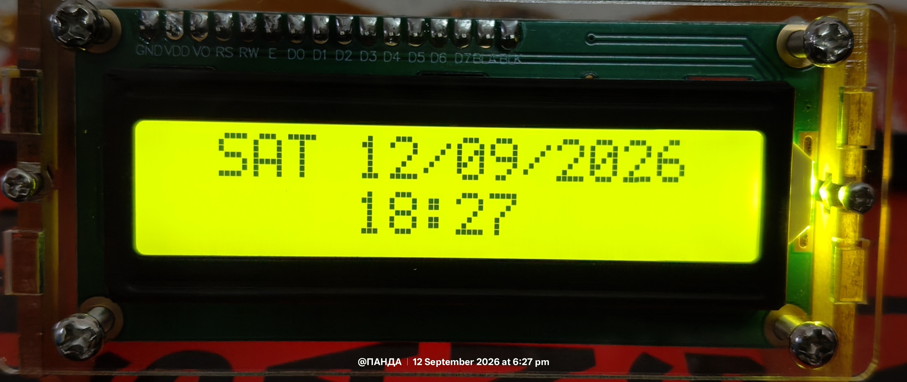
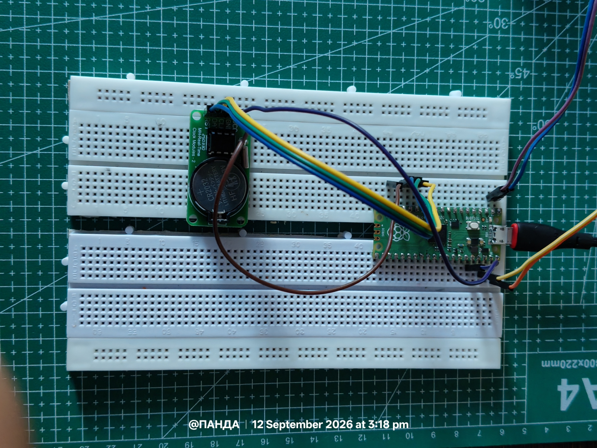

# MicroPython RTC Clock (DS1302 + I2C LCD)

A simple digital clock for MicroPython boards (e.g. Raspberry Pi Pico / RP2040) that reads the current date and time from a **DS1302 RTC module** and displays it on a **16x2 I2C LCD**.

## Features

- Displays the day of the week, date, and time on a 16x2 character LCD
- Centered, easy-to-read layout
- Only refreshes the LCD when the displayed value actually changes, reducing unnecessary I2C writes and flicker
- Minimal, dependency-light main loop

## Hardware Requirements

- A MicroPython-compatible microcontroller (e.g. Raspberry Pi Pico)
- DS1302 RTC module
- 16x2 I2C LCD display (PCF8574-based backpack, default address `0x27`)
- Jumper wires

## Wiring

**DS1302 RTC**

| DS1302 Pin | Microcontroller Pin |
|------------|----------------------|
| CLK | GPIO 10 |
| DAT (I/O) | GPIO 11 |
| RST (CE) | GPIO 12 |
| VCC | 3V3 |
| GND | GND |

**16x2 I2C LCD**

| LCD Pin | Microcontroller Pin |
|---------|----------------------|
| SDA | GPIO 0 |
| SCL | GPIO 1 |
| VCC | 5V (or 3V3, depending on your backpack) |
| GND | GND |

The LCD is wired to **I2C bus 0** (`I2C(0, sda=Pin(0), scl=Pin(1), freq=400_000)`) at 400 kHz, using GPIO 0 for SDA and GPIO 1 for SCL. Adjust the pin numbers and I2C bus in `main.py` if your wiring differs.

## Software Requirements

This script depends on two MicroPython driver libraries, which must be present on the device alongside `main.py`:

- [`ds1302.py`](https://github.com/omarbenhamid/micropython-ds1302) - driver for the DS1302 RTC

Rest of the drivers can be found in the Drivers directory of Projects Directory.

Make sure these files are uploaded to your board's filesystem (e.g. via `mpremote`, `rshell`, or Thonny) before running `main.py`.

## Usage

1. Wire up the DS1302 and I2C LCD as described above.
2. Copy `ds1302.py`, `i2c_lcd.py` (and `lcd_api.py`, if required by your `i2c_lcd` implementation) to the board.
3. Copy `main.py` to the board as well (or run it directly with `mpremote run main.py`).
4. Power on the board. The LCD will display:
 - **Line 1:** Day of week and date, e.g. `MON 15/09/2026`
 - **Line 2:** Current time in `HH:MM` format

> **Note:** The DS1302 must already be set with the correct date/time (this script only reads from the RTC, it does not set it). You'll need a separate script or driver call to initialize the RTC's clock the first time you use it.

## How It Works

The main loop runs continuously:

1. Reads `year, month, day, weekday, hour, minute, second` from the RTC.
2. Formats the date and time into centered 16-character strings.
3. Compares each string to the last one displayed, updating only the LCD line that changed.
4. Sleeps for 1 second before repeating (seconds are read but not displayed, since the display only shows minute-level precision).

